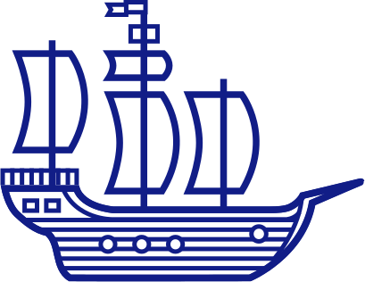

# ¿Qué es dagger?



Dagger es un herramienta que permite crear y correr funciones dentro de containers con el propósito principal de integrar y desplegar código. 

Gracias a su particular diseño y al empleo de buildkit permite el empleo de contenedores por cada función de nuestro workflow. 

En palabras de su creador: ```Dagger es el primer motor de containerización de funciones```.


