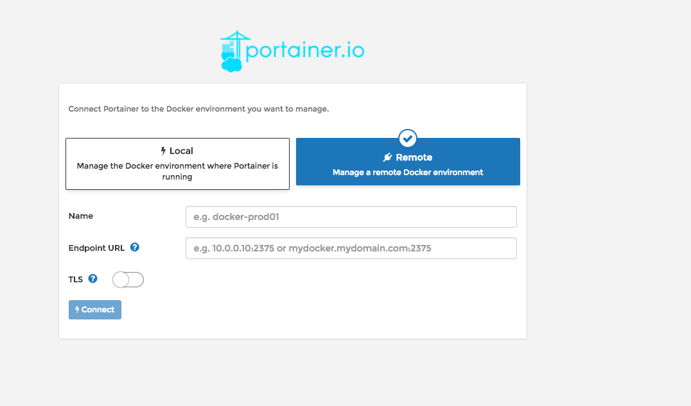

# Portainer: a administración visual do Docker

> O proxecto de portainer consiste na creación dunha servicio web que permite interactuar coa API de Docker dun xeito visual e intuitivo. 

Para instala-lo, basta con facer:

```shell
docker run -d -p 9000:9000 --restart always -v /var/run/docker.sock:/var/run/docker.sock -v /opt/portainer:/data portainer/portainer
```

E xa teríamos o portainer correndo nun contedor, bastaría con abrir o navegador no porto elixido e veríamos a pantalla de inicio. 

Fornecemos un usuario e un contrasinal, e aparecerá esta pantalla:



Polo de agora, imos a escoller o entorno local:


Damoslle a connect e xa teríamos un sistema para administrar visualmente o noso Docker. 

# 📖 Actividade

Probemos a instalar o portainer. 

A partir de agora, ó longo do resto do curso aparecerá esta icona  en varios lugares. Cando sexa así, estamos a recomandar que se vexan os resultados no portainer. 

Consideramos que a información que aporta facilita o proceso de aprendizaxe. 
