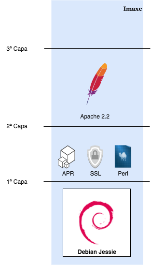

# Exemplo de imaxe

> As imaxes en Docker están formadas por **capas** o que permite a súa modularidade e reutilización. 

Para este exemplo, imos montar unha imaxe co servidor web Apache2. 

## 1ª Capa: O sistema base

Xa sabemos que un container está completamente illado, coa excepción do Kernel, do Sistema Operativo anfitrión. Isto implica que, para que o container funcione, compre ter unha primeira capa na imaxe coas utilidades e programas fundamentais para garantir o funcionamento do software que queremos correr dentro do container. Noutras palabras, precisamos un Sistema Operativo como base da imaxe do container. 

Para este exemplo, imos elixir unha [Debian Jessie](https://www.debian.org/releases/jessie/). Por suposto, poderíamos ter feito a escolla de calqueira outra distro de Linux que sexa compatible co kernel que esté a correr na máquina anfritión (unha Ubuntu, Centos, Alpine...)

A nosa imaxe tería esta estrutura: 

## 2ª Capa: As dependencias do Apache2

Neste exemplo, a versión de Apache a montar é a [2.2](https://httpd.apache.org/download.cgi#apache22) que, por suposto, ten unha serie de [dependencias](https://httpd.apache.org/docs/2.2/install.html#requirements) específicas de software. 

Estas dependencias, constituirían unha segunda capa na nosa imaxe: 

## 3ª Capa: O servidor Apache

Por último, imos agregar a capa co noso servidor web. 

A imaxe, por fin, quedaría da seguinte forma:

E listo! Agora xa podemos empregar a imaxe para lanzar containers con **versións específicas** de software e cunha base **Debian** sen preocuparnos do resto de software que poida estar a correr no anfitrión. 

