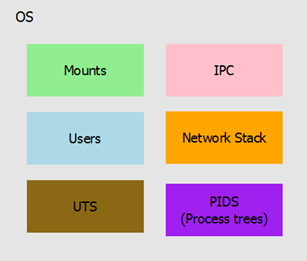

# La "Brecha" en el aislamiento del Kernel: recursos globales

> Se puede encontrar una discusión detallada de este tema en este [artículo](https://lwn.net/Articles/524952/).

Hemos visto en el apartado anterior que el kernel aísla una serie de recursos de tal forma que pueden ser utilizados de forma privada, aunque sea ilusoria, por un proceso o grupo de procesos.

Pero, ¿los sistemas operativos logran aislar todos los recursos de una máquina?

La respuesta es que no. Al menos en entornos UNIX, hay una serie de recursos que son comunes y, por lo tanto, globales para todos los procesos.

Estos recursos son:

- Usuarios
- Comunicaciones entre procesos (IPC: Sockets, pipes...)
- Puntos de montaje (sistemas de archivos)
- Pila de red (interfaces, puentes, iptables...)
- UTS (nombre de host, nombre de dominio...)
- PID

Esto implica que, en un sistema, no puede haber dos procesos con el mismo PID, o procesos que vean diferentes nombres de host en la misma máquina, o que tengan acceso a diferentes puntos de montaje...

**Σ Webografía**
- Kerrisk, Michael. "LEC: El fallo de los sistemas operativos y cómo podemos repararlo". [en línea](https://lwn.net/Articles/524952/)
