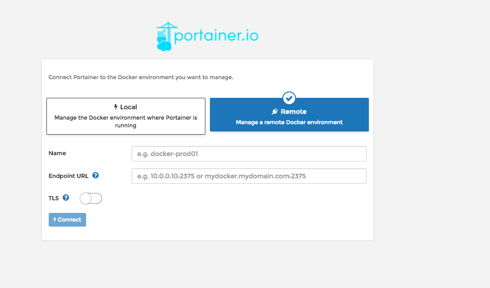
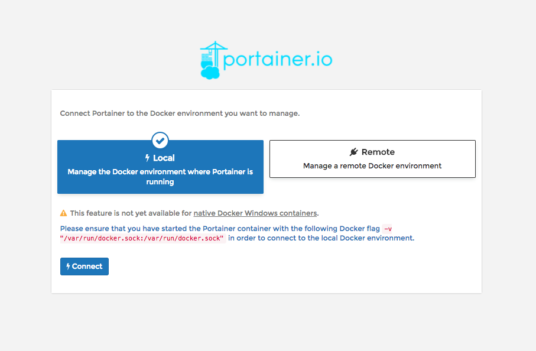

# Portainer: administración visual de Docker

> El proyecto portainer consiste en la creación de un servicio web que permite interactuar con la API de Docker de forma visual e intuitiva.

Para desplegarlo solo haz lo siguiente:

```shell
docker run -d -p 9000:9000 --restart always -v /var/run/docker.sock:/var/run/docker.sock -v /opt/portainer:/data portainer/portainer
```

Y ya tendríamos el portainer funcionando en un contenedor, bastaría con abrir el navegador en el puerto elegido y veríamos la pantalla de inicio.

Proporcionamos un nombre de usuario y contraseña, y aparecerá esta pantalla:



Por ahora, elijamos el entorno local:



Le damos a connect y ya tendríamos un sistema para administrar visualmente nuestro Docker.

# 📖 Actividad

Intentemos instalar portainer.

A partir de ahora, durante el resto del curso, este ícono  aparecerá en varios lugares. Cuando este sea el caso, le recomendamos que vea los resultados en Portainer.

Creemos que la información que proporciona facilita el proceso de aprendizaje.

