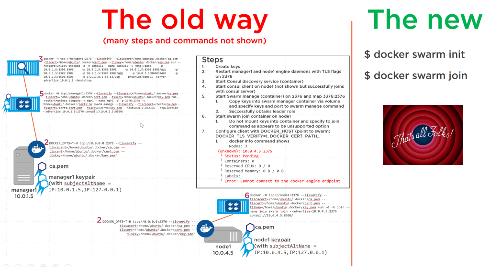

# Conceptos y Características del swarm

## Conceptos:

Dentro de un clúster Swarm de hosts Docker debemos tener claro una serie de conceptos:

### - Nodos

Cada uno de los "hosts" docker que participan en el Docker Swarm.
Un nodo puede ser cualquier tipo de servidor con el demonio docker instalado y vinculado a un clúster Swarm: desde una máquina física, un vps..., ¡hasta un contenedor docker! (ver [Play-with-docker](https://labs.play-with-docker.com)

Un nodo en el clúster Swarm puede ser de tipo **Administrador**, **Trabajador** o **ambos**
El caso más común en clústeres pequeños es tener un nodo Manager que también actúa como Worker, y los demás funcionando exclusivamente como Worker.

Si desea redundar el nodo maestro apropiado y usar un número impar de maestros, para que puedan llegar a un consenso (quórum) en caso de disparidad. Para obtener más detalles sobre los nodos maestros, así como el algoritmo de consenso que utilizan, puede [ver esta página de documentación](https://docs.docker.com/engine/swarm/admin_guide/#operate-manager-nodes-in-a-swarm).

*Para administrar el clúster, necesito conectarme a uno de los nodos del Administrador, al que enviaremos comandos directamente con el cliente Docker o a través de la API.*

Los Managers son responsables de administrar los recursos del clúster, las nuevas altas y bajas de los nodos, y monitorear el estado de los **servicios de swarm** que se ejecutan dentro de él, y los Trabajadores alojan los contenedores de estos **servicios* * . En cualquier caso, el Manager, en pequeños clusters, puede ser perfectamente utilizado como Worker.

### - Servicios y Tareas

Un servicio dentro del swarm cluster se entiende como la declaración de un estado deseado de los elementos que componen nuestra aplicación (el servicio web, el servicio de base de datos…).

Una tarea es la unidad atómica de la planificación, un espacio (**slot**) donde el planificador terminará poniendo un contenedor.

La idea del swarm es ser un orquestador y planificador de propósito general, por lo que tanto las tareas como los servicios son las abstracciones que funcionan.

A partir de ahí, los servicios definen el estado deseado de los diferentes elementos que componen nuestra aplicación, y las tareas acaban plasmadas en contenedores que realizan la tarea de conformar ese estado deseado. Para comprender esto con más detalle, puede consultar [esta página del manual] (https://docs.docker.com/engine/swarm/how-swarm-mode-works/services/).

Un servicio se describe usando el lenguaje que conocemos de docker-compose, pero con algunas características adicionales. Consulte [docker-compose v3](https://docs.docker.com/compose/compose-file/compose-versioning/#version-3).

La principal es la sección [**deploy**](https://docs.docker.com/compose/compose-file/#deploy) donde especifica las características de implementación que desea aplicar a ese servicio (réplicas, actualización política...)

*En realidad, el concepto de **servicio** en docker-compose y docker swarm no es exactamente el mismo, principalmente porque la herramienta docker-compose está diseñada para orquestar contenedores en un solo nodo de Docker, y Docker Swarm los administra en un grupo de máquinas, y maneja conceptos más avanzados como réplicas o políticas de actualización.
Pero docker intenta mantener una especificación compatible entre los dos, con la idea de facilitar la migración a entornos con múltiples nodos en un clúster (que se supone que es necesario para cumplir con los requisitos de un entorno de producción)*

### - Pilas

Una pila es una colección de servicios que representan una aplicación en un entorno determinado. Un archivo de pila es un archivo YAML en el formato de docker-compose v3.

Es realmente el equivalente de docker-compose.yaml en un clúster Swarm; una forma conveniente de implementar servicios que están relacionados entre sí para crear una aplicación.

## Características

Además de estos conceptos, tenemos una serie de características de Docker Swarm que debemos conocer:
 
* **Modelo de servicio declarativo**: Docker Engine nos permite definir de forma declarativa (no imperativa) el estado deseado de un conjunto de servicios que componen nuestra aplicación (stack). Por ejemplo, nuestra aplicación puede estar compuesta por un servicio de base de datos, un servicio web front-end y una cola de mensajes.
 
* **Escalado**: Para cada servicio, podemos definir el número de réplicas (tareas) que queremos ejecutar. Cuando aumentamos o disminuimos este número y volvemos a publicar los cambios en el swarm, los administradores reaccionan automáticamente al cambio agregando o eliminando réplicas para ajustarse al estado deseado.
 
* **Reconciliación con el estado deseado**: Los administradores monitorean constantemente el estado deseado de las pilas desplegadas, de manera que si un nodo se cae con N réplicas de un contenedor, el clúster se encarga de reiniciarlas en los nodos que quedan disponibles .

* **Red de múltiples hosts**: cuando un nodo se une a un clúster de swarm, las redes virtuales se crean encima (superposición) de las propias redes del host (subcapa), lo que permite que los contenedores lanzados en el clúster puedan verse entre sí, a pesar de estar ejecutándose en distintos nodos, e incluso permitirnos definir redes entre distintos contenedores, aislados unos de otros. Por ejemplo: "Quiero que el contenedor A esté en la red R1, donde también debe estar el contenedor B, pero el contenedor C debe estar en otra red R2 que no tenga acceso a la red R1".
 
* **Malla de enrutamiento de ingreso**: en relación con lo anterior, cuando un servicio publica un puerto en el exterior (declarando el atributo del puerto), el clúster de swarm publica ese puerto en todos los nodos para que se pueda acceder al servicio conectándose a IP pública de cualquiera de ellos (con el puerto correspondiente). También equilibra automáticamente las solicitudes entre todas las réplicas disponibles. Para obtener más información, consulte esta página del manual.

* **Detección de servicios**: Los nodos Swarm Manager asignan un nombre DNS único a cada servicio del swarm, y al mismo tiempo también equilibran las solicitudes recibidas a ese nombre DNS, entre todas las réplicas disponibles para ese servicio. Cualquier otro servicio puede llegar al servicio inicial simplemente usando su nombre (por ejemplo: bbdd, app), gracias al DNS interno incrustado en el clúster.

* **Actualizaciones continuas**: al actualizar las réplicas de un servicio, puede especificar un tiempo de implementación, de modo que la actualización no se ejecute de una vez, sino de forma incremental. Y además, si algo sale mal, puedes hacer un roll-back del deployment, para que tengamos una versión anterior del servicio funcionando nuevamente.

