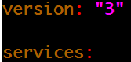
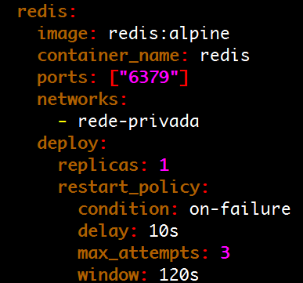
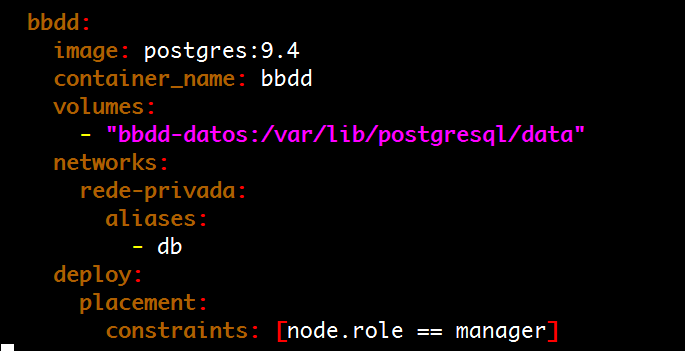
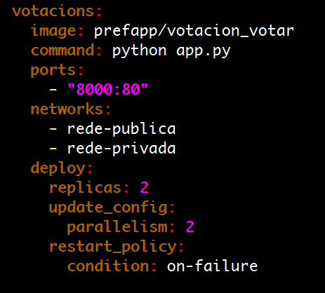
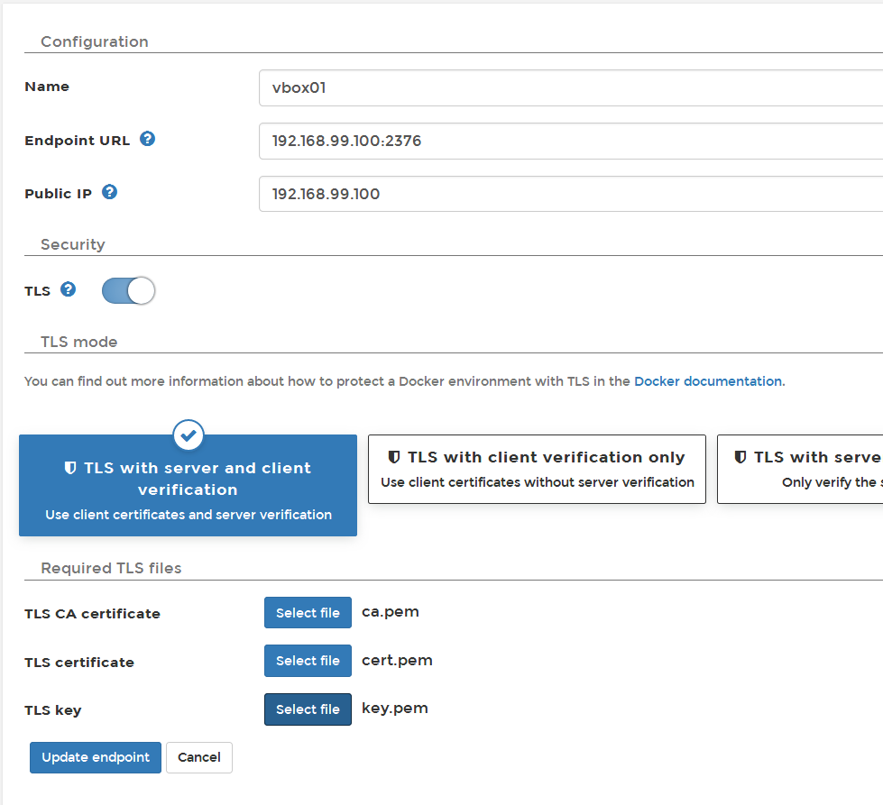

# Práctica guiada: Nesquik vs Colacao repartido

Finalmente, y como cierre de curso, vamos a desplegar en nuestro swarm cluster, creado en el apartado anterior, la aplicación de votación que configuramos en el tema 5.

Vamos a adaptar el docker-compose.yaml de la aplicación anterior, al formato v3, listo para lanzar en swarm, con una serie de mejoras a la hora de dar un servicio más fiable.

Para ello iremos de servicio en servicio añadiendo configuración extra.

Lo primero que debemos hacer es cambiar la versión de la especificación docker-compose, para usar al menos 3. (Actualmente están en 3.6)



Básicamente todas las configuraciones relacionadas con el modo swarm se concentran, dentro de cada servicio, en la sección **deploy**, por lo que el único comando que interpreta estas opciones es
**docker stack deployment**, y tanto docker-compose up como docker-compose run simplemente pasan por alto esta sección.

### Redis

En el caso del servicio redis, solo queremos que tenga una sola réplica y una política de reinicio:

* en caso de falla del contenedor, el clúster responsable de traerlo de nuevo, que intenta al menos 3 veces, con 10s entre cada intento, en una ventana de tiempo de 120s



### PostgreSQL

En el caso del servicio de base de datos, al ser algo bastante crítico QUE NECESITA PERSISTENCIA, sus datos deben almacenarse en un volumen DEPENDIENTE DEL HOST\* donde se ejecuta el contenedor. Por lo tanto, no podemos permitir que el programador Swarm mueva la base de datos a un nodo diferente de donde se inició por primera vez.
Para esto vamos a agregar una restricción para que este servicio solo se ejecute en el nodo **Manager**.

_\*Docker se caracteriza por traer baterías incluidas, pero intercambiables. Esto quiere decir que hay partes del Docker Engine que, aunque vienen con una funcionalidad ya definida, se pueden cambiar por otras de otro proveedor para mejorarlo. Existen principalmente 2 tipos de proveedores de complementos, los que brindan complementos de red y los que brindan complementos de administración de volumen. Precisamente estos últimos están muy centrados en intentar buscar soluciones para poder abstraer el volumen de datos, del host, de forma que los contenedores de servicios puedan moverse entre nodos del clúster y seguir teniendo sus datos disponibles. Puede ver algunos de ellos [aquí](https://store.docker.com/search?type=plugin)_.



Sin embargo, es necesario agregar las variables para la configuración de usuario y contraseña de postgres:

```yaml
environment:

 POSTGRES_USER: "postgres"

 POSTGRES_PASSWORD: "postgres"
```

### Votos

Para el servicio de votaciones, como es una aplicación que no guarda estado en sí misma, y ​​está teniendo mucha demanda ;) la vamos a escalar a 2 réplicas, para que el cluster se encargue de balancear las solicitudes entre cada una de a ellos.

Además, cuando sea necesario actualizar el servicio, queremos que la actualización de las 2 réplicas se ejecute al mismo tiempo y, por supuesto, si falla, se reiniciará automáticamente por sí solo.



Para el nodo de trabajo vamos a agregar 1 sola réplica ya que la aplicación que lo ejecuta ya no lo admite, y una política de reinicio en caso de falla.

Para el nodo de resultados, agreguemos otras 2 réplicas, de manera similar a la votación.

Una vez que esto esté completo, todo lo que queda es preparar nuestro cliente acoplable para hablar con el nodo Administrador.

Input
```sh
env vbox01
export DOCKER_TLS_VERIFY="1"
export DOCKER_HOST="tcp://192.168.100.2376"
export DOCKER_CERT_PATH="/home/alambike/.docker/machine/machines/vbox01"
export DOCKER_MACHINE_NAME="vbox01"
#Run this command to configure your shell:
#eval $(docker-machine env vbox01)
```
Output
```sh
eval $(docker-machine env vbox01) #sendo vbox01 o noso nodo Manager
```

Y finalmente quedaría desplegar esta pila

Input
```sh
docker stack deploy --compose-file docker-stack-tema6.yaml nesquik-colacao
```

Para comprobar cómo el clúster está lanzando los servicios y tareas correspondientes, podemos ejecutar:

Input
```sh
docker stack ps nesquick-colacao
```

## Actividad

Complete la pila y despliéguela en el swarm creado previamente.

Comprobar el funcionamiento de la aplicación, comprobando el puerto 8000 y 8001 en ambos nodos.

Conecte el portainer al nodo Manager y revise visualmente la arquitectura de la aplicación.

## Conectar un nuevo punto final a portainer

Para configurar el portainer contra el nodo Manager del clúster Swarm, hay que acceder a la sección Endpoints y dar de alta uno nuevo, especificando los datos de conexión al mismo.

Los certificados TLS para la conexión al Administrador están dentro de la carpeta **.docker** en su $HOME, en la subcarpeta **máquinas**.

