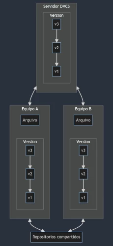

# Historia

[Git](https://git-scm.com/) é un software de control de versións distribuído, que facilita e asegura o traballo colaborativo nos nosos repositorios de código.

Git xurdiu como un novo software de control de versións proxecto para administrar e controlar os cambios de software que se realizaban a través de parches e arquivos. 

Antiguamente as ferramentas de control de versións tiñan unha mentalidade de servidor central. Cando se quería traballar sobre un ficheiro este se marcaba e quedaba dispoñible únicamente para o usuario que traballaba con él. A solución era perfecta para un traballo individual e centralizado, pero podemos imaxinar as diferentes barreiras que nos formula:

- Único punto de erro debido á estructura centralizada.
- Dificulta o traballo colaborativo.
- Ralentiza o proxecto, especialmente a medida que este medra.

Como solución a problemática e para o mantemento de proxecto do kernel de Linux no ano 2002 comezouse a utilizar unha ferramenta de control de versión distribuída chamada Bitkeeper. Puoco tempo despois e a raíz de problemas empresariais co uso de Bitkeeper Linus Torvalds creou Git en 2005 como unha oferta open-source a Bitkeeper, ca experiencia do mesmo e melloras que foron implementando.

> A día de hoxe Git é unha das ferramentas online de traballo máis usadas do mundo.

# Sistemas de control de versións

Un control de versións é un sistema que rexistra os cambios realizados nun ficheiro ou conxunto de ficheiros ó longo do tempo, nun modo que poidamos recuperar estas versións máis adiante.

Isto permítenos recuperar versións anteriores nun proxecto, comparar cambios, debugar problemas, ver que agregou unha modificación...

Temos distintos tipos de sistemas de control de versións:

- Sistemas de control de versións locais
- Sistemas de control de versións centralizados
- Sistemas de control de versións distribuídos

## Sistemas de control de versións locais

Os VCS locais conteñen unha sinxela base de datos na que se leva o rexistro de tódolos cambios realizados ós arquivos. Isto almacénase de forma local no propio equipo de traballo e para un mesmo.

- Vantaxes:
  - Ferramenta sinxela.
  - Rápida implementación.
- Desvantaxes:
  - Non é váida como ferramenta colaborativa.
  - Single point of failure.

## Sistemas de control de versións centralizados

O principal problema que atopamos nos sistemas de control de versións VCS e que no día a día é imprescindible poder colaborar con outros programadores en outros sistemas. Para este inconveniente creáronse os sitemas de control de versións centralizados CVCS.

Estos sistemas contan cun único servidor que contén tódolos arquivos versionados e varios clientes que descargan os arquivos dende ese lugar centralizado.

- Vantaxes:

  - Tódolos colaboradores saben ata certo punto en que traballan o resto de compañeiros de proxecto.
  - Os administradores teñen control sobre os permisos a accesos de cada usuario.
  - A administración é moito máis sinxela que ter que lidiar cas bases de datos locais de cada cliente.

- Desvantaxes:
 - Single point of failure.

## Sistemas de control de versións distribuídos

Os sistemas de control de versións distribuídos DVCS ofrecen solucións a tódolos problemas anteriormente mencionados.

Os clientes a maiores de descargar a última copia instantánea dos arquivos e replica completamente o repositorio. Con esto eliminamos o SPOF e ante falla do sistema pódese restaurar o proxecto mediante calqueira dos repositorios dispoñibles nos clientes.

- Vantaxes:

  - Tódolos colaboradores saben ata certo punto en que traballan o resto de compañeiros de proxecto.
  - Os administradores teñen control sobre os permisos a accesos de cada usuario.
  - A administración é moito máis sinxela que ter que lidiar cas bases de datos locais de cada cliente.
  - Cos repositorios distribuídos eliminamos o SPOF

- Desvantaxes:
 - Resulta máis complexo de configurar respecto ós VCS e ós DVCS.
