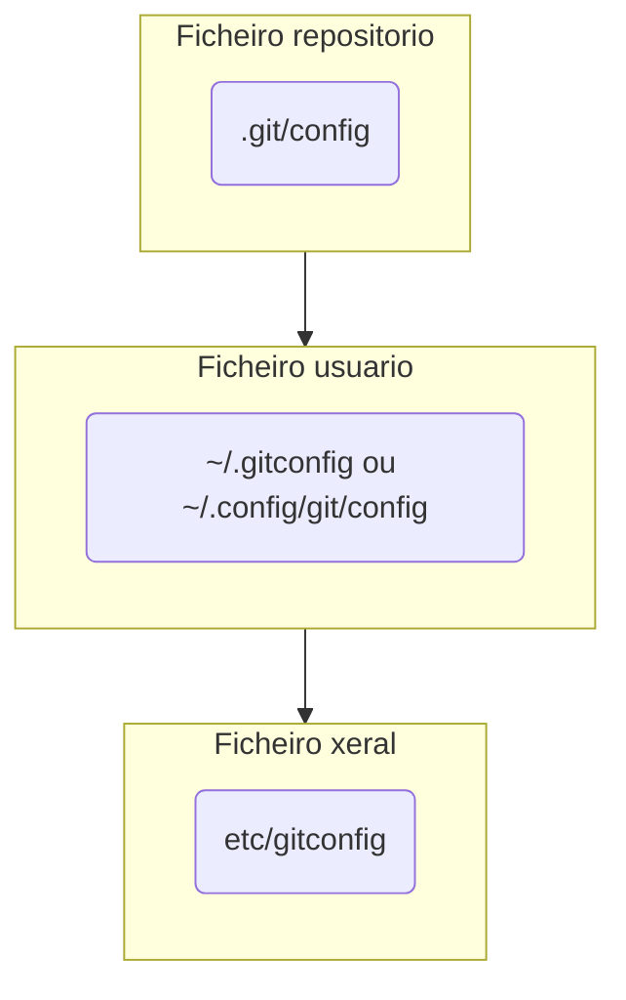

# Módulo 1: Primeiros pasos, configuración e instalación

Nesta tarefa imos a instalar Git na nosa máquina,facer a nosa configuración inicial e clonar o noso primer repositorio.

## 1. Instalación de Git

A continuación imos a instalar Git nos diferentes tipos de SO. Temos varios modos de instalar Git, pero iremos ca/cas maneiras máis comúns ou directas.

### 1.1 Instalación en Windows

Para instalar Git en Windows temos dous opcións principalmente:
1. **mysisGit**: debemos ir ó seguinte enlace [Git para Windows](https://git-scm.com/download/win), escoller a noso instalador ou tipo de instalador e proceder ca descarga.

2. **GitHub para Windows** é outra forma de instalar Git no noso equipo Windows. Este instalador a maiores do CLI inclúe unha interfaz de usuario moi completa e intuitiva, que pode facilitar moito o traballo.

> Para comezar e mellor empezar co CLI de Git para familiarizarnos cos comandos.

### 1.2 Instalación en Linux e Unix

Podemos instalar Git en Linux de diferentes modos, pero vamos a ver as distintas **ferramentas de administración de paquetes** nas diferentes distribucións:

1. Fedora:

    ```bash
    # ata Fedora 21
    $ yum install git
    # Fedora 22 e posteriores
    $ dnf install git
    ```

2. Debian/Ubuntu:

    ```bash
    # a última versión estable para a nosa release de Debian/ubuntu
    $ apt-get install git
    # en Ubuntu este PPA proporciona a última versión estable
    $ add-apt-repository ppa:git-core/ppa
    $ apt update; apt install git
    ```

3. Alpine

    ```bash
    $ apk add git
    ```

Para outras versións podemos ver en este enlace -> [Descargas para Linux e Unix](https://git-scm.com/download/linux).

### 1.3 Instalación en Mac

Vamos a ver as formas máis comúns:
1. Cas ferramentas de Xcode de Línea de Comandos, a partir de Mavericks 10.9 se excutamos **git** dende o noso Terminal se nos mostrará a pregunta de se desexamos instalalo, no caso de que no no teñamos.

2. Podemos usar unha versión máis actualizada dende un instalador binario dispoñible [aquí](https://sourceforge.net/projects/git-osx-installer/).

3. Ferramentas de administración de paquetes:

    - Homebrew:
    ```bash
    # Versión sen interfaz
    $ brew install git
    # Versión con interfaz GUI
    $ brew install git-gui
    ```
    - MacPorts:
    ```bash
    $ sudo port install git
    ```

4. Instalador de Git en OS X no sitio web de [GitHub Desktop](https://desktop.github.com/).

### 1.4 Instalaión en VSCode

[Visual Studio Code](https://code.visualstudio.com/) é un poderoso editor de texto que nos permite traballar dunha maneira moi cómoda e áxil debido á súa versatilidade, facilidade e cantidade de plugins, e que se integra dunha maneira moi sinxela con [Git](https://git-scm.com/).

Para instalar a extensión de [Git](https://marketplace.visualstudio.com/items?itemName=donjayamanne.git-extension-pack) en [Visual Studio Code](https://code.visualstudio.com/) e tan sinxelo como ir ó apartado das extensións, escribimos `git` no recadro de búsqueda e instalamos a extensión.

Temos moitas opcións que nos facilitan o uso destas extensións, pero en VSCode temos a funcionalidade `Terminal`que nos mostra unha terminal nunha ventana da interfaz na que podemos facer uso do CLI de Git instalado en calquera dos pasos anteriores sen necesidade de agregar ningunha extensión.

Podemos facer uso de calquer outro editor de texto de preferencia para a realización das actividades, pero debido á facilidade de uso e integración coas ferramentas que imos a usar recomendamos [Visual Studio Code](https://code.visualstudio.com/).

> Para comprobar que todo saiu correctamente e averiguala versión de Git que acabamos de instalar facemos uso do comando `git version`.

## 2. Configuración de Git

Unha vez teñamos instalado Git no noso equipo teremos que configuralo por primeira vez para personalizar o noso entorno.

Estas configuracións manteranse ó longo das actualizacións pero sempre podremos volver modificalas cando nos sexa necesario.

### 2.1 Ficheiros Git

Git dispón da ferramenta `git config` que nos permite obter e establecer variables de configuracón que controlan o aspecto e funcionamento de Git.

Temos 3 ficheiros diferentes de configuración onde almacenar estas variables:
- `etc/gitconfig`: Contén tódolos valores para tódolos usuarios do sistemas e os seus repositorios. **Comando**: `git config --system`.
- `~/.gitconfig` ou `~/.config/git/config`: Ficheiro específico do noso usuario. **Comando**: `git config --global`.
- `.git/config`: Ficheiro `config` no directorio Git do repositorio que estamos a usar no momento.


Cada nivel sobreescribe ó anterior, polo que podemos dispor dunha configuración xeral da máquina, unha por usuario e específicas para cada repositorio.

### 2.2 Git config

Imos a comezar ca configuración de Git establecendo o noso nome de usuario e a nosa dirección de correo electrónico. Os commits de Git dan uso desta información, a cal vai incluida neles:

```bash
# nome de usuario
$ git config --global user.name "user prefapp"
# email de usuario
$ git config --global user.email user_prefapp@prefapp.com
```

Ca opción `--global` temos esta configuración definida para todo o sistema. Para definila de maneira indidual tan só temos que realizar a configuración `git config` desta vez sen o atributo `--global`.

Así mesmo podemos escoller o editor por defecto:

```bash
$ git config --global core.editor [emacs|vim|vi|...]
```

> Se non especificamos nada Git fará uso do editor que teñamos por defecto, xeralmente é Vim.

Podemos comprobar a nosa configuración co comando `git config --list`, que nos dará un resultado como o seguinte:

```bash
$ git config --list
user.name=user prefapp
user.email=user_prefapp@prefapp.com
color.status=auto
color.branch=auto
color.interactive=auto
color.diff=auto
...
```

Se aparecen claves repetidas e porque Git está lendo en diferentes ficheiros de configuración.

> Se queremos comprobar o valor dunha clave específica o recollemos usando `git config <clave>`:

```bash
$ git config --user.name
user prefapp
```
>⚠️ Se temos dúbidas con respecto á configuración ou calquer comando de Git sempre podemos facer uso do manual:

```bash
$ git help <comando>
$ git <comando> --help
$ man git-<comando>
```

## Evaluación

**Evidencias da adquisición dos desempeños**:
- Resultado da versión de Git instalada.
- Resultado da configuración inicial.

**Indicadores de logro**: 
- Correctamente instalado o Git.
- Correctamente realizada a configuración inicial.

**Criterios de corrección**:
- 5 puntos se se instalou Git de maneira correcta.
- 5 puntos se se realizou a configuración principal de modo axeitado.
**Autoavaliación**: Revisa e autoavalia o teu traballo aplicando os indicadores de logro.

**Peso na cualificación**:
- Peso desta tarefa na cualificación final ........................................ 10 puntos
- Peso desta tarefa no seu tema ....................................................... 10 %
---
