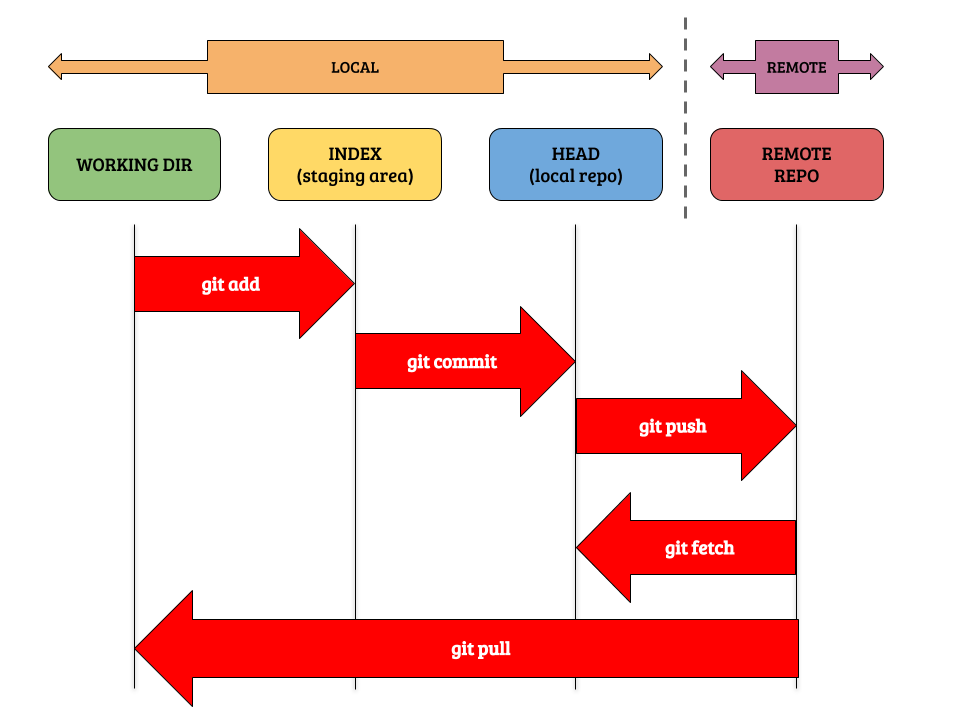
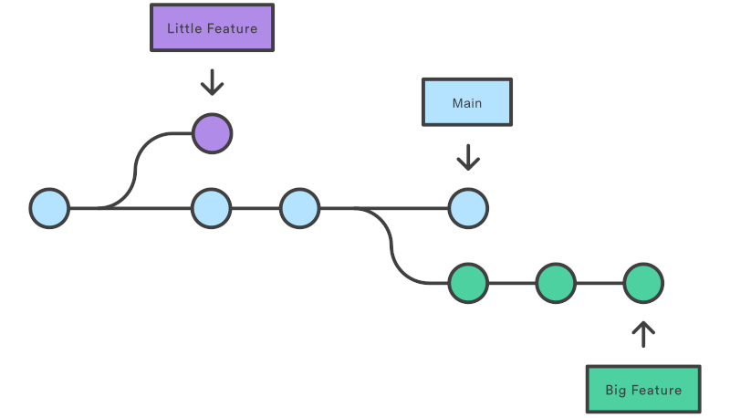
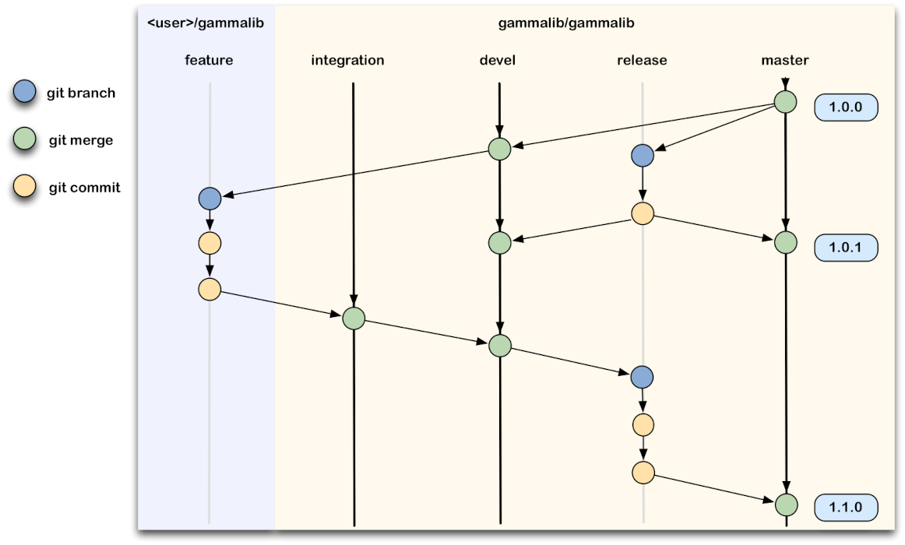

# Seccións Git 

Un proxecto Git consta de tres seccións principais no repositorio local:

- **Directorio de traballo (working dir)** - no que se agregan, borran e editan os arquivos.
- **Área de preparación (INDEX, staging area)** - na que se preparan (ou indexan) os cambios.
- **Directorio git (HEAD, local repo)** - no que se confirman os cambios efectuados deixando unha mensaxe no rexistro.

Dende o directorio Git en local se subirá ó repositorio remoto escollido.

<div style="text-align: center;">
  <div style="margin: 0 auto;">



  </div>
</div>

Segundo a anterior imaxe, o noso traballo en Git pode ter tres estados: modificado (modified), preparado (staged) e confirmado (commited).
- **Modificado**: o arquivo foi modificado, pero aínda non se confirmou sobre a base de datos.
- **Preparado**: un arquivo modificado foi marcado na súa versión actual para formar parte da próxima confirmación.
- **Confirmado**: os datos están almacenados de xeito seguro na base de datos local.

## Ramificación (Branching)

A creación de ramas é unha función dispoñible na maioría dos sistemas de control de versións modernos. En Git, as ramas son parte do proceso de desenvolvemento diario. As ramas de Git son un punteiro eficaz para as instantáneas dos teus cambios.

Cando queres engadir unha nova función ou solucionar un erro, independentemente do seu tamaño, faríalo xerando unha nova rama para aloxar estes cambios. Isto fai que resulte máis complicado que o código inestable se fusione co código de base principal, e date a oportunidade de limpar o teu historial futuro antes de fusionalo coa rama principal.

<div style="text-align: center;">
  <div style="margin: 0 auto;">



  </div>
</div>

Os tipos de ramas máis usados en Git son:
- **Main**: é a rama principal ou por defecto (main) dun repositorio Git. Contén o código estable e debe ser utilizada coma a base para crear novas ramas. Hai algún tempo, a convención xeral para a rama principal era chamala **master**, pero cambiouse por cuestións de inclusión.
- **Feature**: unha rama de característica (feature) utilízase para desenvolver novas funcionalidades nun proxecto. Créase a partir da rama principal e se elimina unha vez que a nova funcionalidade foi integrada na rama principal.
- **Fix**: unha rama de corrección (fix) utilízase para corrixir erros ou fallos no código. Créase a partir da rama principal ou dunha rama de característica e, unha vez o erro foi corrixido, intégrase de novo na rama principal ou na rama de característica correspondente.
- **Hotfix**: unha rama de corrección urxente (hotfix) utilízase para corrixir erros críticos que deben ser solucionados inmediatamente. Créase a partir da rama principal e intégrase de xeito inmediato na rama principal e nas ramas de característica correspondentes.
- **Test**: unha rama de probas (test) utilízase para realizar as probas de integración ou de rendemento no código. Créase a partir da rama principal ou dunha rama de característica e, unha vez realizadas as probas, intégrase na rama principal ou na rama de característica correspondente.
- **Release**: unha rama de lanzamento (release) utilízase para preparar unha nova versión do software para a súa publicación. Créase a partires da rama principal e utilízase para facer axustes finais, correccións de erros e probas de última hora antes de que a nova versión sexa lanzada.
- **Experimental**: unha rama experimental (experimental) utilízase para desenvolver novas funcionalidades ou probar ideas que aínda non foron completamente definidas. Esta rama utilízase para experimentar e non adoita integrarse directamente na rama principal.
- **Refactor**: unha rama de refactorización (refactor) utilízase para realizar cambios no código que melloran a calidade ou eficiencia do mesmo, pero que non engaden novas funcionalidades. Créase a partires da rama principal ou dunha rama de característica e intégrase de novo na rama correspondente unha vez se realizaron os cambios.
- **Doc**: unha rama de documentación (doc) utilízase para actualizar ou mellorar a documentación do proxecto. Esta rama créase a partires da rama principal e intégrase de novo nesta unha vez realizados os cambios na documentación.

Existen distintas estratexias de creación de ramas, como veremos máis adiante. O importante é ter claro cal é a estratexia utilizada en cada proxecto para poder adaptarse a ela.

A seguinte imaxe ilustra un exemplo de ramificación:

<div style="text-align: center;">
  <div style="margin: 0 auto;">



  </div>
</div>

Hai que ter en conta que ó crear unha bifurcación da rama principal poden crearse conflitos con outros compañeiros que colaboren no proxecto. 👀 Para evitalos, é importante:
- Antes de crear unha nova rama, asegurarse de que a copia local da rama principal está actualizada.
- Intentar fusionala (merge) coa principal tan pronto sexa posible. (É como unha lata de comida aberta, pode cheirar se non se pecha a tempo).
- As ramas deben ser o máis cortas posible, para que sexa máis fácil a súa integración coa rama principal.

### Tags (etiquetas) e releases (versións de lanzamento)

As tags (etiquetas) e as releases (versións de lanzamento) utilízanse en Git para marcar puntos específicos na historia do repositorio e para identificar versións estables do software, utilizando o identificador de 40 caracteres do commit ("hash do commit" ou "SHA-1 hash").

As **etiquetas** utilízanse, por exemplo, para marcar unha versión específica do código que se lanzou facendo referencia a un punto concreto na historia do repositorio, e para identificar versións importantes do software. 

Para crear unha etiqueta en Git, utilízase o comando `git tag` seguido do nome da etiqueta e o hash do commit (pódese utilizar o resume do hash) á que se quere facer referencia. Por exemplo:

```bash
git tag v1.0.0 3a2e7c6
```

As **versións de lanzamento** ou releases, utilízanse para identificar versións estables do software que foron lanzadas para o seu uso en produción. Unha versión de lanzamento adoita incluír un conxunto de funcionalidades e correccións de erros, e se considera estable e lista para o seu uso en produción.

Para crear un lanzamento en Git, pódense seguir os seguintes pasos:

1. Crear unha etiqueta que identifique a versión do lanzamento, utilizando o comando `git tag`, como describiuse anteriormente.
2. Crear a release, que incluirá os arquivos binarios ou o código fonte da versión lanzada, xunto coa documentación e os arquivos de configuración necesarios para o seu uso.

As releases poden ser útiles para comunicar ós usuarios, colaboradores ou clientes do software que funcionalidades e correccións foron incluídas nunha versión específica do software, e para proporcionar un xeito fácil de descargar e utilizar o software lanzado. Para isto, pódese engadir un ficheiro `changelog.md` ou similar á raíz do repositorio, onde se inclúa unha lista de cambios en cada versión do software.

## Fusión

A fusión (merge) de ramas en Git é o proceso de combinar os cambios realizados nunha rama cos cambios realizados noutra. A fusión de ramas é unha das funcións principais de Git, e permite ós equipos de desenvolvemento traballar en paralelo en distintas características ou correccións de erros en diferentes ramas e, despois, integrar os cambios nunha rama común para crear unha versión estable do software.

Para fusionar dúas ramas en Git, pódese utilizar o comando `git merge`. Por exemplo, se se quere fusionar a rama "feature" coa rama "main", pódese facer o seguinte:

1. Cambiar á rama "main": `git checkout main`
2. Executar o comando `git merge` e especificar a rama "feature": `git merge feature`
3. Se non hai conflitos na fusión, Git fusionará automaticamente as ramas e creará un novo commit de fusión.

Se hai conflitos na fusión, Git amosará os arquivos con conflitos e pedirá ó usuario que resolva os conflitos manualmente antes de que se poida completar a fusión. Falaremos disto máis adiante.

É importante ter en conta que a fusión de ramas en Git pode afectar á historia do repositorio, polo que é importante seguir as mellores prácticas de Git ó realizar a fusión, como realizar probas e facer copias de seguridade antes da fusión, e asegurarse de que tódalas ramas estean actualizadas antes da fusión.

Nesta sección explicouse a fusión de ramas en local, pero cómpre, pola súa transparencia, fusionar as ramas no repositorio remoto. Para isto, pódese utilizar a interface web do repositorio remoto ou, se a ten, usar algunha ferramenta de liña de comandos complementaria que se poida instalar no equipo local. Por exemplo, en GitHub, pódese utilizar o GitHub CLI para fusionar ramas no repositorio remoto.
