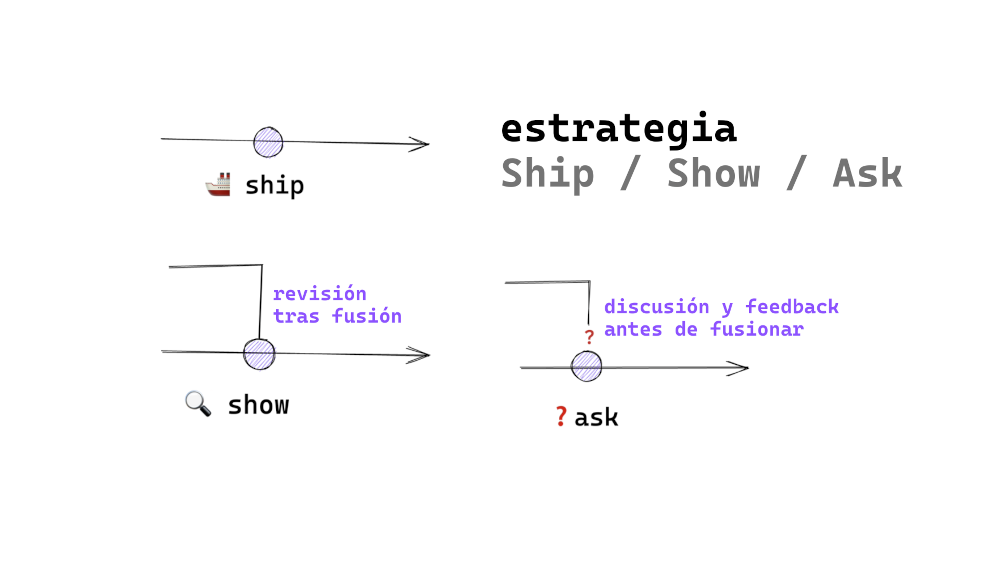
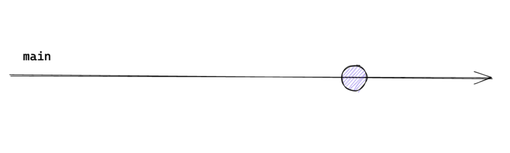
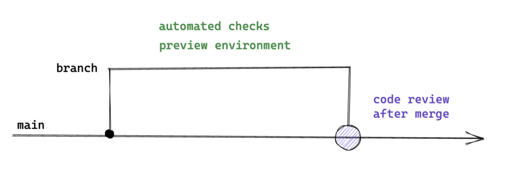
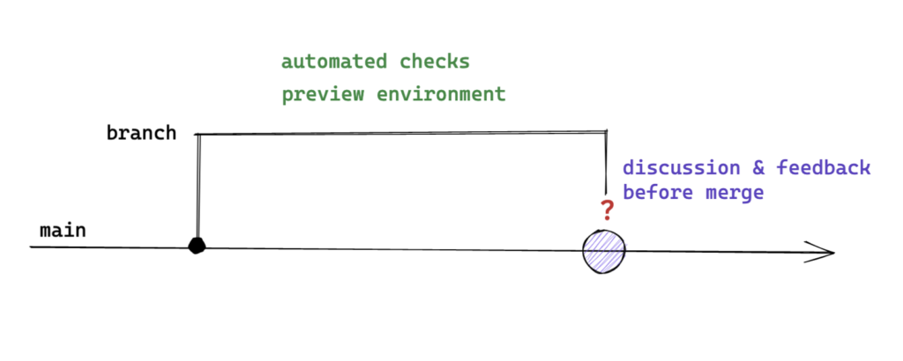

# Pull request

Una pull request (PR) es una solicitud de fusión de una rama en otra rama. En GitHub, las pull requests se utilizan para solicitar la fusión de una rama en otra rama, y para revisar los cambios realizados en la rama antes de fusionarla con la rama principal.

Para crear una pull request en GitHub, se puede utilizar la interfaz web del repositorio remoto o, en su caso, alguna herramienta de línea de comandos complementaria que se pueda instalar en el equipo local. Por ejemplo, en GitHub, se puede utilizar la herramienta de línea de comandos GitHub CLI para crear una pull request en el repositorio remoto.

Algunas buenas prácticas para crear una pull request son:

- **Mantén la pull request pequeña y enfocada**: esto facilitará la revisión y la aprobación de la solicitud.

- **Proporciona una descripción clara**: describe lo que se cambió, por qué se realizó el cambio y cómo afecta al proyecto.

- **Acompaña con pruebas**: si has realizado cambios en el código, asegúrate de proporcionar pruebas adicionales para demostrar que los cambios funcionan correctamente.

- **Actualiza la rama base**: antes de enviar una pull request, asegúrate de que tu rama se actualiza con la rama base. 

- **Haz seguimiento a la pull request**: asegúrate de hacer seguimiento y estar disponible para responder cualquier pregunta o comentario que los revisores puedan tener.

- **Antes de mergear revisa una última vez los cambios**: asegúrate de que no se haya colado algún error.

- **Agradece a los revisores**: asegúrate de agradecer a los revisores por su tiempo y esfuerzo. Esto fomentará una cultura de colaboración y agradecimiento en el equipo.

Y la otra parte, algunas buenas prácticas para los revisores de una pull request son:

- **Realiza una revisión detallada**: asegúrate de revisar cuidadosamente los cambios realizados en la pull request y de entender el propósito de los mismos.

- **Proporciona comentarios constructivos**: asegúrate de proporcionar comentarios constructivos y sugerencias claras para que el autor pueda mejorar su trabajo.

- **Comunica claramente tus sugerencias**: usa un lenguaje claro y conciso para que el autor pueda entender tus comentarios sin confusiones.

- **Haz preguntas para obtener más información**: si tienes dudas sobre los cambios realizados, asegúrate de hacer preguntas y asegurarte de que comprendes lo que el autor ha realizado.

- **Sé respetuoso y agradecido**: agradece al autor por su trabajo y tiempo dedicado a la pull request. Sé respetuoso en tus comentarios y evita usar un tono negativo o sarcástico.

- **Comunica claramente la decisión de la revisión**: una vez que hayas realizado la revisión, comunica claramente al autor si se aprobó la solicitud de extracción, si se necesitan cambios adicionales o si se rechaza la solicitud. Si es posible, explica por qué se tomó esa decisión.

## Ship / Show / Ask
_Extraído del artículo de Rouan Wilsenach ["Ship / Show / Ask"](https://martinfowler.com/articles/ship-show-ask.html)_

  

  

Cada vez que haces un pull request eliges una de las tres opciones: Ship, Show o Ask.

### Ship
Esto es lo más parecido a la [Integración Continua](https://es.wikipedia.org/wiki/Integraci%C3%B3n_continua) de antaño. Haces directamente el cambio en la rama principal con todas las técnicas habituales de integración continua para que sea seguro.. Cuando haces esto, no te quedas esperando a que alguien lleve tu cambio a producción. No estás pidiendo una revisión del código.

Funciona muy bien cuando:

- Se añade una característica usando un patrón establecido.
- Se arregla un error sin importancia.
- Se actualiza documentación.
- Se ha mejorado el código basándose en los comentarios.
- El repositorio no es colaborativo.
- Cuando no son cambios críticos.
- Tienes la suficiente confianza en tu experiencia y en la experiencia de tu equipo.

  

  

### Show 

La opción show incluye la mentalidad de la Integración Continua y le damos uso a las bondades que los pull requests nos pueden dar. Haces tu cambio en una rama diferente a la principal, abres un pull request, y lo fusionas sin esperar a nadie, tan solo a tus comprobaciones automatizadas (pruebas, cobertura de código, entornos de vista previa, etc. Los workflow los veremos más adelante). 

De este modo, habrás puesto en marcha el cambio con rapidez dejando un espacio para la retroalimentación y la conversación a posteriori. Tu equipo será notificado de la pull request y entonces pueden revisar lo que has hecho. Pueden proporcionarle comentarios sobre su enfoque o código. Pueden hacerte preguntas. Pueden aprender de lo que has hecho.

Funciona muy bien cuando:

- Quieres la opinión de terceros sobre cómo podría mejorar el cambio.
- Mostrar un nuevo enfoque o patrón.
- Refactorización, bugs, mejoras de rendimiento, etc.
- Cuando es un error o una solución interesante o para no olvidar.
- El repositorio es colaborativo pero con un owner único.
- Cuando no son cambios críticos.
- Tienes la suficiente confianza en tu experiencia y en la experiencia de tu equipo.

  

  

### Ask
Con la opción ask hacemos una pausa. Con nuestros cambios en una rama abrimos un pull request contra la rama principal y esperamos la retroalimentación antes de fusionar. Tal vez no estamos seguros de haber tomado el enfoque correcto. Tal vez hay algún código con el que no estamos del todo contentos pero no estamos seguros de cómo mejorarlo. Tal vez hayamos hecho un experimento y queramos ver qué piensa la gente.

Las herramientas modernas de revisión de código ofrecen un gran espacio para este tipo de conversación e incluso puedes reunir a todo el equipo para ver un pull request y discutirlo.

Funciona muy bien cuando:

- Queremos preguntar si funcionará.
- Propuesta de un nuevo enfoque.
- Pides ayuda para mejoras.
- Se ha terminado por hoy y se fusionará mañana.
- Control de nuevos integrantes en el código.
- Cuando los cambios son críticos.
- El código es colaborativo y mantenido por un equipo o comunidad.

  

  

