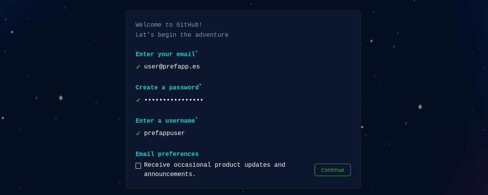

# Práctica guiada - Clonar repo, creación de ramas, primeiro commit e pull request

Vimos de pasar por unhas largas lecturas teóricas, así que esta práctica será corta. Nesta práctica guiada imos clonar un repositorio, crear unha rama, realizar o noso primeiro commit e crear unha pull request, para entender a funcionalidade básica de Git.

## Crear una conta en Github

Para poder realizar esta práctica, cómpre ter un usuario nunha plataforma para repositorios remotos. Se aínda non o tes, podes crealo en GitHub, accedendo a [https://github.com/signup](https://github.com/signup).

  

  

## Crear un novo repositorio

Precisamos ter un repositorio para poder traballar sobre el dende a nosa máquina. En GitHub, os pasos a seguir son:

- Na esquina superior dereita de calquera páxina, seleccionar a opción '+' > New repository.

  

  

- Na páxina que se abre, cubrimos as seguintes opcións:

  - Repository name: o-meu-primeiro-repo.
  - Seleccionamos "Public".
  - Seleccionamos "Add a README file".

  O resto de opcións poden quedar por defecto, polo que seleccionamos "Create repository".

- Copiamos a ruta do noso repositorio, que será algo similar a "https://github.com/username/o-meu-primeiro-repo".

## Clonar o repositorio

- Abre a liña de comandos (terminal) na túa computadora. Navega ata a carpeta onde queres clonar o repositorio usando o comando `cd <ruta_da_carpeta>`.
- Clona o repositorio usando o comando `git clone <URL_del_repositorio>`.

## Crear unha rama

- Navega ata a carpeta do repositorio clonado usando o comando `cd o-meu-primeiro-repo`.
- Crea unha nova rama usando o comando `git branch <nome_da_rama>`.
- Cambia á nova rama usando o comando `git checkout <nome_da_rama>`.

## Realizar o primeiro commit

- Crea un novo arquivo ou modifica un existente na carpeta do repositorio.
- Executa `git status` para ver que ficheiros teñen cambios locais.
- Agrega os cambios á área de preparación (staging area) usando o comando `git add <nombre_do_arquivo_modificado>` ou `git add .` para agregar tódolos cambios realizados. Podes executar de novo `git status` para comprobar como agora o ficheiro aparece na área de staging.
- Confirma os cambios realizados usando o comando `git commit -m "<mensaxe_do_commit>"`. Asegúrate de incluír unha mensaxe descritiva que indique que cambios se realizaron.

## Crear pull request

- Empurra a rama creada co comando `git push origin <nome_da_rama>`.
- Accede ó repositorio dende a web de GitHub, navega ata a sección "Pull Requests" e fai clic en "New Pull Request".
- Selecciona a rama principal do repositorio na lista de ramas de "base" e a rama que acabas de crear na lista de ramas "compare", como na seguinte imaxe:

- Asegúrate de que os cambios que se amosan na pull request sexan os que desexas enviar.
- Se estás satisfeito cos cambios, fai clic en "Create Pull Request" para crear a pull request.
- Engade un título e unha descrición dos cambios que se van realizar. Na columna da dereita, podes designar a outros usuarios de GitHub coma reviewers, pero para esta práctica non será necesario, así que selecciona directamente "Create pull request".

## Fusionar na rama principal

Xa temos a nosa primeira pull request aberta! Agora, só nos queda fusionala coa rama principal para incluír os cambios.

- Navega polas distintas opcións da páxina da pull request: verás que se amosan os commits engadidos e os cambios que se fixeron nos arquivos.
- Fusiona as ramas seleccionando a opción "Merge pull request".
- Elimina a rama que acabas de fusionar. Para isto, na propia páxina da pull request aparecerá a opción de borrado:

Agora que xa tes os básicos controlados, tamén podes practicar co resto dos comandos de Git que explicamos no [capítulo 2 - Manos a la obra](02_basic_commands.md). A recomendación para este capítulo é que repases unha e outra vez a documentación Git e de GitHub para poder ter unha visión xeral do traballo cos repositorios, tanto en local coma en remoto.
