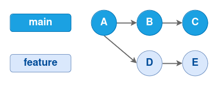
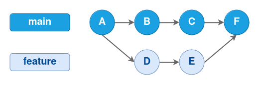
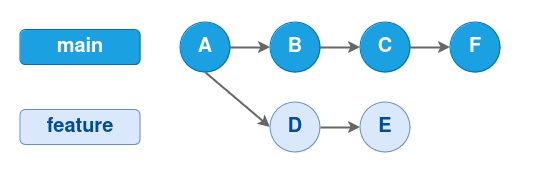
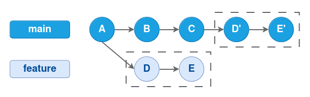
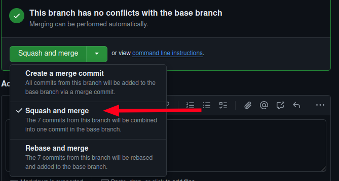

# Estratexia de fusión - Merge vs squash vs rebase vs pull

No desenvolvemento de software con Git, o xeito no que se fusionan as ramas é crucial para manter un historial de commits limpo e manexable. As estratexias de fusión máis comúns son merge, squash, rebase e pull.

Cada estratexia de fusión ten as súas avantaxes e desvantaxes, e a elección da estratexia adecuada pode afectar de xeito significativo á calidade e á claridade do historial do proxecto. A continuación presentamos unha táboa comparativa seguida dunha explicación detallada da estratexia squash.

Táboa comparativa de estratexias de fusión:

| Estratexia | Vantaxes                                | Desvantaxes                                          | Uso Recomendado                                      |
| ---------- | --------------------------------------- | ---------------------------------------------------- | ---------------------------------------------------- |
| **Merge**  | Historial completo, simplicidade        | Historial complexo, commits de fusión adicionais     | Proxectos colaborativos, integracións grandes       |
| **Squash** | Historial limpo, commits agrupados      | Perda de detalle, menos información de depuración  | Pequenas funcionalidades, limpeza de historial       |
| **Rebase** | Historial lineal, sen commits de fusión | Risco de conflitos, perigoso en ramas compartidas    | Historial limpo, antes de fusionar                   |
| **Pull**   | Actualización fácil, comodidade         | Historial máis complexo, conflitos automáticos       | Sincronización rápida, programadores principiantes |

## Exemplo gráfico

Queremos fusionar unha rama feature coa rama principal, pero esta recibiu novos commits dende a creación de feature:

  

  

Se o solucionamos cun `merge`, crearase un novo commit para a fusión, pero manteranse os commits da rama feature no historial:

  

  

Se o solucionamos cun `squash`, engadiranse os cambios mediante un novo commit, que será o único que se amosará no historial:

  

  

Se o solucionamos cun `rebase`, reescribirase o historial, engadindo os commits da rama tras os commits máis recentes de main:

  

  

Artigo cun exemplo práctico de cada un dos métodos de fusión: [Git Merge, Squash, Rebase, or Pull — What To Choose?](https://betterprogramming.pub/git-merge-squash-rebase-or-pull-what-to-choose-50b331d3e7c1)

## Squash merge

En **Prefapp** adoptamos a estratexia de fusión `squash` debido ós beneficios que ofrece en termos de simplicidade e claridade do historial de commits. O noso enfoque céntrase en manter un historial de cambios limpo e fácil de xestionar, o que é crucial para a revisión de código e a colaboración efectiva entre os membros do equipo.

Algunhas razóns son:
- **Mantemento do historial**: ó consolidar os cambios nun único commit o historial de commits na rama principal mantense limpo e fácil de entender. Isto é particularmente útil en proxectos con múltiples desenvolvedores e ramas de características activas.
- **Facilidade de revisión**: a revisión de código simplifícase cando os cambios relacionados agrúpanse nun só commit. Os revisores poden comprender mellor o alcance e o propósito dos cambios se necesidade de revisar múltiples commits.
- **Redución da complexidade**: a estratexia `squash` reduce a complexidade do historial de commits, evitando a saturación do historial con numerosos commits pequenos. Isto é especialmente importante en proxectos de gran escala onde a claridade do historial é crucial.
- **Eficiencia na integración**: ó integrar características mediante un só commit, facilítase a xestión de versións e a implantación continua, aliñándose coa nosa metodoloxía áxil e de entrega continua.

### Exemplo de uso

Para realizar un squash en Prefapp, seguimos estes pasos básicos:

1. **Realizar los cambios**: os desenvolvedores traballan nunha rama de característica realizando múltiples commits para rexistrar os seus progresos.

2. **Fusionar a rama**: cando estea todo listo e os cambios confirmados na rama, fusiónase a rama de característica á rama principal usando `git merge --squash`, o que crea un único commit con tódolos cambios.

En GitHub, pódese realizar un squash merge directamente dende a interface gráfica dunha Pull request ó fusionar unha rama de característica na rama principal.

  

  

Documentación de GitHub sobre as fusións nas PRs: https://docs.github.com/en/pull-requests/collaborating-with-pull-requests/incorporating-changes-from-a-pull-request/about-pull-request-merges
