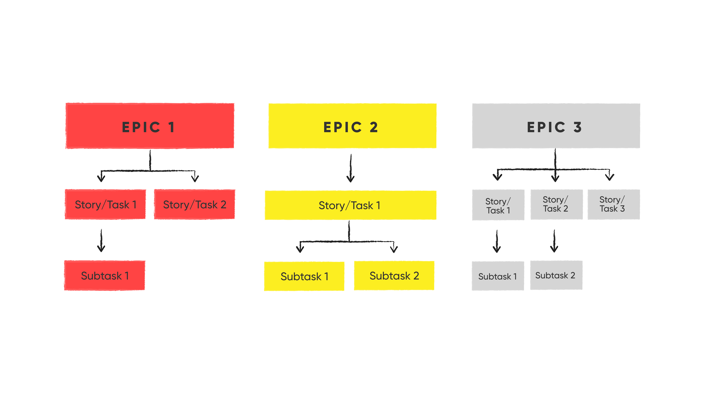

# Manexo de Projects en Backlog con GitHub

No contexto do desenvolvemento de software, os proxectos de GitHub son unha ferramenta fundamental para a planificación e xestión do traballo. Permiten ós equipos organizar, priorizar e realizar un seguimento do progreso das tarefas e características dun proxecto nun entorno colaborativo. En Prefapp utilizamos os proxectos de GitHub coma un xeito centralizado de xestionar o noso backlog e coordinar o traballo en equipo.


## GitHub Projects

Os proxectos de GitHub son taboleiros flexibles e personalizables que permiten ós equipos organizar e priorizar o seu traballo. Cada proxecto pode ter múltiples columnas que representan diferentes etapas do fluxo de traballo, dende a planificación inicial ata a finalización do traballo. As tarefas se representan coma tarxetas que poden moverse entre columnas para reflectir o seu estado actual.


## Metodoloxía Scrum y GitHub Issues

En Prefapp adoptamos unha metodoloxía Scrum áxil para xestionar os nosos proxectos de desenvolvemento de software. Utilizamos GitHub Issues para representar as distintas unidades de traballo, que poden ser historias de usuario (epic), tarefas (story/task) ou subtarefas (subtask). Cada issue representa unha unidade de traballo específica que debe completarse coma parte do proxecto.

<div style="text-align: center;">
  <div style="margin: 0 auto;">



  </div>
</div>


### GitHub Issues

As GitHub Issues son un xeito de realizar un seguimento das tarefas, melloras, erros e outros elementos de traballo nun proxecto. Cada issue pode ter asignado un responsable, etiquetas, comentarios e outros metadatos que faciliten a xestión e a colaboración no desenvolvemento de software.

- **Epic**: representa unha característica ou funcionalidade completa que pode dividirse en múltiples tarefas máis pequenas. As epics adoitan ser issues de alto nivel que abarcan múltiples tarefas (task) ou historias de usuario (story).
  
- **Story/Task**: representa unha unidade de traballo máis específica que debe completarse coma parte dunha epic ou de xeito independente. As tasks representan tarefas individuais que deben realizarse para cumprir cun obxectivo máis amplo.

- **Subtask**: representa unha tarefa máis pequena e específica que forma parte dunha tarefa principal. É convinte evitar o uso de subtarefas en favor das pull requests, que adoitan representar cambios máis específicos no código.

Se ves algunha necesidade no código, algunha mellora ou, simplemente, un erro, podes abrir unha issue en GitHub para que o equipo poida abordala. As issues son un xeito efectivo de comunicar e xestionar o traballo nun proxecto de software. É importante que reflicta a **"Motivación"** e os **"Criterios de aceptación"** para que o equipo poida entender e traballar na issue de xeito efectivo. Tamén podes engadir observacións, anotar como evoluciona a tarefa, documentación, etc. 

Podes crear as túas propias templates para as issues. Revisa a documentación de GitHub:
https://docs.github.com/en/communities/using-templates-to-encourage-useful-issues-and-pull-requests/configuring-issue-templates-for-your-repository


## Procedementos

Algunhas das tarefas de operacións en produción requiren de **xanelas de actualización**. Estas son períodos programados e pactados co cliente durante os cales realízanse cambios significativos no sistema, co obxectivo de minimizar a interrupción do servizo e asegurar unha execución exitosa.

Normalmente, redáctanse **procedementos** en issues (poden ser illados, epics, stories...) onde descríbese o plan de acción, os impactos esperados e os pasos detallados para a execución e posibles rollbacks.

Modelo de procedemento: https://github.com/prefapp/demo-state/blob/main/.github/docs/template_migration_es.md

O importante ó redactar un procedemento é que sexa **claro, conciso e detallado**. Debe conter toda a información precisa para que calquera membro do equipo poida executalo de xeito efectivo e seguro. Pódense utilizar elementos coma os checklists, comandos e exemplos para facilitar a compresión e execución do procedemento.


## Uso de GitHub Projects en Prefapp

En Prefapp abrimos un proxecto de GitHub para cada proxecto de software que estamos desenvolvendo. Utilizamos as seguintes columnas nos nosos proxectos de GitHub para reflectir o noso fluxo de traballo:

- **New**: é onde se agregan novas tarefas ou características ó backlog do proxecto. Estas tarefas aínda non foron priorizadas nin asignadas a un sprint.

- **Refining**: nesta columna refinamos e detallamos as tarefas ou características que foron agregadas ó backlog. Isto pode implicar a división de epics en tarefas máis pequenas ou a clarificación dos requisitos.

- **Ready to Start (DoD completed)**: unha vez que unha tarefa ou característica foi completamente definida e lista para ser implantada, móvese a esta columna. Aquí se asegura de que se cumpran tódolos criterios de aceptación e definición de "done" (DoD) antes de comezar o traballo.

- **In Progress**: cando un membro do equipo comeza a traballar nunha tarefa ou característica, móvese a esta columna para indicar que está en progreso.

- **Blocked / On hold**: se unha tarefa ou característica atópase bloqueada por algún motivo, móvese a esta columna para indicar que non se pode avanzar nela temporalmente.

- **In Review**: unha vez que se completou unha tarefa ou característica e está lista para a súa revisión, móvese a esta columna. Aquí realízase a revisión do traballo antes da súa integración final.

- **Done**: finalmente, cando unha tarefa ou característica está completada e revisada satisfactoriamente, móvese a esta columna para indicar que está terminada.


## Integración de GitHub Projects con Pull Requests

En Prefapp vinculamos as nosas tarefas de GitHub Issues con pull requests (PRs), que representan os cambios de código asociados con esas tarefas. Isto nos permite rastrear o progreso do traballo e a implantación de características específicas directamente dende o proxecto de GitHub.

Ó utilizar GitHub Projects deste xeito, podemos manter un seguimento claro do traballo pendente, colaborar de xeito efectivo no desenvolvemento de software e garantir a entrega oportuna de proxectos de alta calidade.

Ademais, coas keywords de GitHub, podemos relacionar as issues coas PRs, de xeito que cada issue se peche automaticamente ó facer o merge da súa PR asociada.

Doc: 
- "Using keywords in issues and pull requests" https://docs.github.com/en/get-started/writing-on-github/working-with-advanced-formatting/using-keywords-in-issues-and-pull-requests
- "Linking a pull request to an issue" https://docs.github.com/en/issues/tracking-your-work-with-issues/linking-a-pull-request-to-an-issue


# Exemplo práctico

Un bo exemplo dunha epic issue é a que se usou para a creación deste curso. "Add Git course": https://github.com/prefapp/formacion/issues/107

Pódese apreciar como se crearon story issues a partir desta:
- Build course structure: https://github.com/prefapp/formacion/issues/108
- Build 1st module fundamentals and introduction: https://github.com/prefapp/formacion/issues/109
- Build 2nd module Hands on: https://github.com/prefapp/formacion/issues/110
- ...

E, neste caso, cada story issue contén unha ou varias PRs relacionadas coa tarefa. Por exemplo, "Build course structure" conta coa PR "structure, readme and 1st module" (https://github.com/prefapp/formacion/pull/112) que resolveu dúas issues á vez mediante a relación seguinte:

```
resolves #108 and resolves #109
```

👀 *Revisar a documentación mencionada anteriormente para máis información sobre como relacionar issues con PRs.*
