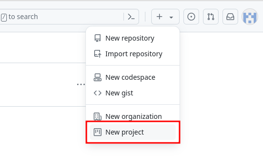
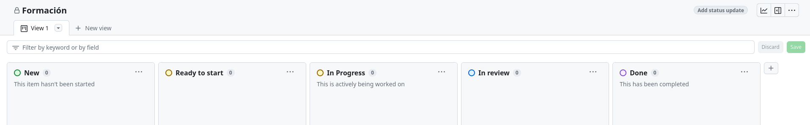

# Práctica guiada: creación de ramas, pull request e preparación do traballo mediante issues (Projects)

Nesta práctica guiada explicaremos como aplicar a metodoloxía de Prefapp para xestionar o teu traballo en GitHub, incluíndo a creación de ramas, a apertura de issues e a preparación do traballo mediante proxectos.


## Paso 1: creación do project

1. Dende a páxina de [GitHub Projects](https://github.com/projects), selecciona '+' > New project. 

<div style="text-align: center;">
  <div style="margin: 0 auto;">



  </div>
</div>

2. Na pantalla que se abre, escollemos New project > Board > Create project.
3. Engadimos e editamos as columnas para quedarnos coas seguintes: New, Ready to Start, In Progress, In Review y Done.

<div style="text-align: center;">
  <div style="margin: 0 auto;">



  </div>
</div>

4. Navega ata o repositorio que creamos na práctica do capítulo anterior. Accede á pestana "Projects", selecciona "Link a project" e escolle o proxecto que acabas de crear. Agora as issues que crees no teu proxecto se asociarán a este repositorio.

## Paso 2: creación dunha issue

1. Abre o teu proxecto en GitHub Projects.
2. Na columna "New", crea un novo ítem para unha tarefa específica que precise ser realizada. Por exemplo, "Engadir presentación no ficheiro README.md".

## Paso 3: configuración da issue

1. Abre o ítem que ves de crear e, en assignees, asígnao ó teu usuario.
2. Engade toda a información da issue na descrición e gárdaa con "Update comment".
👀 *Recorda que podes usar modelos para os [procedementos](https://github.com/prefapp/demo-state/blob/main/.github/docs/template_migration_es.md).*
3. Cando o teñas todo preparado, selecciona "Convert to issue" e confirma o repositorio no que queres que se cree.
4. Move o ítem á columna "Ready to Start".

## Paso 4: creación dunha rama e Pull Request (PR)

1. Antes de comezar a traballar, move o ítem á columna "In Progress".

2. Dende o teu terminal, accede á carpeta local do repositorio que clonamos no capítulo anterior. Asegúrate de que estás na rama principal e baixa os cambios con:
```bash
git pull origin main
```

3. Crea unha nova rama para traballar na issue que acabas de crear:
```bash
git checkout -b feature/branch-test
```

4. Crea un ficheiro README.md ou modifica o existente engadindo información sobre o teu repositorio. Este é un ficheiro especial, xa que o seu contido amosarase na páxina principal do teu repo en GitHub.

5. Confirma os cambios e sube la rama a GitHub:
```bash
git add README.md
git commit -m "Add a description to README.md"
git push origin feature/branch-test
```

6. Crea unha PR para fusionar a túa rama coa rama principal do repositorio. No output do anterior comando haberá un enlace para crear a PR. Se non o ves, podes facelo dende a interface de GitHub.

7. Asegúrate de seguir as boas prácticas para configurar a PR. Engade:
  - Unha descrición clara dos cambios realizados.
  - Un revisor apropiado.
  - Etiquetas se é preciso.
  - A issue relacionada coa PR.

8. Unha vez rematados os cambios descritos na issue e mentres agardas pola revisión, podes mover a issue á columna "In review" do project de GitHub.

## Paso 5: Revisión y fusión da Pull Request

1. O revisor examinará os teus cambios, realizará comentarios se é preciso e aprobará a PR unha vez que estea satisfeito co traballo (looks good to me (LGTM)).
2. Unha vez aprobada, a PR pode fusionarse coa rama principal do repositorio (squash and merge).
3. Se todos os cambios propostos na issue están completados, poderemos mover a issue á columna "Done".

Parabéns! Completaches con éxito a práctica guiada de creación de ramas, pull request e preparación do traballo mediante issue en GitHub. Se tes algunha dúbida, observa e pregunta ós teus compañeiros.


