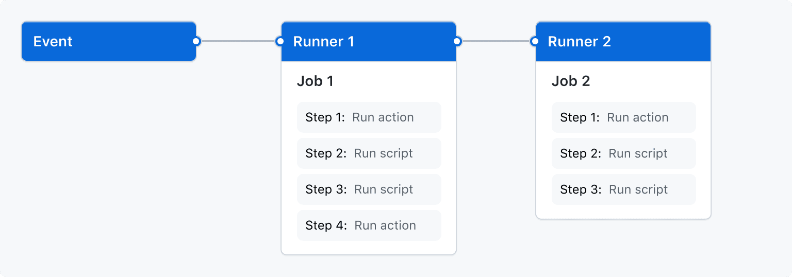
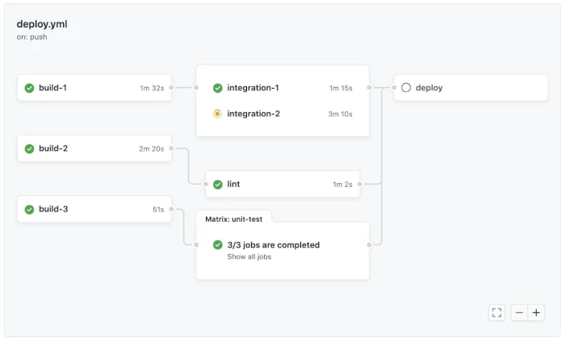

# Github Actions avanzado


Vimos de ver brevemente que son as Github Actions, pero agora imos afondar un pouco máis nelas. Neste capítulo exploraremos como se configuran, como se executan e como se poden personalizar para satisfacer necesidades específicas.

GitHub Actions é unha plataforma de integración continua e entrega continua (CI/CD) que automatiza as pipelines de construción, proba e despregamento. Permíteche crear fluxos de traballo que constrúen e proban tódalas pull requests a un repositorio, ou despregar pull requests fusionadas no teu entorno de produción.

Os workflows defínense no directorio .github/workflow do repositorio. Podes definir múltiples workflows, cada un realizando un conxunto diferente de accións. Por exemplo, un workflow pode especificar como crear e probar unha pull request, mentres que outro workflow pode despregar automaticamente unha aplicación cando se crea unha nova release.

Para unha referencia máis detallada, podes consultar a [documentación oficial de Github Actions](https://docs.github.com/en/actions/using-workflows).


## Conceptos dos workflows en Github Actions

### Workflow Triggers

Un trigger de workflow é un evento que fai que se execute un workflow. Hai catro tipos de triggers:

- Eventos no repositorio de GitHub do workflow.
- Eventos fóra de GitHub, que activan un evento repository_dispatch en GitHub.
- Un horario predefinido.
- Trigger manual.

Despois de que se active un workflow, o seu motor executa un ou máis jobs. Cada job contén unha lista predefinida de pasos; un paso pode executar un script definido ou realizar unha acción específica (dunha biblioteca de accións dispoñibles en GitHub Actions). Isto se ilustra no diagrama a continuación. 

<div style="text-align: center;">
  <div style="margin: 0 auto;">



  </div>
</div>

O proceso cando se activa un evento é o seguinte:

1. Prodúcese un evento no repositorio. Cada evento ten un SHA de commit e unha referencia de Git (un alias lexible para humanos do hash do commit).
2. GitHub busca no directorio `.github/workflow` do repositorio arquivos de workflow relacionados co SHA de commit ou a referencia de Git asociada co evento.
3. Para os workflows con valores que coinciden co evento disparador, actívase a execución do workflow. Algúns eventos requiren que o arquivo do workflow estea na rama predeterminada do repositorio para executarse.
4. Cada workflow usa a versión do workflow no SHA de commit ou a referencia de Git asociada co evento. Cando se executa o workflow, GitHub configura as variables de entorno `GITHUB_SHA` e `GITHUB_REF` no entorno do launcher.


### Workflow Jobs e Concurrency

A execución dun workflow consta dun ou máis jobs que se executan en paralelo. Este é o comportamento predeterminado, pero podes definir dependencias noutros jobs para facer que os jobs executen tarefas secuencialmente. Isto faise utilizando a palabra clave `jobs.<job-id>.needs`.

Podes executar un número ilimitado de tarefas dentro dos límites de uso do teu workflow. Para evitar que se executen demasiados jobs simultaneamente, podes usar `jobs.<job-id>.concurrency` para asegurar que só un job ou workflow no mesmo grupo de concorrencia se execute ó mesmo tempo. O nome dun grupo de concorrencia pode usar calquera cadea ou expresión, excepto segredos.

Se un job ou workflow concorrente está na cola e outro job ou workflow está en progreso, a tarefa ou workflow na cola ponse en espera e calquera tarefa ou workflow previamente suspendido no grupo de concorrencia se cancela.

<div style="text-align: center;">
  <div style="margin: 0 auto;">



  </div>
</div>

## Exemplos de Workflows de GitHub Actions: sintaxe e comandos

### Sintaxe das Github Actions

Os workflows en GitHub Actions escríbense en sintaxe YAML. Polo tanto, os arquivos de workflow teñen unha extensión .yml ou .yaml.

Recorda: os arquivos de workflow deben almacenarse nun directorio dedicado no repositorio chamado `.github/workflows.`

#### name

Utilízase para establecer o nome do workflow, dos jobs ou dos steps. GitHub Actions amosa este nome na pestana de accións do repositorio. Se falta o name, Actions amosará a ruta relativa do arquivo de workflow dende o directorio raíz do repositorio. Pódense usar emojis para agregar un toque identificador e colorido, facéndoos máis visuais.

Por exemplo, o nome dun workfow establécese colocando a seguinte liña ó comezo do arquivo:

```yaml
name: demo-github-actions-workflow 🧪
```

O job, coa identificación adecuada, establécese do seguinte xeito:

```yaml
jobs:
  build:
    name: Build 🏗
    runs-on: ubuntu-latest
```

E o step, tamén coa identificación axeitada:

```yaml
steps:
  - name: Install dependencies 🔌
    run: npm install
```


#### on

Utilízase para especificar o evento ou os eventos (triggers) que activan automaticamente o workflow. Pode tomar un ou múltiples eventos coma triggers. Ademais, pode restrinxir os triggers a arquivos específicos, cambios de rama ou etiquetas.

Exemplos:

A seguinte liña activa o workflow cada vez que hai un push no repositorio:

```yaml
on: push
```

A seguinte liña activa o workflow cando hai un push ou o repositorio é bifurcado:

```yaml
on: [fork, push]
```

Se se producen múltiples eventos simultaneamente, o workflow se activa múltiples veces.

O seguinte exemplo amosa como especificar a actividade do evento e o tipo de actividade para activar un workflow:

```yaml
on:
  branch_protection_rule:
    types:
      - edited
```

Aquí, o workflow execútase cada vez que se cambia a regra de protección da rama do repositorio. O trigger pode ser múltiples tipos de actividade do seguinte xeito:

```yaml
on:
  branch_protection_rule:
    types:
      - edited
      - created
```

Isto executa os workflows dúas veces cando un usuario crea unha nova regra de protección de rama e a agrega.

O seguinte exemplo amosa como usar os filtros de eventos e activar o workflow só cando o evento ten certos aspectos específicos:

```yaml
on:
  pull_request:
    types:
      - assigned
    branches:    
      - 'demo-branch/**'
```

O seguinte exemplo amosa como o workflow pode executarse só para certos tipos de arquivos usando o filtro paths:

```yaml
on:
  push:
    paths:
      - '**.py'
```

O workflow se activará cada vez que se suba un arquivo Python ó repositorio.


#### defaults

Utilízase para especificar a configuración predeterminada do workflow. Se se especifica baixo un job concreto, só se aplica ó job. En caso contrario, especifica configuracións para tódolos jobs.

A shell predeterminada para os comandos no workflow e o directorio que contén os scripts que se deben executar especifícanse do seguinte xeito:

```yaml
defaults:
  run:
    shell: bash
    working-directory: demo-workflow-scripts
```

#### jobs

Utilízase para especificar as accións que realiza o workflow. Pode ter múltiples jobs baixo el, e cada job pode ter o seu propio alcance, conxunto de accións e jobs dependentes.

Exemplos de comandos:

Cada job dentro do bloque de jobs precisa un identificador único que debe ser unha cadea única e conter só -, _, e caracteres alfanuméricos:

```yaml
jobs:
  first_demo_job:
    name: The first demo job
  second_demo_job:
    name: The second demo job
```

As accións dun job se especifican coa sintaxe steps. Cada step pode ter un nome, as súas propias variables de entorno e comandos a executar:

```yaml
jobs:
  first_demo_job:
    name: The first demo job
    steps:
      - name: Show the demo running
        env:
          VAR1: This is
          VAR2: A Demo of
          VAR3: GitHub Actions
          VAR4: Workflow jobs
        run: |
          echo $VAR1 $VAR2 $VAR3 $VAR4.
```


### Comandos do Workflow

#### Establecer outputs

O comando set-output establece o valor para a saída dunha acción. Unha vez establecido, outros comandos poden usar a saída facendo referencia ó id do job:

```yaml
- name: Set output parameter
  run: echo '::set-output name=OUTPUT_PARAM::parameter_set'
  id: output-parameter-setter
- name: Get output
  run: echo "The output parameter is set to ${{ steps.output-parameter-setter.outputs.OUTPUT_PARAM }}"
```

#### Amosar erros

O comando error escribe mensaxes de erro no rexistro. Toma o nome do arquivo, a posición e a mensaxe coma entradas:

```shell
echo "::error file=demo-file.js,line=1,col=7,endColumn=9::Missing semicolon"
```

#### Amosar outputs completos

Os comandos echo::on e echo::off activan e desactivan respectivamente a impresión dos comandos para tódolos comandos seguintes:

```yaml
jobs:
  demo-workflow-job:
    steps:
      - name: set echoing of commands on and off
        run: |
          echo '::set-output name=demo_action_echoing::off'
          echo '::echo::on'
          echo '::set-output name=demo_action_echoing::on'
          echo '::echo::off'
          echo '::set-output name=action_echo::disabled'
```

Isto amosará a seguinte saída no rexistro:

```shell
::set-output name=demo_action_echoing::on
::echo::off
```


### Titorial rápido: creando workflows de inicio

Os workflows de inicio son modelos de workflows que os usuarios poden personalizar segundo as súas necesidades e pór en uso. GitHub proporciona moitos workflows de inicio para categorías como despregamento continuo, automatización e seguridade para axudar ós usuarios a comezar.

Doc Github: https://docs.github.com/en/actions/learn-github-actions/using-starter-workflows 

Para crear un novo workflow de inicio:

1. Crea un novo directorio e chámao .github, se aínda non existe.
2. Crea un directorio dentro do novo directorio e chámao workflow-templates.
3. Crea un arquivo de workflow e chámao demo-workflow.yml. Pon o seguinte código YAML no arquivo:

    ```yaml
    Name: Starter Workflow Demo

    on:
      push:
        branches: [ $default-branch ]
      pull_request:
        branches: [ $default-branch ]

    jobs:
      build:
        runs-on: ubuntu-latest

        steps:
          - uses: actions/checkout@v3

          - name: demo workflow job
            run: echo This is a demo start workflow
    ```

4. Crea un arquivo de metadatos dentro de workflow-templates e chámao demo-workflow.properties.json. O nome do arquivo do workflow e o nome do arquivo de metadatos deben ser iguais. Pon o seguinte no arquivo de metadatos:

    ```json
    {
        "name": "Starter Workflow Demo",
        "description": "Demo starter workflow.",
        "iconName": "demo-icon",
        "categories": [
            "Python"
        ]
    }
    ```

Aquí, os metadatos especifican a categoría da linguaxe do workflow de inicio para que un usuario poida atopar este workflow de inicio máis facilmente.


## GitOps

GitOps é unha metodoloxía para a xestión da infraestrutura e as aplicacións baseadas en Git. No lugar de depender de ferramentas e procesos manuais, GitOps utiliza repositorios Git coma fonte única para todo o relacionado coa infraestrutura e as aplicacións. Isto inclúe a configuración da infraestrutura, as definicións das aplicacións, os scripts de despregamento e calquera outro artefacto ou recurso que se precise para o ciclo de vida de desenvolvemento e operacións.

<div style="text-align: center;">
  <div style="margin: 0 auto;">


  </div>
</div>

- Lectura recomendada "GitOps: 쯤ué es y cuáles son sus ventajas?": https://www.redhat.com/es/topics/devops/what-is-gitops 👀
- Lista de actions e recursos relacionados: https://github.com/sdras/awesome-actions?tab=readme-ov-file 👀

No seguinte módulo veremos exemplos prácticos GitOps que se utilizan en Prefapp.
