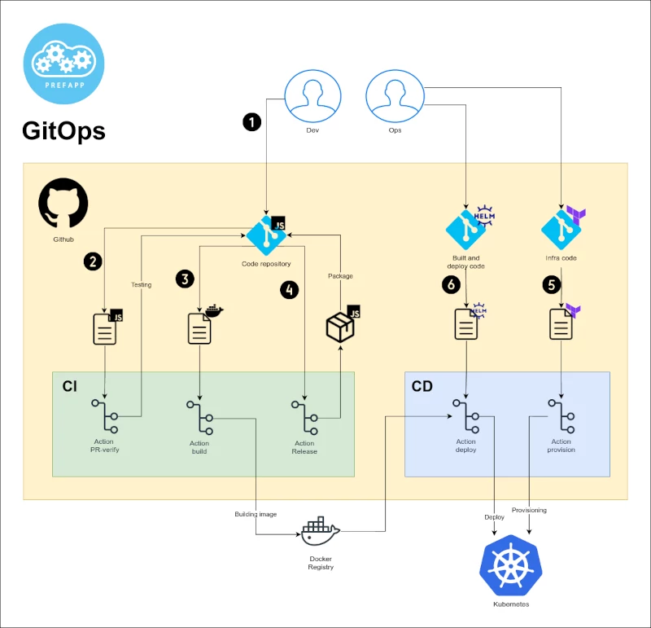
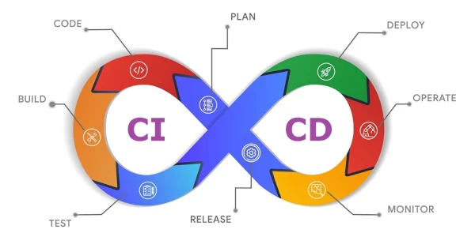

# Workflows utilizados en Prefapp

Xa vimos unha pequena explicación do que é GitOps, agora imos ver graficamente algúns workflows básicos para a automatización do ciclo de vida do software.

1. Créase o código fonte e súbese a un repositorio de código fonte mediante unha Pull Request.
2. A Pull Request activa un workflow que testea o código fonte.
3. Ó facer merge da Pull Request se activa un workflow que crea unha imaxe de contedor, a sube a un rexistro de contedores e abre outra Pull Request ó repositorio de Helm.
4. Cando se crea unha release no repositorio do código, esta dispara un workflow que xerará un documento Changelog e empaqueta a aplicación.
5. Antes de aplicar a Chart (non ten por que ser xusto antes, podería ser o paso 1), débense aprovisionar os recursos que a aplicación precise mediante Terraform.
6. Cando se fai o merge da Pull Request aberta no repositorio de Helm (aberta no paso 3) actívase un workflow que desprega a release de Helm.

  

  

Xenial! Con isto se automatizou case todo o ciclo de vida do software, dende a creación do código fonte ata o despregamento da aplicación.

  

  

Antes de seguir, é recomendable unha lectura das boas prácticas para crear workflows en GitHub Actions:

- Fortalecer a seguridade en Github Actions: https://docs.github.com/en/actions/security-guides/security-hardening-for-github-actions 👀 

Imos examinar algúns dos workflows máis usados en Prefapp para poder introducirnos no mundo da automatización de GitHub Actions:

- [release-please](./05_release-please.md) (paso 4)
- [release-pipeline](./07_release-pipeline.md) (paso 4)
- [build_and_dispatch](./06_build_and_dispatch.md) (paso 3)
- [PR-verify](./04_pr_verify.md) (paso 2)

---

Repositorio demo para "[Build and dispatch](https://github.com/prefapp/hello-k8s/blob/main/.github/workflows/build_and_dispatch.yaml)" e "[PR verify](https://github.com/prefapp/hello-k8s/blob/main/.github/workflows/pr_verify.yaml)": [hello-k8s](https://github.com/prefapp/hello-k8s/tree/main/.github) 👀 

