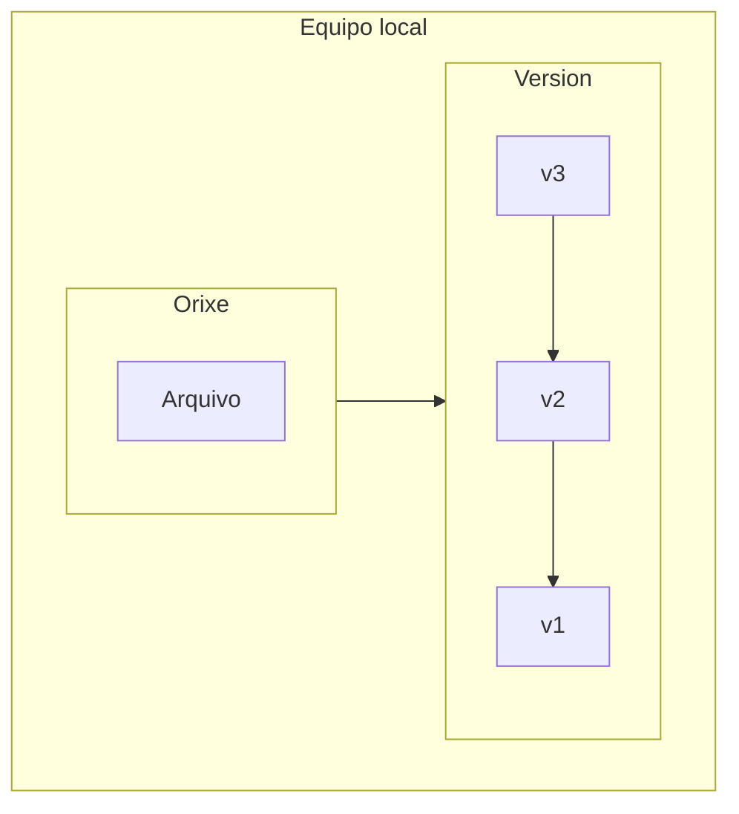
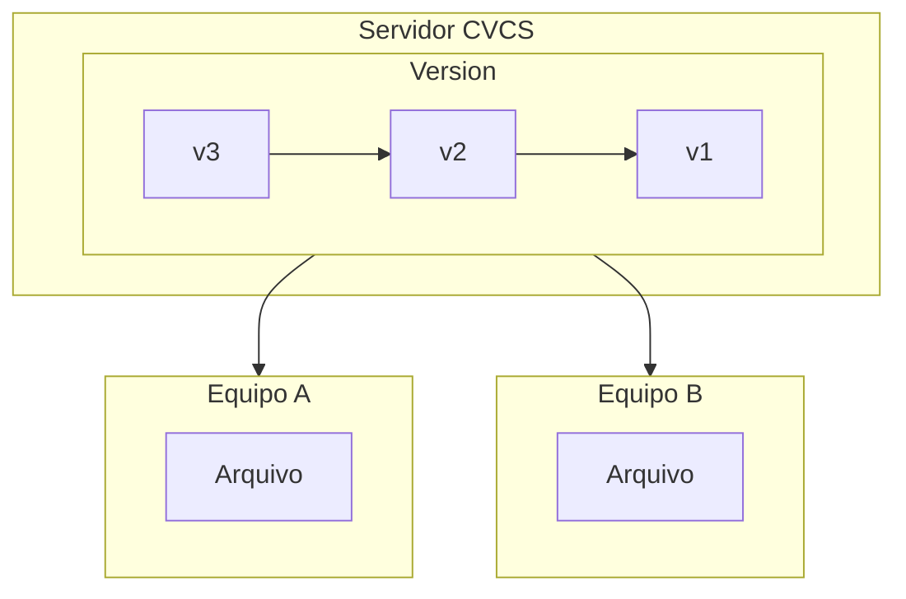
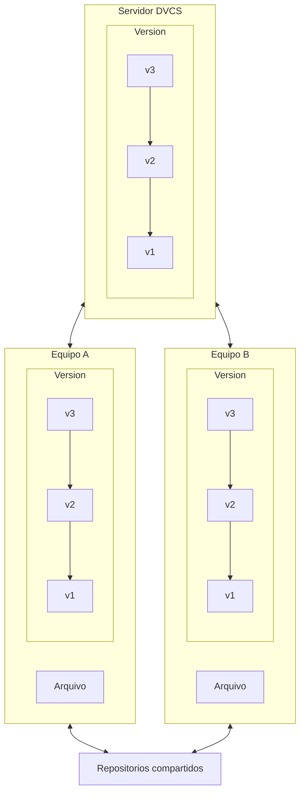

# Historia

[Git](https://git-scm.com/) es un software de control de versiones distribuido, que facilita y asegura el trabajo colaborativo en nuestros repositorios de código.

Git surgió como un nuevo proyecto de software de control de versiones para administrar y controlar los cambios de software que se realizaron a través de parches y archivos.

Las herramientas de control de versiones solían tener una mentalidad de servidor central. Cuando quería trabajar en un archivo, se marcaba y quedaba disponible solo para el usuario que trabajaba con él. La solución era perfecta para el trabajo individual y centralizado, pero podemos imaginar algunas barreras en esta metodología:

- [Punto único de error](https://es.wikipedia.org/wiki/Punto_%C3%BAnico_de_fallo) (SPOF) debido a la estructura centralizada.
- Dificulta el trabajo colaborativo.
- Ralentiza el proyecto, especialmente a medida que crece.

Como solución al problema y para el proyecto de mantenimiento del kernel de Linux en el año 2002 se empezó a utilizar una herramienta de control de versiones distribuidas llamada [Bitkeeper](https://www.bitkeeper.org/). Poco tiempo después y como resultado de problemas comerciales con el uso de Bitkeeper [Linus Torvalds](https://es.wikipedia.org/wiki/Linus_Torvalds) creó Git en 2005 como una oferta de código abierto para Bitkeeper, la experiencia del mismo y las mejoras que se implementaron.

> Hoy Git es una de las herramientas de trabajo en línea más utilizadas en el mundo.

# Sistemas de control de versiones

Un control de versiones es un sistema que registra los cambios realizados en un archivo o conjunto de archivos a lo largo del tiempo, de manera que podamos recuperar estas versiones más adelante.

Esto nos permite revertir versiones anteriores de un proyecto, comparar cambios, depurar problemas, ver quién agregó un cambio...

Disponemos de diferentes tipos de sistemas de control de versiones:

- Sistemas de control de versiones locales
- Sistemas de control de versiones centralizado
- Sistemas de control de versiones distribuidos

## Sistemas de control de versiones locales

El VCS local contiene una base de datos simple en la que se guarda el registro de todos los cambios realizados en los archivos. Esto se almacena localmente en la computadora del trabajo y para uno mismo.

- Ventajas:
   - Herramienta sencilla.
   - Rápida implementación.
- Desventajas:
   - No es útil como herramienta colaborativa.
   - Punto único de fallo.

## Sistemas de control de versiones centralizado

El principal problema lo encontramos en los sistemas de control de versiones VCS y que en el día a día son fundamentales poder colaborar con otros programadores en otros sistemas. Los sistemas de control de versiones centralizados CVCS se crearon para solventar esta inconveniencia.

Estos sistemas cuentan con un único servidor que contiene todos los archivos versionados y varios clientes que descargan los archivos desde esa ubicación centralizada.

- Ventajas:
   - Todos los colaboradores conocen en cierta medida en qué están trabajando el resto de socios del proyecto.
   - Los administradores tienen control sobre los permisos de acceso de cada usuario.
   - La administración es mucho más sencilla que tener que lidiar con las bases de datos locales de cada cliente.

- Desventajas:
  - Punto único de fallo.

## Sistemas de control de versiones distribuidos

Los sistemas de control de versiones distribuidos DVCS ofrecen soluciones a todos los problemas mencionados anteriormente.

Los clientes más antiguos descargan la última copia instantánea de los archivos y replican completamente el repositorio. Con esto eliminamos el SPOF y en caso de falla del sistema se puede restaurar el proyecto usando cualquiera de los repositorios disponibles en los clientes.

- Ventajas:
   - Todos los colaboradores conocen en cierta medida en qué están trabajando el resto de socios del proyecto.
   - Los administradores tienen control sobre los permisos de acceso de cada usuario.
   - La administración es mucho más sencilla que tener que lidiar con las bases de datos locales de cada cliente.
   - Con repositorios distribuidos eliminamos el SPOF

- Desventajas:
  - Es más complejo de configurar en comparación con VCS y DVCS.
