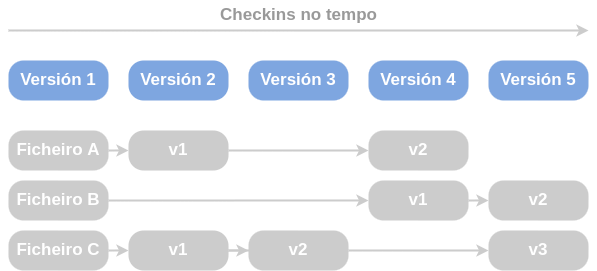
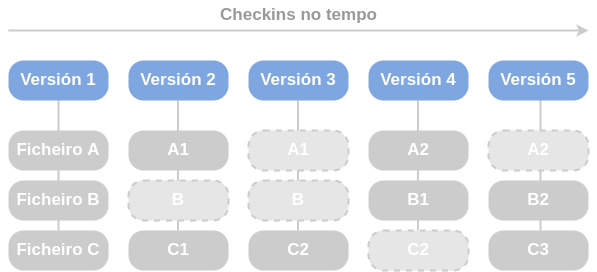
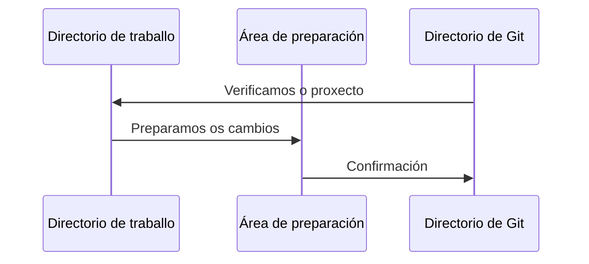

# Fundamentos de Git

A continuación veremos as diferencias máis relevantes entre Git e outros VCS que o posicionan como unha das ferramentas máis importantes:

## Tipos de VCS e versionado
A diferencia de outros VCS, Git manexa os seus datos como un conxunto de copias instantáneas de un sistema de arquivos en miniatura. Cando se produce unha modificación ou gardas o estado do teu proxecto en Git realíazse un snapshot do aspecto de tódos arquivos nese momento e gárdase unha referencia á mesma.

> Se un ficheiro non se modifica o que se crea no momento é un enlace ó ficheiro anterior que xa se ten almacenado. De este modo gañamos en eficiencia

**- Outros VCS:**

Os cambios almacénanse como cambios na versión da base de cada ficheiro.

**- Git instantáneas:**

Os cambios almacénanse como instantáneas no proxecto a través do tempo.

## A maioría de operacións son en local

Git almacena no noso equipo local unha copia dos nosos ficheiros de modo que poidamos traballar e facer uso deles en modo offline. A maioría das operacións sólo precisan dos ficheiros e recursos locais, polo que eliminamos os retardos de rede e a necesidad de estar permanentemento con conexión.

Cando precisemos de ver os cambios antigos só temos que revisar no noso disco local onde temos toda a historia e facer un cálculo de diferencias, o que axiliza enormemente este proceso.

> Esta forma de operativa permítenos traballar sen conexión e só actualizar os nosos datos ou subir as nosas modificacións cando nos sexa preciso, o cal elimina a necesidade de ter unha conexión constante á rede.

## Integridade da información

Todo en Git é verificado mediante [checksum](https://en.wikipedia.org/wiki/Checksum) o que nos garante a súa integridade e inmutabilidade nos ficheiros. O mecanismo de uso é SHA-1.

Estos checksum están presentes en todo Git.

## Git modifica engadindo información

Unha vantaxe de seguridade en Git é a súa forma de modificación da información na nosa base de datos. Unha vez os cambios están confirmados como copia instantánea é moi difícil perdelos, especialmente se temos os nosos repositorios replicados e actualizados con regularidade.

## Os estados de Git

Git ten 3 estados principais nos que podes atopar os teus ficheiros:

- **Confirmado (commited):** os datos atópanse almacenados na nosa base local.
- **Modificado (modified):** modificáronse os ficheiros, pero aínda non se confirmaron os cambios na nosa base de datos.
- **Preparado (staged):** marcáronse os ficheiros modificados na súa versión actual, para que se inclúan no próxima confirmación.

En orixe a estos 3 estados podemos definir as 3 seccións que temos nun proxecto de Git:

- **Directorio de Git (Git directory):** é o directorio onde se gardan os metadatos e a base de datos do noso proxecto. Este directorio é o que se copia cando clonamos un repositorio.
- **Directorio de traballo (working directory):** este directorio é unha copia da versión do proxecto. Estes ficheiros veñen do directorio comprimido de Git e colócanse en disco para que os usemos.
- **Área de preparación (staging area):** é un ficheiro que contén información acerca do que vai ser incluido na nosa próxima confirmación (index).

Neste diagrama vemos como funciona o fluxo de traballo:
1. Modificamos unha serie de ficheiros no noso **directorio de traballo**.
2. Preparámolos ficheriros, engadíndoos na nosa **área de preparación**.
3. Confirmámolos cambios, ó que produce unha instantánea do estado actual dos ficheiros e a copia de maneira permantente no noso **directorio de Git**.

>⚠️ **IMPORTANTE:** Unha versión concreta dun ficheiro no directorio Git está confirmada (committed). Se sufriu cambios, pero foi engadida á área de preparación atoṕase preparada (staged). Se sufriu cambios desde que foi obtida pero non está preparada (staged) atópase modificada (modified).
