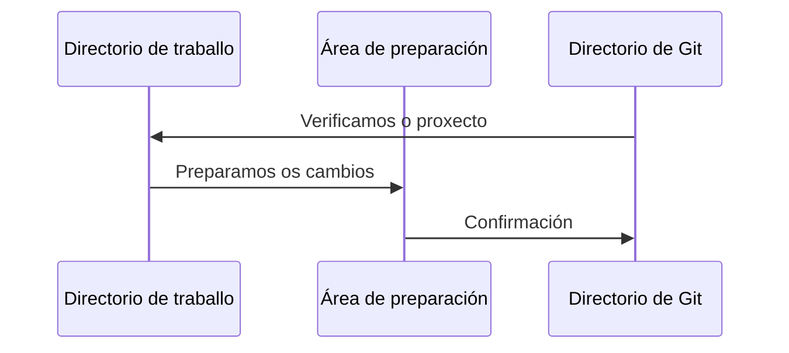

# Fundamentos de Git

A continuación veremos las diferencias más relevantes entre Git y otros VCS que lo posicionan como una de las herramientas más importantes.

## Tipos y versiones de VCS
A diferencia de otros VCS, Git maneja sus datos como un conjunto de instantáneas de un sistema de archivos en miniatura. Cuando se produce una modificación o se guarda el estado del proyecto en Git, se toma una instantánea de la apariencia de todos los archivos en ese momento y se guarda una referencia.

> Si no se modifica un archivo, lo que se crea en ese momento es un enlace al archivo anterior que ya ha sido almacenado. De esta manera ganamos en eficiencia

**- Otros VCS:**

Los cambios se almacenan como cambios en la versión base de cada archivo.

**- Instantáneas de Git:**

Los cambios se almacenan como instantáneas en el proyecto a lo largo del tiempo.

## La mayoría de las operaciones son locales

Git almacena una copia de nuestros archivos en nuestra computadora local para que podamos trabajar y usarlos sin conexión. La mayoría de las operaciones solo requieren archivos y recursos locales, por lo que eliminamos los retrasos en la red y la necesidad de estar permanentemente conectado.

Cuando necesitamos ver los cambios antiguos, solo tenemos que consultar en nuestro disco local donde tenemos todo el historial y hacer un cálculo de diferencia, lo que acelera enormemente este proceso.

> Esta forma de operar nos permite trabajar offline y solo actualizar nuestros datos o subir nuestras modificaciones cuando lo necesitemos, lo que elimina la necesidad de tener una conexión constante a la red.

## Integridad de la información

Todo en Git se verifica usando [checksum](https://en.wikipedia.org/wiki/Checksum) lo que nos garantiza su integridad e inmutabilidad en los archivos. El mecanismo utilizado es SHA-1.

Estos checksum están presentes en todo Git.

## Git modifica agregando información

Una ventaja de seguridad en Git es su forma de modificar la información en nuestra base de datos. Una vez que los cambios se confirman como una instantánea, es muy difícil perderlos, especialmente si tenemos nuestros repositorios replicados y actualizados regularmente.

## Estados de Git

Git tiene 3 estados principales donde puedes encontrar tus archivos:

- **Confirmado (commited):** Los datos se almacenan en nuestra base de datos local.
- **Modificado (modified):** Los archivos han sido modificados, pero los cambios aún no han sido confirmados en nuestra base de datos.
- **Preparado (staged):** Los archivos modificados han sido marcados en su versión actual, para ser incluidos en la próxima confirmación.

En base a estos 3 estados podemos definir las 3 secciones que tenemos en un proyecto Git:

- **Directorio Git (Git directory):** Es el directorio donde se guardan los metadatos y la base de datos de nuestro proyecto. Este directorio es lo que se copia cuando clonamos un repositorio.
- **Directorio de trabajo (working directory):** Este directorio es una copia de la versión del proyecto. Estos archivos provienen del directorio zip de Git y se colocan en el disco para que los usemos.
- **Área de preparación (staging area):** Es un archivo que contiene información sobre lo que se incluirá en nuestra próxima confirmación (índice).

En este diagrama vemos cómo funciona el flujo de trabajo:
1. Modificamos varios archivos en nuestro **directorio de trabajo**.
2. Preparamos los archivos, agregándolos a nuestra **área de preparación**.
3. Confirmamos los cambios, lo que produce una instantánea del estado actual de los archivos y los copia permanentemente en nuestro **directorio Git**.

>⚠️ **IMPORTANTE:** Se confirma una versión específica de un archivo en el directorio de Git. Si ha sufrido cambios, pero se ha agregado al área de preparación, todavía está preparado. Si ha sufrido cambios desde que se obtuvo pero no se escenifica, se modifica.
