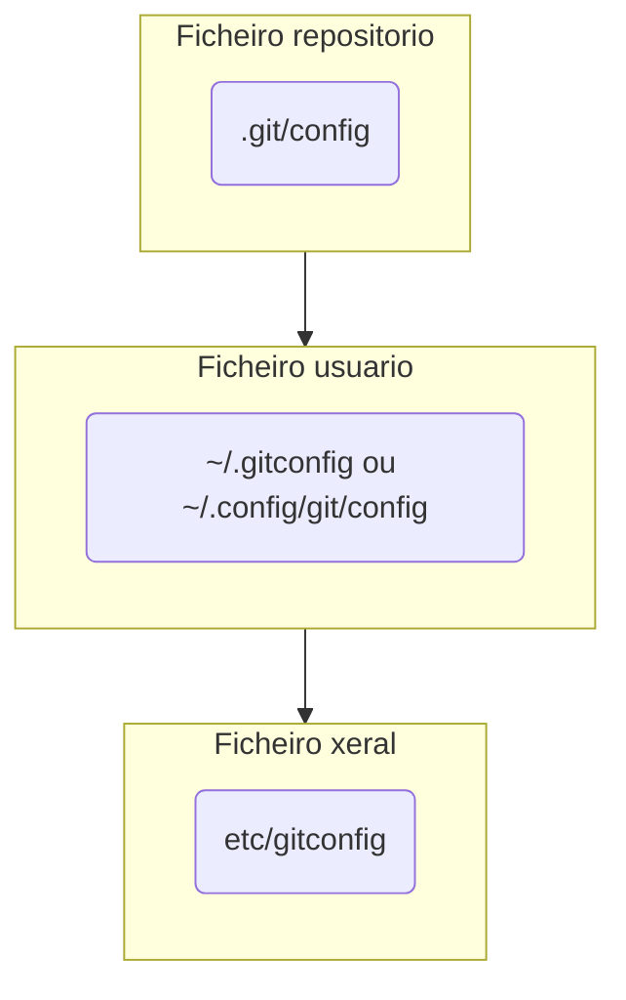

# Módulo 1: Primeros pasos, configuración e instalación

En esta tarea vamos a instalar Git en nuestra máquina, realizar nuestra configuración inicial y clonar nuestro primer repositorio.

## 1. Instalación de Git

A continuación, instalaremos Git en los diferentes tipos de sistemas operativos. Tenemos varias formas de instalar Git, pero iremos a las formas más comunes o directas.

### 1.1 Instalación en Windows

Para instalar Git en Windows tenemos dos opciones principales:
1. **mysisGit**: debemos ir al enlace [Git para Windows](https://git-scm.com/download/win), elegir nuestro instalador o tipo de instalador y proceder con la descarga.

2. **GitHub para Windows** es otra forma de instalar Git en nuestra computadora con Windows. Este instalador además del CLI incluye una interfaz de usuario muy completa e intuitiva, que puede facilitar mucho el trabajo.

> Lo mejor es comenzar con Git CLI para familiarizarse con los comandos.

### 1.2 Instalación en Linux y Unix

Podemos instalar Git en Linux de diferentes maneras, pero veamos las diferentes **herramientas de administración de paquetes** en las diferentes distribuciones:

1. Fedora:

    ```bash
    # hasta Fedora 21
    $ yum install git
    # Fedora 22 y posteriores
    $ dnf install git
    ```

2. Debian/Ubuntu:

    ```bash
    # la última versión estable para nuestro lanzamiento de Debian/ubuntu
    $ apt-get install git
    # en Ubuntu este PPA proporciona la última versión estable
    $ add-apt-repository ppa:git-core/ppa
    $ apt update; apt install git
    ```

3. Alpine

    ```bash
    $ apk add git
    ```

Para otras versiones podemos ver más en [Descargas para Linux e Unix](https://git-scm.com/download/linux).

### 1.3 Instalación en Mac

Veamos las formas más comunes:
1. Cómo funcionan las herramientas de Línea de Comandos de Xcode, a partir de Mavericks 10.9 si ejecutamos **git** desde la Terminal nos preguntará si queremos instalarlo, esto si no lo tenemos.

2. Podemos usar una versión más actualizada de un instalador binario disponible [aquí](https://sourceforge.net/projects/git-osx-installer/).

3. Herramientas de administración de paquetes:

    - Homebrew:
    ```bash
    # Versión sin interfaz
    $ brew install git
    # Versión con interfaz GUI
    $ brew install git-gui
    ```
    - MacPorts:
    ```bash
    $ sudo port install git
    ```

4. Instalador de Git en OS X en el sitio web [GitHub Desktop](https://desktop.github.com/).

### 1.4 Instalación en VSCode

[Visual Studio Code](https://code.visualstudio.com/) es un potente editor de texto que nos permite trabajar de forma muy cómoda y ágil por su versatilidad, facilidad y número de plugins, y que se integra fácilmente con [Git](https://git-scm.com/).

Para instalar la extensión de [Git](https://marketplace.visualstudio.com/items?itemName=donjayamanne.git-extension-pack) en [Visual Studio Code](https://code.visualstudio.com/) es tan sencillo como ir al apartado de las extensiones, escribir `git` en el cuadro de búsqueda e instalamos la extensión.

Existen muchas opciones que facilitan el uso de estas extensiones, pero en VSCode tenemos la funcionalidad `Terminal` que nos muestra una terminal en una ventana de interfaz donde podemos hacer uso del Git CLI instalado en cualquiera de los pasos anteriores sin necesidad de agregar una extensión extra.

Podemos utilizar cualquier otro editor de texto de nuestra preferencia para realizar las actividades, pero por la facilidad de uso e integración con las herramientas que vamos a utilizar, recomendamos [Visual Studio Code](https://code.visualstudio.com/).

> Para comprobar que todo ha ido correctamente y saber la versión de Git que acabamos de instalar utilizamos el comando `git version`.

## 2. Configuración de Git

Una vez hayamos instalado Git en nuestro ordenador tendremos que configurarlo por primera vez para personalizar nuestro entorno.

Estos ajustes se mantendrán a lo largo de las actualizaciones, pero siempre podremos volver a modificarlos cuando sea necesario.

### 2.1 Ficheros Git

Git dispone de la herramienta `git config` que nos permite obtener y establecer variables de configuración que controlan la apariencia y funcionamiento de Git.

Disponemos de 3 archivos de configuración diferentes donde almacenar estas variables:
- `etc/gitconfig`: Contiene todos los valores para todos los usuarios del sistema y sus repositorios. **Comando**: `git config --system`.
- `~/.gitconfig` o `~/.config/git/config`: Fichero específico de nuestro usuario. **Comando**: `git config --global`.
- `.git/config`: Fichero `config` en el directorio Git del repositorio que estamos usando actualmente.

Cada nivel sobrescribe al anterior, por lo que podemos tener una configuración general de la máquina, una por usuario y específica para cada repositorio.

### 2.2 Git config

Comencemos la configuración de Git configurando nuestro nombre de usuario y dirección de correo electrónico. Los commits de Git utilizan esta información, ya que queda incluida en ellos:

```bash
# nome de usuario
$ git config --global user.name "user prefapp"
# email de usuario
$ git config --global user.email user_prefapp@prefapp.com
```

Con la opción `--global` tenemos definida esta configuración para todo el sistema. Para definirlo individualmente solo tenemos que configurar `git config` esta vez sin el atributo `--global`.

También podemos elegir el editor por defecto:

```bash
$ git config --global core.editor [emacs|vim|vi|...]
```

> Si no especificamos nada, Git usará el editor que tenemos por defecto, normalmente Vim.

Podemos comprobar nuestra configuración con el comando `git config --list`, que nos dará un resultado como el siguiente:

```bash
$ git config --list
user.name=user prefapp
user.email=user_prefapp@prefapp.com
color.status=auto
color.branch=auto
color.interactive=auto
color.diff=auto
...
```

Si aparecen claves duplicadas es porque Git está leyendo en diferentes archivos de configuración.

> Si queremos verificar el valor de una clave específica, la recolectamos usando `git config <key>`:

```bash
$ git config --user.name
user prefapp
```
>⚠️ Si tenemos dudas sobre la configuración o cualquier comando de Git, siempre podemos usar el manual:

```bash
$ git help <comando>
$ git <comando> --help
$ man git-<comando>
```

## Evaluación

**Evidencia de la adquisición de actuaciones**:
- Resultado de la versión Git instalada.
- Resultado de la configuración inicial.

**Indicadores de logros**:
- Git correctamente instalado.
- Realizada correctamente la configuración inicial.

**Criterios de corrección**:
- 5 puntos si Git se instaló correctamente.
- 5 puntos si la configuración principal se realizó correctamente.
**Autoevaluación**: Revisa y autoevalúa tu trabajo aplicando los indicadores de logro.

**Peso en calificación**:
- Peso de esta tarea en la calificación final ................................. 10 puntos
- Peso de esta tarea en su tema .................................................... 10%
---
