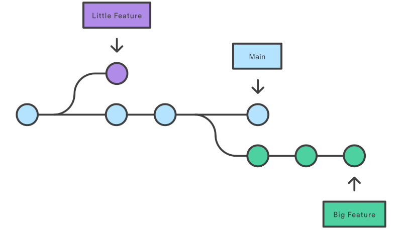

# Secciones git 

Un proyecto GIT, consta de tres secciones principales en local:

- **Directorio de trabajo (Working dir)** – donde se agregan, borran y editan los archivos.
- **Área de preparación (INDEX. Staging area)** – donde se preparan (Indexan) los cambios.
- **Directorio git (HEAD. local repo)** – donde se confirman los cambios efectuados dejando un mensaje en el registro.

Desde el directorio GIT en local se subirá al repositorio remoto (Remote repo) que se haya escogido.

<div style="text-align: center;">
  <div style="margin: 0 auto;">


  </div>
</div>

Según la anterior imagen, nuestro trabajo en Git puede tener tres estados: modificado (modified), preparado (staged) y confirmado (committed).
- **Modificado**: significa que has modificado el archivo pero todavía no lo has confirmado a tu base de datos. 
- **Preparado**: significa que has marcado un archivo modificado en su versión actual para que vaya en tu próxima confirmación.
- **Confirmado**: significa que los datos están almacenados de manera segura en tu base de datos local.


## Ramificación (Branching)

La creación de ramas es una función disponible en la mayoría de los sistemas de control de versiones modernos. En Git, las ramas son parte del proceso de desarrollo diario. Las ramas de Git son un puntero eficaz para las instantáneas de tus cambios. 

Cuando quieres añadir una nueva función o solucionar un error, independientemente de su tamaño, generas una nueva rama para alojar estos cambios. Esto hace que resulte más complicado que el código inestable se fusione con el código base principal, y te da la oportunidad de limpiar tu historial futuro antes de fusionarlo con la rama principal.

<div style="text-align: center;">
  <div style="margin: 0 auto;">



  </div>
</div>

Los tipos de ramas más usados en git son:
- **Main**: La rama principal o por defecto (main) es la rama principal de un repositorio Git. Contiene el código estable y debe ser utilizada como la base para crear nuevas ramas. Hace algún tiempo, la convención general para la rama principal era llamarla **master**, pero se ha cambiado por razones de inclusión.
- **Feature**: Una rama de característica (feature) se utiliza para desarrollar nuevas funcionalidades en un proyecto. Se crea a partir de la rama principal y se elimina una vez que la nueva funcionalidad se ha integrado en la rama principal.
- **Fix**: Una rama de corrección (fix) se utiliza para corregir errores o fallos en el código. Se crea a partir de la rama principal o de una rama de característica, y una vez que se ha corregido el error, se integra de nuevo en la rama principal o en la rama de característica correspondiente.
- **Hotfix**: Una rama de corrección urgente (hotfix) se utiliza para corregir errores críticos que deben ser solucionados inmediatamente. Se crea a partir de la rama principal y se integra de forma inmediata en la rama principal y en las ramas de característica correspondientes.
- **Test**: Una rama de pruebas (test) se utiliza para realizar pruebas de integración o de rendimiento en el código. Se crea a partir de la rama principal o de una rama de característica, y una vez que se han realizado las pruebas, se integra en la rama principal o en la rama de característica correspondiente.
- **Release**: Una rama de lanzamiento (release) se utiliza para preparar una nueva versión del software para su publicación. Se crea a partir de la rama principal y se utiliza para hacer ajustes finales, correcciones de errores y pruebas de última hora antes de que la nueva versión sea lanzada.
- **Experimental**: Una rama experimental (experimental) se utiliza para desarrollar nuevas funcionalidades o probar ideas que aún no han sido completamente definidas. Esta rama se utiliza para experimentar y no suele integrarse directamente en la rama principal.
- **Refactor**: Una rama de refactorización (refactor) se utiliza para realizar cambios en el código que mejoran la calidad o la eficiencia del mismo, pero que no añaden nuevas funcionalidades. Se crea a partir de la rama principal o de una rama de característica y se integra de nuevo en la rama correspondiente una vez que se han realizado los cambios.
- **Doc**: Una rama de documentación (doc) se utiliza para actualizar o mejorar la documentación del proyecto. Esta rama se crea a partir de la rama principal y se integra de nuevo en la rama principal una vez que se han realizado los cambios en la documentación.

Existen diversas estrategias de creación de ramas, hablaremos de ello más adelante. Lo importante es tener claro cuál es la estrategia que se utiliza en cada proyecto para poder adaptarte a ella. 

La siguiente imagen ilustra un ejemplo de ramificación:

<div style="text-align: center;">
  <div style="margin: 0 auto;">


  </div>
</div>

Hay que tener en cuenta que al crear una bifurcación de la rama principal pueden crearse conflictos con otros compañeros que colaboren en el proyecto. 👀 Para evitarlos, es importante:
- Antes de crear una nueva rama, asegurar de que tu copia local de la rama principal está actualizada.
- Intentar fusionarla (merge) con la principal tan pronto como sea posible. (Es como una lata de comida abierta, puede oler mal si no se cierra a tiempo).
- Las ramas deben ser lo más cortas posible, para que sea más fácil su integración con la rama principal.

### Tags (etiquetas) y releases (versiones de lanzamiento)

Las tags (etiquetas) y las releases (versiones de lanzamiento) se utilizan en Git para marcar puntos específicos en la historia del repositorio y para identificar versiones estables del software, utilizando el identificador de 40 carácteres del commit ("hash de commit" o "SHA-1 hash").

Las **etiquetas** se utilizan, por ejemplo, para marcar una versión específica del código que se ha lanzado haciendo referencia a un punto concreto en la historia del repositorio, y para identificar versiones importantes del software. 

Para crear una etiqueta en Git, se utiliza el comando git tag, seguido del nombre de la etiqueta y el hash del commit (Se puede utilizar el resumen del hash) al que se quiere hacer referencia. Por ejemplo:

```bash
git tag v1.0.0 3a2e7c6
```

Las **versiones de lanzamiento** se utilizan para identificar versiones estables del software que se han lanzado para su uso en producción. Una versión de lanzamiento suele incluir un conjunto de funcionalidades y correcciones de errores, y se considera estable y lista para su uso en producción.

Para crear un lanzamiento en Git, se pueden seguir los siguientes pasos:

1. Crear una etiqueta que identifique la versión del lanzamiento, utilizando el comando git tag, como se ha descrito anteriormente.
2. Crear la release, que incluirá los archivos binarios o código fuente de la versión lanzada, junto con la documentación y los archivos de configuración necesarios para su uso.

Las releases pueden ser útiles para comunicar a los usuarios, colaboradores o clientes del software qué funcionalidades y correcciones se han incluido en una versión específica del software, y para proporcionar una forma fácil de descargar y utilizar el software lanzado. Para ello, se puede añadir un fichero `changelog.md` o similar a la raíz del repositorio, donde se incluya una lista de cambios en cada versión del software.

## Fusión

La fusión (merge) de ramas en Git es el proceso de combinar los cambios realizados en una rama con los cambios realizados en otra rama. La fusión de ramas es una de las funciones principales de Git, y permite a los equipos de desarrollo trabajar en paralelo en diferentes características o correcciones de errores en diferentes ramas, y luego integrar los cambios en una rama común para crear una versión estable del software.

Para fusionar dos ramas en Git, se puede utilizar el comando git merge. Por ejemplo, si se quiere fusionar la rama "feature" con la rama "main", se puede hacer lo siguiente:

1. Cambiar a la rama "main": `git checkout main`
2. Ejecutar el comando `git merge` y especificar la rama "feature": `git merge feature`
3. Si no hay conflictos en la fusión, Git fusionará automáticamente las ramas y creará un nuevo commit de fusión.

Si hay conflictos en la fusión, Git mostrará los archivos con conflictos y pedirá al usuario que resuelva los conflictos manualmente antes de que se pueda completar la fusión. De esto hablaremos más adelante.

Es importante tener en cuenta que la fusión de ramas en Git puede afectar a la historia del repositorio, por lo que es importante seguir las mejores prácticas de Git al realizar la fusión, como realizar pruebas y hacer copias de seguridad antes de la fusión, y asegurarse de que todas las ramas estén actualizadas antes de la fusión.

En esta sección se ha explicado la fusión de ramas en local, pero es conveniente por su transparencia fusionar las ramas en el repositorio remoto. Para ello, se puede utilizar la interfaz web del repositorio remoto, o si la tiene, usar alguna herramienta de línea de comandos complementaria que se puede instalar en el equipo local. Por ejemplo, en GitHub, se puede utilizar GitHub CLI para fusionar ramas en el repositorio remoto.
