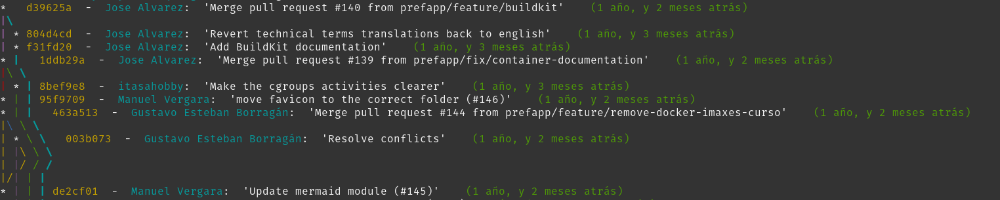

# Comandos básicos git

Los comandos más utilizados:

- `git init`: inicializa un nuevo repositorio Git vacío en la carpeta actual.
- `git add`: agrega cambios de archivos específicos o de todos los archivos nuevos o modificados al área de preparación.
- `git commit`: crea un nuevo commit con los cambios en el área de preparación y un mensaje de commit descriptivo.
- `git status`: muestra el estado actual del repositorio, incluyendo los archivos modificados, los archivos en el área de preparación y los commits pendientes.
- `git log`: muestra el historial de commits del repositorio, incluyendo los mensajes de commit, los autores y las fechas de cada commit.
- `git branch`: muestra una lista de ramas en el repositorio, y también se puede utilizar para crear, eliminar y cambiar de rama.
- `git checkout`: cambia de rama, crea una nueva rama, o cambia el estado de los archivos en el repositorio.
- `git merge`: fusiona dos ramas en una rama común, y también se puede utilizar para resolver conflictos de fusión.
- `git pull`: descarga y fusiona los cambios más recientes de un repositorio remoto en el repositorio local.
- `git push`: envía los cambios locales a un repositorio remoto.
- `git diff`: muestra las diferencias entre dos archivos o entre dos commits, y también se puede utilizar para comparar los cambios entre dos ramas.
- `git reset`: deshace cambios en el repositorio, ya sea eliminando los cambios del área de preparación o eliminando un commit específico.
- `git rm`: elimina archivos del repositorio y también los elimina del área de preparación.
- `git mv`: cambia el nombre de un archivo o mueve un archivo de una ubicación a otra, y también actualiza el estado del repositorio y el área de preparación.
- `git stash`: guarda temporalmente los cambios en una pila de cambios y restablece el repositorio a su estado anterior, lo que puede ser útil para cambiar rápidamente de rama o para guardar cambios inacabados.
- `git tag`: crea una etiqueta para un commit específico, lo que puede ser útil para marcar versiones o hitos importantes.
- `git remote`: muestra una lista de los repositorios remotos asociados con el repositorio local, y también se puede utilizar para agregar, eliminar y actualizar repositorios remotos.
- `git fetch`: descarga los cambios más recientes de un repositorio remoto en el repositorio local, pero no fusiona los cambios con la rama actual.
- `git clone`: crea una copia completa de un repositorio remoto en una nueva carpeta local.

No olvides consultar la [guía oficial de comandos de git](https://git-scm.com/docs/git) para sacarle el máximo partido a git.


## 10 comandos (menos uno) muy útiles

1. Cuando pones mal un comando en Git te suele sugerir el correcto. Puedes hacer que se ejecute automáticamente configurando el tiempo de autocorreción:

    ```bash
    git config --global help.autocorrect 1
    ```

2. Volver a la rama anterior rápidamente usando:

    ```bash
    git switch -
    ```

    Si no tienes `git switch`, puedes usar `git checkout`.

3. El git log por defecto no ofrece una información visual. Con unas pocas opciones puedes conseguir colores, ramificaciones y más información.

    ```bash
    git log --pretty=oneline --graph --decorate --all
    ```

    Un ejemplo vistoso de lo que puedes conseguir es el siguiente:

    ```bash
    git log --graph --pretty=format:"%C(yellow)%h%Cred%d%Creset  -  %C(cyan)%an%Creset:  '%s'    %Cgreen(%cr)%Creset"
    ```

    Que devuelve un resultado como el siguiente:

    

    Y para no tener que recordar el comando se puede definir un alias (por ejemplo, `gglog`) en el archivo `.zshrc`/`.bashrc`.

4. Si no quieres pasar por la fase de staging de Git, si añades el parámetro `-a` al commit, te saltas la necesidad de ejecutar `git add` sobre esos ficheros.

    ⚠️ Ojo. No funciona si es un fichero nuevo. Sólo ficheros modificados.

5. Se pueden crear alias en el fichero de configuración de Git de los comandos más usados. Por ejemplo, con dos letras para `git commit`:

    ```bash
    git config --global alias․co commit
    ```

    Ahora podrás usar:

    ```bash
    git co
    ```

6. Push a múltiples remotos a la vez.

    Primero configura el repositorio remoto como lo tendrías normalmente, con push y fetch

    ```bash
    git remote add origin git@github.com:[username]/[repository]
    ```

    Puedes confirmar esta configuración listando los remotos configurados

    ```bash
    git remote -v
    ```

    Ahora configura las multiples URLs remotas incluyendo la que acabas de añadir.

    ```bash
    git remote set-url --add --push origin git@github.com:[username]/[repository]
    git remote set-url --add --push origin git@bitbucket.org:[username]/[repository]
    ```

    Y si confirmas de nuevo con git remote -v podrás ver configuradas ambas URLs como push más la primera como fetch.

    ```bash
    origin	git@github.com:[username]/[repository] (fetch)
    origin	git@github.com:[username]/[repository] (push)
    origin	git@bitbucket.org:[username]/[repository] (push)
    ```

7. Puedes añadir ficheros al commit anterior con:

    ```bash
    git commit --amend
    ```

    Esto es útil cuando has olvidado añadir algo al commit anterior.
    ⚠️ Ojo. No lo hagas si ya has hecho push del commit.

8. Imagina que has modificado varios archivos de un repositorio, pero solo quieres hacer commit de uno de ellos. ¿Como puedo hacer commit de un sólo fichero de mi repositorio?

    ```bash
    git commit -m "Aquí tu mensaje del commit" archivo.txt
    ```

9. En caso de que hayamos añadido al staging con `git add` un archivo que aun no esta listo para subir, podemos volver atrás con:

    ```bash
    git rm --cached nombrefichero.txt
    ```
    
    o, si queremos sacar del staging todos los archivos por que nos hemos equivocado haciendo un `git add .`, podemos utilizar 
    ```bash
    git reset HEAD. 
    ```
    ⚠️ Ojo. No lo hagas si ya has hecho push del commit.

    ⚠️ Ojo. No deberías utilizar `git add .` con el punto, la buena práctica es añadir los archivos uno a uno con `git add nombrearchivo.txt`. Recordemos que los pull request deben ser lo más pequeños posible, así que los commits también.

## Cheatsheat comandos
Un cheatsheet es una hoja de referencia rápida que contiene los comandos más utilizados de un lenguaje o herramienta. En este caso, el cheatsheet de git. Aquí tienes algunos que te pueden ayudar:
- Cheatsheat [oficial de git](https://training.github.com/downloads/es_ES/github-git-cheat-sheet/)
- Cheatsheet de [GitLab](https://about.gitlab.com/images/press/git-cheat-sheet.pdf)
- Cheatsheet de [GitHub](https://education.github.com/git-cheat-sheet-education.pdf)
- Cheatsheet de [Atlassian](https://www.atlassian.com/es/git/tutorials/atlassian-git-cheatsheet)
- Cheatsheet de [Git Tower](https://www.git-tower.com/blog/git-cheat-sheet/)
- Cheatsheet de [Cheatography](https://cheatography.com/itsellej/cheat-sheets/git-commands/)
