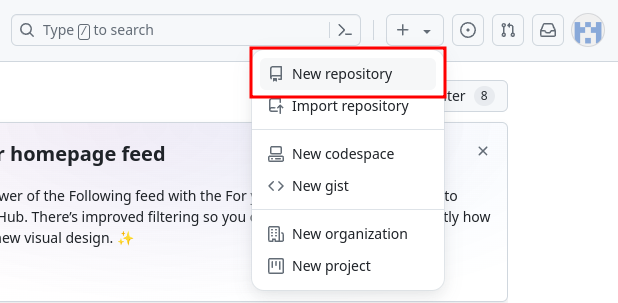

# Práctica guiada - Clonar repo, creación de ramas, primer commit y push request

Hemos pasado por unas largas lecturas teóricas, así que esta práctica será muy corta. En esta práctica guiada vamos a clonar un repositorio, crear una rama, realizar un primer commit y crear un pull request.

## Crear una cuenta en Github

Para poder realizar esta práctica, será necesario tener un usuario en una plataforma para repositorios remotos. Si no lo tienes todavía, puedes crearlo en Github, accediendo a [https://github.com/signup](https://github.com/signup).

  

  

## Crear un nuevo repositorio

Necesitamos tener un repositorio para poder trabajar sobre él desde nuestra máquina. En Github, los pasos a seguir son:

- En la esquina superior derecha de cualquier página, seleccionar la opción '+' > New repository.
- 

  

  

- En la página que se nos abre, cubrimos las siguientes opciones:

  - Repository name: mi-primer-repositorio.
  - Seleccionamos "Public".
  - Seleccionamos "Add a README file".

  El resto de opciones se pueden dejar por defecto, por lo que pinchamos en "Create repository".

- Copiamos la ruta de nuestro repositorio, que será algo similar a "https://github.com/username/mi-primer-repositorio".

## Clonar el repositorio

- Abre la línea de comandos (terminal) en tu computadora. Navega hasta la carpeta donde quieres clonar el repositorio usando el comando `cd <ruta_de_la_carpeta>`.
- Clona el repositorio usando el comando `git clone <URL_del_repositorio>`.

## Crear una rama

- Navega hasta la carpeta del repositorio clonado usando el comando `cd mi-primer-repositorio`.
- Crea una nueva rama usando el comando `git branch <nombre_de_la_rama>`.
- Cambia a la nueva rama usando el comando `git checkout <nombre_de_la_rama>`.

## Realizar el primer commit

- Crea un nuevo archivo o modifica uno existente en la carpeta del repositorio.
- Ejecuta `git status` para ver qué ficheros tienen cambios locales.
- Agrega los cambios al área de preparación (staging area) usando el comando `git add <nombre_del_archivo_modificado>` o `git add .` para agregar todos los cambios realizados. Puedes ejecutar de nuevo `git status` para comprobar cómo ahora el fichero aparece en el área de staging.
- Confirma los cambios realizados usando el comando `git commit -m "<mensaje_del_commit>"`. Asegúrate de incluir un mensaje descriptivo que indique qué cambios se realizaron.

## Crear pull request

- Empuja la rama creada con el comando `git push origin <nombre_de_la_rama>`.
- En la página web del repositorio, navega hasta la sección "Pull Requests" y haz clic en "New Pull Request".
- Selecciona la rama que acabas de crear en la lista de ramas de "base" y la rama principal del repositorio en la lista de ramas "compare".
- Asegúrate de que los cambios que se muestran en la solicitud de extracción sean los que deseas enviar.
- Si estás satisfecho con los cambios, haz clic en "Create Pull Request" para enviar la solicitud de extracción.

Espero que también hayas practicado el resto de los comandos de git que se explican en el [capítulo 2 - Manos a la obra](02_basic_commands.md). La recomendación para este capítulo es que repases una y otra vez la documentación git y de github para poder tener una visión general del trabajo con los repositorios, tanto en local como en remoto.
