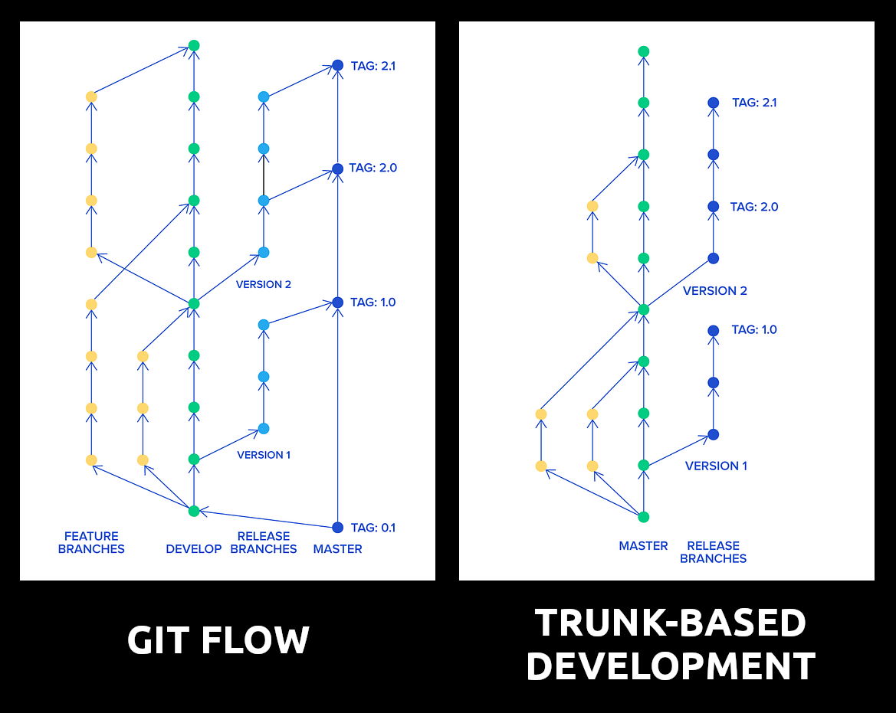

# Estrategía de bifurcación - TBD vs. Git Flow.

Existen varias estrategias populares de ramificación que puedes adoptar, siendo las más populares **git-flow** (también conocido como ramas de características de larga duración) y **trunk-based development** (desarrollado basado en rama principal).

  

  

Además de la estrategia de ramificación, tenemos que tener en cuenta que se puede combinar con una estrategia de fusión, como comentamos en el capítulo [ship/show/ask](../02_hands_on/04_pull_request.md#ship--show--ask). Ambas estrategias pueden ser más laxas o no, según el tamaño del proyecto y la experiencia de los desarrolladores.

Tabla con las diferencias entre git-flow y trunk-based development:

|                            | Git-flow                                                                                                          | Trunk-based                                                                                                                                                                                    |
| -------------------------- | ----------------------------------------------------------------------------------------------------------------- | ---------------------------------------------------------------------------------------------------------------------------------------------------------------------------------------------- |
| **Filosofía**              |                                                                                                                   |                                                                                                                                                                                                |
|                            | Lo más lejos posible de la rama principal                                                                         | Lo más cerca posible de la rama principal                                                                                                                                                      |
|                            | Nuevas características comienzan desde la rama ‘develop’                                                          | Ramas de características de corta duración comienzan desde la rama principal                                                                                                                   |
|                            | Nueva rama de versión derivada de la rama ‘develop’, después de que se implemente la rama de versión estabilizada | La rama principal siempre está lista para ser implementada en producción                                                                                                                       |
|                            | Solo hotfixes derivados de la rama principal                                                                      | Hotfixes empiezan desde la rama principal o de versión y deben seleccionarse de vuelta a la rama principal                                                                                     |
| **Composición del equipo** |                                                                                                                   |                                                                                                                                                                                                |
|                            | Falta de antigüedad en el equipo                                                                                  | Equipo bien compuesto y experimentado                                                                                                                                                          |
|                            | Trabajo con otros proveedores/terceros                                                                            | Modelo de aumento del equipo                                                                                                                                                                   |
| **Tipo de producto**       |                                                                                                                   |                                                                                                                                                                                                |
|                            | Producto complejo, maduro, monolítico                                                                             | Microservicios                                                                                                                                                                                 |
|                            | Producto en terreno complicado                                                                                    | Aplicación de página única (SPA) moderna / Aplicaciones móviles                                                                                                                                |
|                            |                                                                                                                   | Prueba de concepto (POC) / Prototipo                                                                                                                                                           |
|                            |                                                                                                                   | Componentes de sistemas distribuidos                                                                                                                                                           |
| **Proceso de creación**    |                                                                                                                   |                                                                                                                                                                                                |
|                            | Gobernado                                                                                                         | Dirigido por el equipo                                                                                                                                                                         |
| **Implementación**         |                                                                                                                   |                                                                                                                                                                                                |
|                            | Se usan varios modelos de implementación                                                                          | Se recomiendan prácticas de Implementación Continua, como palancas de características, puertas de calidad, pruebas canarias, automatización de autoservicio (por ejemplo, ChatOps) y monitoreo |

## Trunk-Based Development (TBD)

La metodología de Trunk-Based Development (TBD) es una estrategia ágil de desarrollo de software que se centra en la simplicidad y la integración continua de cambios en una única rama principal. A diferencia de enfoques más complejos como Git-flow, TBD promueve la rapidez y la colaboración al eliminar ramas prolongadas y fomentar la integración frecuente en la rama principal. En la anterior tabla se pueden apreciar las diferencias, como resumen de los principios clave:
- Integración Continua: En TBD, los desarrolladores integran cambios con frecuencia en la rama principal, lo que permite detectar y resolver conflictos de manera temprana y mantener el código en un estado siempre funcional.
- Ramas de Características Cortas: Las ramas de características en TBD son de corta duración y se integran rápidamente en la rama principal. Esto simplifica la gestión del código y reduce el riesgo de conflictos de integración.
- Rama Principal Estable: La rama principal en TBD siempre está lista para ser implementada en producción, lo que garantiza un flujo de trabajo fluido y una alta calidad del código.

Las ventajas de TBD que se pueden apreciar son:
- Reducción de Conflictos: Integrar cambios con frecuencia minimiza los conflictos de integración y mejora la eficiencia del equipo.
- Despliegue Continuo: TBD facilita el despliegue continuo de nuevas funcionalidades, permitiendo entregas rápidas y seguras a los usuarios finales.
- Colaboración Eficiente: Al trabajar en una única rama principal, los equipos colaboran estrechamente y coordinan eficientemente sus esfuerzos de desarrollo.

En Prefapp, hemos adoptado Trunk-Based Development como estrategia principal de desarrollo de software. Como hemos comentado, esta metodología nos permite mantener un flujo de trabajo ágil y eficiente, entregando productos de alta calidad de manera rápida y segura a nuestros clientes.

Para implementar TBD en Prefapp, seguimos prácticas de integración continua, revisiones de código y pruebas automatizadas para garantizar la estabilidad y calidad del código en la rama principal.

En resumen, Trunk-Based Development es una estrategia ágil y eficiente que promueve la simplicidad, la velocidad y la colaboración en el desarrollo de software. En Prefapp, hemos encontrado que esta metodología nos permite ofrecer productos de alta calidad de manera consistente y eficiente.

Más info: https://trunkbaseddevelopment.com/

## Versionado semántico.

El versionado semántico (SemVer) es una convención para asignar versiones a las bibliotecas de software que siguen un patrón de tres números: `X.Y.Z` donde `X` es la versión mayor, `Y` es la versión menor y `Z` es la versión de parche. La convención de versionado semántico establece reglas claras para incrementar cada número de versión en función de los cambios realizados en la biblioteca.

Versión Mayor (X):
- Incrementa cuando se realizan cambios incompatibles en la API.
- Indica que hay modificaciones significativas que pueden romper la compatibilidad con versiones anteriores.

Versión Menor (Y):
- Incrementa cuando se añaden funcionalidades de manera retrocompatible.
- Refleja mejoras y nuevas características que no afectan el funcionamiento del código existente.

Versión de Parche (Z):
- Incrementa cuando se corrigen errores de manera retrocompatible.
- Indica la solución de problemas sin introducir nuevas funcionalidades ni romper la compatibilidad.

En una estrategia de Trunk-Based Development (TBD), el versionado semántico se alinea perfectamente con las prácticas de integración continua y despliegue continuo. Al mantener la rama principal siempre lista para producción y realizar integraciones frecuentes, se puede gestionar y comunicar de manera clara los cambios en el software mediante versiones semánticas.

En Prefapp, combinamos Trunk-Based Development con el versionado semántico para mantener un flujo de trabajo ágil y transparente. Al integrar frecuentemente los cambios en la rama principal y seguir las convenciones de versionado semántico, logramos:
- Claridad y Transparencia: Los usuarios y desarrolladores pueden comprender fácilmente la naturaleza de los cambios entre versiones.
- Compatibilidad y Mantenimiento: Facilitamos el mantenimiento del software y la compatibilidad hacia atrás al seguir una convención clara para los cambios importantes, las nuevas funcionalidades y las correcciones de errores.
- Agilidad en Despliegues: Con una rama principal siempre lista para producción, podemos desplegar nuevas versiones rápidamente, asegurando que cada cambio se documente y versione adecuadamente.

Más info: https://semver.org/ 
