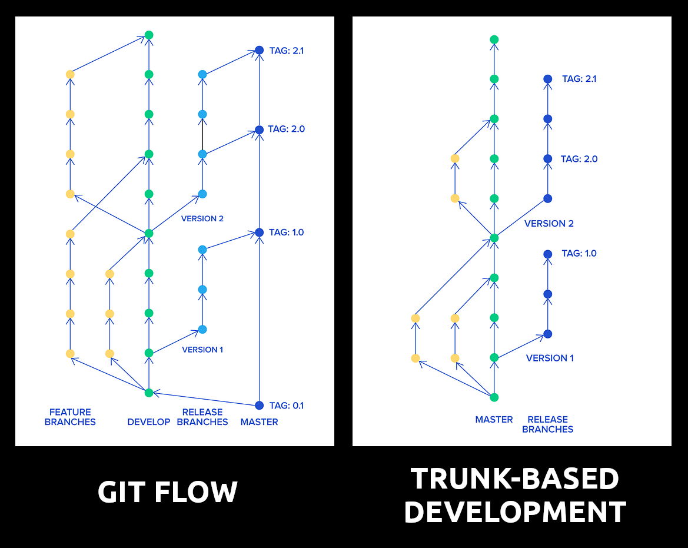

# Estrategia de bifurcación - TBD vs. Git Flow

Existen varias estrategias populares de ramificación que puedes adoptar, siendo las más populares **git-flow** (también conocido como ramas de características de larga duración) y **trunk-based development** (desarrollo basado en rama principal).

  

  

Además de la estrategia de ramificación, tenemos que tener en cuenta que se puede combinar con una estrategia de fusión, como comentamos en el capítulo [ship/show/ask](../02_hands_on/04_pull_request.md#ship--show--ask). Ambas estrategias pueden ser más laxas o no, según el tamaño del proyecto y la experiencia de los desarrolladores.

Tabla con las diferencias entre git-flow y trunk-based development:

<table border="1">
  <tr>
    <th></th>
    <th>Git-flow</th>
    <th>Trunk-based</th>
  </tr>
  <tr>
    <th>Filosofía</th>
    <td>
      <ul>
        <li>Lo más lejos posible de la rama principal</li>
        <li>Nuevas características comienzan desde la rama ‘develop’</li>
        <li>Nueva rama de versión derivada de la rama ‘develop’, después de que se implemente la rama de versión estabilizada</li>
        <li>Solo hotfixes derivados de la rama principal</li>
      </ul>
    </td>
    <td>
      <ul>
        <li>Lo más cerca posible de la rama principal</li>
        <li>Ramas de características de corta duración comienzan desde la rama principal</li>
        <li>La rama principal siempre está lista para ser implementada en producción</li>
        <li>Hotfixes empiezan desde la rama principal o de versión y deben seleccionarse de vuelta a la rama principal</li>
      </ul>
    </td>
  </tr>
  <tr>
    <th>Composición del equipo</th>
    <td>
      <ul>
        <li>Falta de antigüedad en el equipo</li>
        <li>Trabajo con otros proveedores/terceros</li>
      </ul>
    </td>
    <td>
      <ul>
        <li>Equipo bien compuesto y experimentado</li>
        <li>Modelo de aumento del equipo</li>
      </ul>
    </td>
  </tr>
  <tr>
    <th>Tipo de producto</th>
    <td>
      <ul>
        <li>Producto complejo, maduro, monolítico</li>
        <li>Producto en terreno complicado</li>
      </ul>
    </td>
    <td>
      <ul>
        <li>Microservicios</li>
        <li>Aplicación de página única (SPA) moderna / Aplicaciones móviles</li>
        <li>Prueba de concepto (POC) / Prototipo</li>
        <li>Componentes de sistemas distribuidos</li>
      </ul>
    </td>
  </tr>
  <tr>
    <th>Proceso de creación</th>
    <td>
      <ul>
        <li>Gobernado</li>
      </ul>
    </td>
    <td>
      <ul>
        <li>Dirigido por el equipo</li>
      </ul>
    </td>
  </tr>
  <tr>
    <th>Implementación</th>
    <td>
      <ul>
        <li>Se usan varios modelos de implementación</li>
      </ul>
    </td>
    <td>
      <ul>
        <li>Se recomiendan prácticas de Implementación Continua, como palancas de características, puertas de calidad, pruebas canarias, automatización de autoservicio (por ejemplo, ChatOps) y monitoreo</li>
      </ul>
    </td>
  </tr>
  <tr>
    <th>Más información</th>
    <td>
      <ul>
        <li><a href="https://www.atlassian.com/git/tutorials/comparing-workflows/gitflow-workflow" target="blank">https://www.atlassian.com/git/tutorials/comparing-workflows/gitflow-workflow</a></li>
      </ul>
    </td>
    <td>
      <ul>
        <li><a href="https://trunkbaseddevelopment.com/" target="blank">https://trunkbaseddevelopment.com/</a></li>
      </ul>
    </td>

  </tr>
</table>

## Trunk-Based Development (TBD)

En Prefapp, hemos adoptado Trunk-Based Development como estrategia principal de desarrollo de software. Esta metodología nos permite mantener un flujo de trabajo ágil y eficiente, entregando productos de alta calidad de manera rápida y segura a nuestros clientes.

La metodología de Trunk-Based Development (TBD) es una estrategia ágil de desarrollo de software que se centra en la simplicidad y la integración continua de cambios en una única rama principal. A diferencia de enfoques más complejos como Git-flow, TBD promueve la rapidez y la colaboración al eliminar ramas prolongadas y fomentar la integración frecuente en la rama principal. En la anterior tabla se pueden apreciar las diferencias, como resumen de los principios clave:
- **Integración Continua**: en TBD, los desarrolladores integran cambios con frecuencia en la rama principal, lo que permite detectar y resolver conflictos de manera temprana y mantener el código en un estado siempre funcional.
- **Ramas de características cortas**: las ramas de características en TBD son de corta duración y se integran rápidamente en la rama principal. Esto simplifica la gestión del código y reduce el riesgo de conflictos de integración.
- **Rama principal estable**: la rama principal en TBD siempre está lista para ser implementada en producción, lo que garantiza un flujo de trabajo fluido y una alta calidad del código.

Las ventajas de TBD que se pueden apreciar son:
- **Reducción de conflictos**: integrar cambios con frecuencia minimiza los conflictos de integración y mejora la eficiencia del equipo.
- **Despliegue Continuo**: TBD facilita el despliegue continuo de nuevas funcionalidades, permitiendo entregas rápidas y seguras a los usuarios finales.
- **Colaboración eficiente**: al trabajar en una única rama principal, los equipos colaboran estrechamente y coordinan eficientemente sus esfuerzos de desarrollo.

Para implementar TBD en Prefapp, seguimos prácticas de integración continua, revisiones de código y pruebas automatizadas para garantizar la estabilidad y calidad del código en la rama principal.

Más info: https://trunkbaseddevelopment.com/

## Versionado semántico

El versionado semántico (SemVer) es una convención para asignar versiones a las bibliotecas de software que siguen un patrón de tres números: `X.Y.Z` donde `X` es la versión mayor, `Y` es la versión menor y `Z` es la versión de parche. La convención de versionado semántico establece reglas claras para incrementar cada número de versión en función de los cambios realizados en la biblioteca.

**Versión Mayor** `(X)`:
- Incrementa cuando se realizan cambios incompatibles en la API.
- Indica que hay modificaciones significativas que pueden romper la compatibilidad con versiones anteriores.

**Versión Menor** `(Y)`:
- Incrementa cuando se añaden funcionalidades de manera retrocompatible.
- Refleja mejoras y nuevas características que no afectan el funcionamiento del código existente.

**Versión de Parche** `(Z)`:
- Incrementa cuando se corrigen errores de manera retrocompatible.
- Indica la solución de problemas sin introducir nuevas funcionalidades ni romper la compatibilidad.

Además del Semantic Versioning (SemVer), existen otras convenciones y sistemas de numeración de versiones que se utilizan en el desarrollo de software. Veamos otros tipos en una tabla comparativa:

| Método de Versionamiento     | Ejemplo de Versión           | Características                                      |
| ---------------------------- | ---------------------------- | ---------------------------------------------------- |
| Versionamiento Calendárico   | 2024.05.24                   | Basado en fechas                                     |
| Números Secuenciales         | 1, 2, 3, ...                 | Incrementa secuencialmente sin significado semántico |
| Nombre de Código             | Trusty Tahr, Bionic Beaver   | Utiliza nombres descriptivos o temáticos             |
| Basado en Hitos o Metas      | Alpha, Beta, RC, ...         | Identifica el estado de desarrollo del software      |
| Semántica Personalizada      | 1.2.3-alpha.1+build.20240524 | Adaptación de SemVer o personalización específica    |

Cada enfoque tiene sus propias ventajas y desventajas, y la elección del método de versionamiento depende en gran medida de las necesidades y preferencias del equipo de desarrollo y de la comunidad de usuarios del software. 😊

En Prefapp, combinamos Trunk-Based Development con el versionado semántico para mantener un flujo de trabajo ágil y transparente. Al integrar frecuentemente los cambios en la rama principal y seguir las convenciones de versionado semántico, logramos:
- **Claridad y transparencia**: los usuarios y desarrolladores pueden comprender fácilmente la naturaleza de los cambios entre versiones.
- **Compatibilidad y mantenimiento**: facilitamos el mantenimiento del software y la compatibilidad hacia atrás al seguir una convención clara para los cambios importantes, las nuevas funcionalidades y las correcciones de errores.
- **Agilidad en despliegues**: con una rama principal siempre lista para producción, podemos desplegar nuevas versiones rápidamente, asegurando que cada cambio se documente y versione adecuadamente.

Más info: https://semver.org/ 
