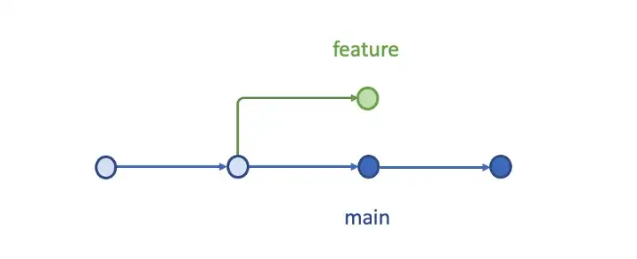
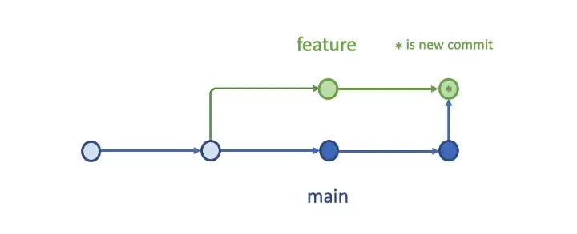
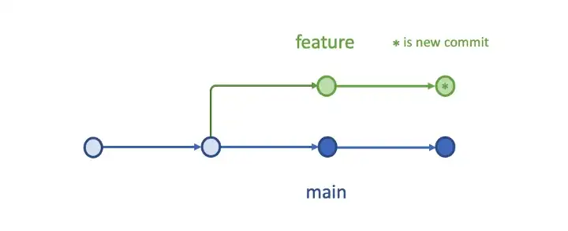
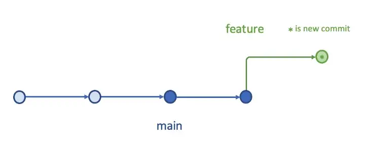

# Estrategía de fusión - Merge vs squash vs rebase vs pull

En el desarrollo de software con Git, la forma en que se fusionan las ramas es crucial para mantener un historial de commits limpio y manejable. Las estrategias de fusión más comunes son merge, squash, rebase y pull. 

Cada estrategia de fusión tiene sus ventajas y desventajas, y la elección de la estrategia adecuada puede afectar significativamente la calidad y la claridad del historial del proyecto. A continuación, presentamos una tabla comparativa seguida de una explicación detallada de la estrategia squash.

Tabla comparativa de estrategias de fusión:

| Estrategia | Ventajas                                | Desventajas                                          | Uso Recomendado                                      |
| ---------- | --------------------------------------- | ---------------------------------------------------- | ---------------------------------------------------- |
| **Merge**  | Historial completo, simplicidad         | Historial complejo, commits de fusión adicionales    | Proyectos colaborativos, integraciones grandes       |
| **Squash** | Historial limpio, commits agrupados     | Pérdida de detalle, menos información de depuración  | Pequeñas funcionalidades, limpieza de historial      |
| **Rebase** | Historial lineal, sin commits de fusión | Riesgo de conflictos, peligroso en ramas compartidas | Historial limpio, antes de fusionar                  |
| **Pull**   | Actualización fácil, comodidad          | Historial más complejo, conflictos automáticos       | Sincronización rápida, desarrolladores principiantes |

## Ejemplo gráfico

Tenemos este conflicto en el historial de commits:

  

  

Si lo solucionamos con un `merge`, el historial de commits se vería así:

  

  

Si lo solucionamos con un `squash`, el historial de commits se vería así:

  

  

Si lo solucionamos con un `rebase`, el historial de commits se vería así:

  

  

Artículo efectuando un ejemplo práctico de cada uno de los métodos de fusión: [Git Merge, Squash, Rebase, or Pull — What To Choose?](https://betterprogramming.pub/git-merge-squash-rebase-or-pull-what-to-choose-50b331d3e7c1)

## Squash merge

En **Prefapp**, hemos adoptado la estrategia de fusión `squash` debido a los beneficios que ofrece en términos de simplicidad y claridad del historial de commits. Nuestro enfoque se centra en mantener un historial de cambios limpio y fácil de gestionar, lo que es crucial para la revisión de código y la colaboración efectiva entre los miembros del equipo.

Alguna razones son:
- **Mantenimiento del Historial**: Al consolidar los cambios en un único commit, el historial de commits en la rama principal se mantiene limpio y fácil de entender. Esto es particularmente útil en proyectos con múltiples desarrolladores y ramas de características activas.
- **Facilidad de Revisión**: La revisión de código se simplifica cuando los cambios relacionados se agrupan en un solo commit. Los revisores pueden comprender mejor el alcance y el propósito de los cambios sin necesidad de revisar múltiples commits.
- **Reducción de la Complejidad**: La estrategia `squash` reduce la complejidad del historial de commits, evitando la saturación del historial con numerosos commits pequeños. Esto es especialmente importante en proyectos de gran escala donde la claridad del historial es crucial.
- **Eficiencia en la Integración**: Al integrar características mediante un solo commit, se facilita la gestión de versiones y la implementación continua, alineándose con nuestra metodología ágil y de entrega continua.

### Ejemplo de Uso

Para realizar un squash en Prefapp, seguimos estos pasos básicos:

1. **Realizar los Cambios**: Los desarrolladores trabajan en una rama de características realizando múltiples commits para registrar sus progresos.
   
2. **Preparar para Squash**: Antes de fusionar la rama de características, se utiliza el comando `git rebase -i` para interactivamente combinar los commits en uno solo.

3. **Fusionar la Rama**: Finalmente, se fusiona la rama de características a la rama principal utilizando `git merge --squash`, lo que crea un único commit con todos los cambios.
