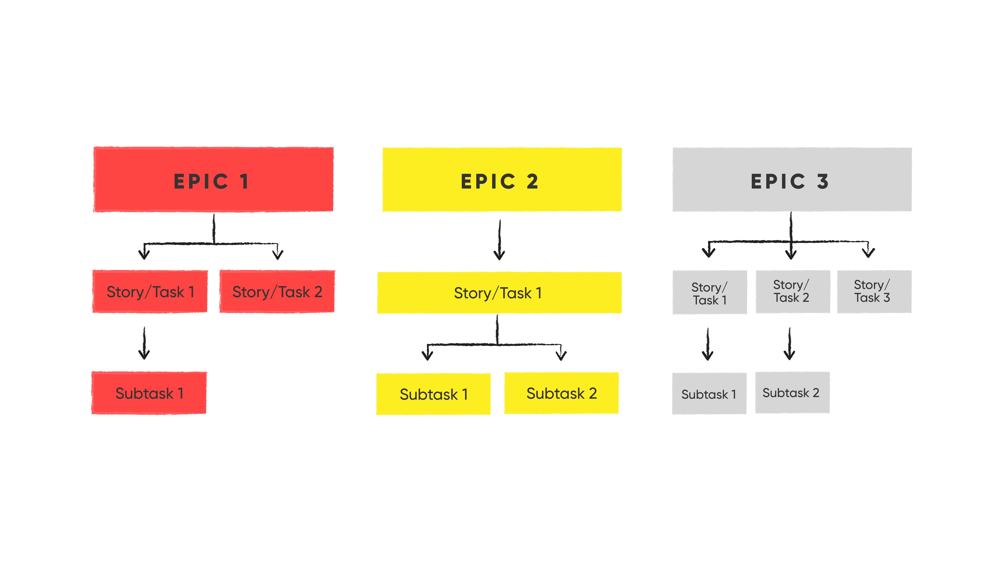

# Manejo de Projects en Backlog con GitHub

En el contexto del desarrollo de software, los proyectos de GitHub son una herramienta fundamental para la planificación y gestión del trabajo. Permiten a los equipos organizar, priorizar y realizar un seguimiento del progreso de las tareas y características de un proyecto en un entorno colaborativo. En Prefapp, utilizamos proyectos de GitHub como una forma centralizada de gestionar nuestro backlog y coordinar el trabajo en equipo.

## GitHub Projects

Los proyectos de GitHub son tableros flexibles y personalizables que permiten a los equipos organizar y priorizar su trabajo. Cada proyecto puede tener múltiples columnas que representan diferentes etapas del flujo de trabajo, desde la planificación inicial hasta la finalización del trabajo. Las tareas se representan como tarjetas que pueden moverse entre columnas para reflejar su estado actual.

## Metodología Scrum y GitHub Issues

En Prefapp, adoptamos una metodología Scrum ágil para gestionar nuestros proyectos de desarrollo de software. Utilizamos GitHub Issues para representar las distintas unidades de trabajo, que pueden ser historias de usuario (epic), tareas (story/task) o subtareas (subtask). Cada issue representa una unidad de trabajo específica que debe completarse como parte del proyecto.

  

  

### GitHub Issues

- **Epic**: Representa una característica o funcionalidad completa que puede dividirse en múltiples tareas más pequeñas. Los epics suelen ser issues de alto nivel que abarcan múltiples tareas (task) o historias de usuario (story).
  
- **Story/Task**: Representa una unidad de trabajo más específica que debe completarse como parte de un epic o de manera independiente. Las tasks representan tareas individuales que deben realizarse para cumplir con un objetivo más amplio.

- **Subtask**: Representa una tarea más pequeña y específica que forma parte de una tarea principal. Es conveniente evitar el uso de subtareas en favor de las pull requests, que suelen representar cambios más específicos en el código.

## Uso de GitHub Projects en Prefapp

En Prefapp, abrimos un proyecto de GitHub para cada proyecto de software que estamos desarrollando. Utilizamos las siguientes columnas en nuestros proyectos de GitHub para reflejar nuestro flujo de trabajo:

- **New**: Aquí es donde se agregan nuevas tareas o características al backlog del proyecto. Estas tareas aún no han sido priorizadas ni asignadas a un sprint.

- **Refining**: En esta columna, refinamos y detallamos las tareas o características que han sido agregadas al backlog. Esto puede implicar la división de epics en tareas más pequeñas o la clarificación de los requisitos.

- **Ready to Start (DoD completed)**: Una vez que una tarea o característica ha sido completamente definida y está lista para ser implementada, se mueve a esta columna. Aquí se asegura de que se cumplan todos los criterios de aceptación y definición de done (DoD) antes de comenzar el trabajo.

- **In Progress**: Cuando un miembro del equipo comienza a trabajar en una tarea o característica, se mueve a esta columna para indicar que está en progreso.

- **Blocked / On hold**: Si una tarea o característica se encuentra bloqueada por algún motivo, se mueve a esta columna para indicar que no se puede avanzar en ella temporalmente.

- **In Review**: Una vez que se ha completado una tarea o característica y está lista para su revisión, se mueve a esta columna. Aquí se realiza la revisión del trabajo realizado antes de su integración final.

- **Done**: Finalmente, cuando una tarea o característica ha sido completada y revisada satisfactoriamente, se mueve a esta columna para indicar que está terminada.

## Integración de GitHub Projects con Pull Requests

En Prefapp, vinculamos nuestras tareas de GitHub Issues con pull requests (PRs) que representan los cambios de código asociados con esas tareas. Esto nos permite rastrear el progreso del trabajo y la implementación de características específicas directamente desde el proyecto de GitHub.

Al utilizar GitHub Projects de esta manera, podemos mantener un seguimiento claro del trabajo pendiente, colaborar de manera efectiva en el desarrollo de software y garantizar la entrega oportuna de proyectos de alta calidad en Prefapp.

Además, con las keywords de github, podemos relacionar los issues con los PRs, de manera que se cierre automáticamente el issue al hacer merge del PR.

Doc: 
- "Using keywords in issues and pull requests" https://docs.github.com/en/get-started/writing-on-github/working-with-advanced-formatting/using-keywords-in-issues-and-pull-requests
- "Linking a pull request to an issue" https://docs.github.com/en/issues/tracking-your-work-with-issues/linking-a-pull-request-to-an-issue
