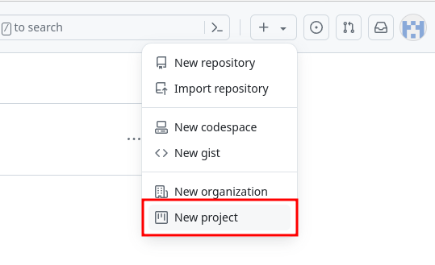
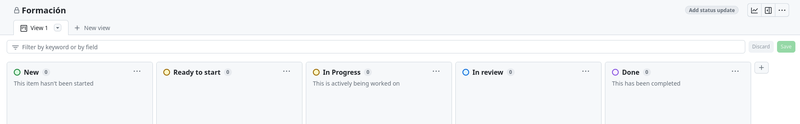

# Práctica guiada: creación de ramas, pull request y preparación de trabajo mediante issues (Projects)

En esta práctica guiada, te mostraremos cómo aplicar la metodología de Prefapp para gestionar tu trabajo en GitHub, incluyendo la creación de ramas, la apertura de issues y la preparación del trabajo mediante proyectos.


## Paso 1: creación del project

1. Desde la página de [GitHub Projects](https://github.com/projects), selecciona '+' > New project. 

<div style="text-align: center;">
  <div style="margin: 0 auto;">



  </div>
</div>

2. En la pantalla que se nos abre, escogemos New project > Board > Create project.
3. Añadimos y editamos las columnas para quedarnos con las siguientes: New, Ready to Start, In Progress, In Review y Done.

<div style="text-align: center;">
  <div style="margin: 0 auto;">



  </div>
</div>

4. Ve al repositorio que creamos en la práctica del capítulo anterior. Accede a la pestaña "Projects", selecciona "Link a project" y escoge el proyecto que acabas de crear. Ahora, todas las issues que crees en tu proyecto se asociarán a este repositorio.

## Paso 2: creación de una issue

1. Abre tu proyecto en GitHub Projects.
2. En la columna "New", crea un nuevo item para una tarea específica que necesite ser realizada. Por ejemplo, "Añadir presentación en el fichero README.md".

## Paso 3: configuración de la issue

1. Abre el item que acabas de crear y, en assignees, asígnatela a ti mismo.
2. Añade toda la información de la issue en la descripción y guárdala con "Update comment".
👀 *Recuerda que puedes usar plantillas para los [procedimientos](https://github.com/prefapp/demo-state/blob/main/.github/docs/template_migration_es.md).*
3. Una vez lo tengas todo preparado, selecciona "Convert to issue" y confirma el repositorio en el que quieres que se cree.
4. Mueve el ítem a la columna "Ready to Start".

## Paso 4: Creación de una Rama y Pull Request (PR)

1. Antes de empezar a trabajar, mueve el ítem a la columna "In Progress".

2. Desde tu terminal, accede a la carpeta local del repositorio que clonamos en el capítulo anterior. Asegúrate de que estás en la rama principal y baja los cambios con:
```bash
git pull origin main
```

3. Crea una nueva rama para trabajar en la issue que acabas de crear:
```bash
git checkout -b feature/branch-test
```

4. Crea un fichero README.md o modifica el existente añadiendo información sobre tu repositorio. Este es un fichero especial, ya que su contenido será lo que se muestre en la página principal de tu repo en GitHub.

5. Confirma los cambios y sube la rama a GitHub:
```bash
git add README.md
git commit -m "Add a description to README.md"
git push origin feature/branch-test
```

6. Crea una PR para fusionar tu rama con la rama principal del repositorio. En el output del anterior comando habrá un enlace para crear la PR. Si no lo ves, puedes hacerlo desde la interfaz de GitHub.

7. Asegurate de que sigues las buenas prácticas para configurar la PR. Añade:
  - Una descripción clara de los cambios realizados.
  - Un revisor apropiado.
  - Etiquetas si es necesario.
  - La issue relacionada con la PR.

8. Una vez terminados los cambios descritos en la issue y mientras esperas la revisión, puedes mover la issue a la columna "In review" del project de GitHub.

## Paso 5: Revisión y Fusión del Pull Request

1. El revisor examinará tus cambios, realizará comentarios si es necesario y aprobará el PR una vez que esté satisfecho con el trabajo (looks good to me (LGTM)).
2. Una vez aprobado, la PR puede fusionarse con la rama principal del repositorio (squash and merge).
3. Si todos los cambios propuestos en la issue están completados, podremos mover la issue a la columna "Done".


¡Felicidades! Has completado con éxito la práctica guiada de creación de ramas, pull request y preparación de trabajo mediante issue en GitHub. Si tienes dudas, observa y pregunta a tus compañeros.

<div style="text-align: center;">
  <div style="margin: 0 auto;">


  </div>
</div>
