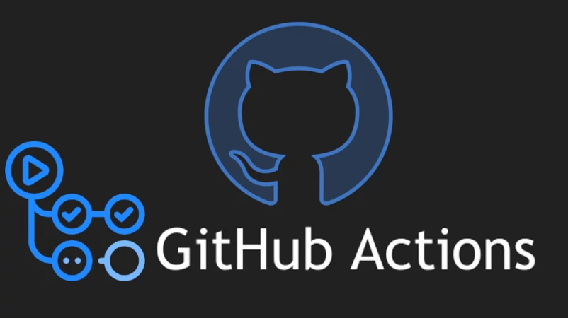
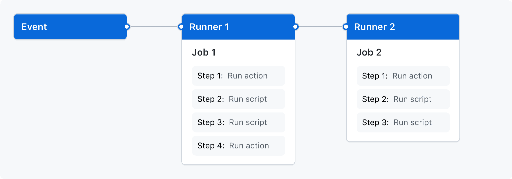
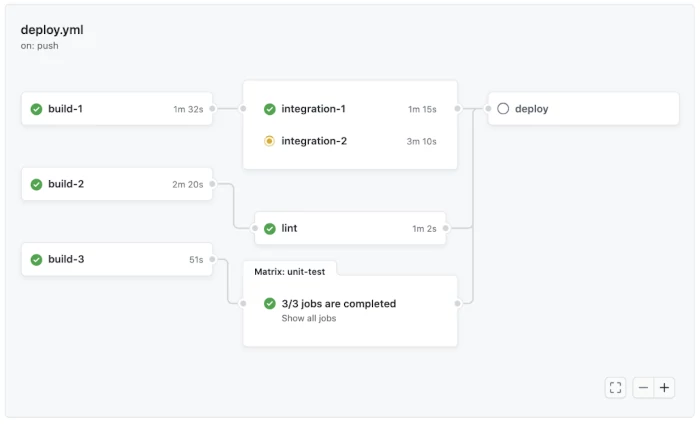
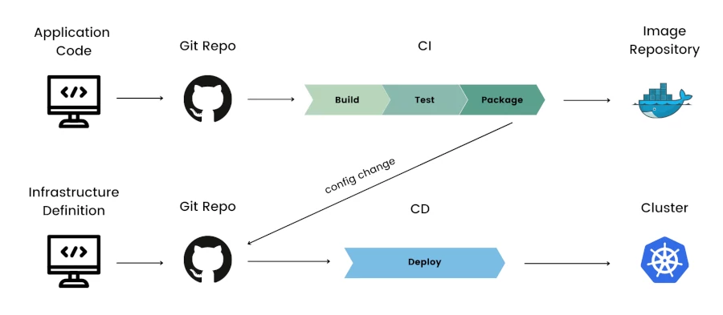

# Github Actions avanzado




Ya hemos visto brevemente qué son las Github Actions, pero ahora vamos a profundizar un poco más en ellas. En este capítulo, exploraremos cómo se configuran, cómo se ejecutan y cómo se pueden personalizar para satisfacer necesidades específicas. 

GitHub Actions es una plataforma de integración continua y entrega continua (CI/CD) que automatiza los pipelines de construcción, prueba y despliegue. Te permite crear flujos de trabajo que construyen y prueban todas las pull requests a un repositorio, o puedes desplegar pull requests fusionadas en tu entorno de producción.

Los workflows se definen en el directorio .github/workflow del repositorio. Puedes definir múltiples workflows, cada uno realizando un conjunto diferente de acciones. Por ejemplo, un workflow puede especificar cómo crear y probar una pull request, mientras que otro workflow puede desplegar automáticamente una aplicación cuando se crea una nueva release.

Para una referencia más detallada, puedes consultar la [documentación oficial de Github Actions](https://docs.github.com/en/actions/using-workflows).


## Conceptos de los workflows en Github Actions

### Workflow Triggers

Un trigger de workflow es un evento que hace que se ejecute un workflow. Hay cuatro tipos de triggers:

- Eventos que ocurren en el repositorio de GitHub del workflow.
- Eventos que ocurren fuera de GitHub, que activan un evento repository_dispatch en GitHub.
- Un horario predefinido.
- Trigger manual.

Después de que se activa un workflow, el motor del workflow ejecuta uno o más jobs. Cada job contiene una lista predefinida de pasos; un paso puede ejecutar un script definido o realizar una acción específica (de una biblioteca de acciones disponibles en GitHub Actions). Esto se ilustra en el diagrama a continuación.

<div style="text-align: center;">
  <div style="margin: 0 auto;">



  </div>
</div>

El proceso que ocurre cuando se activa un evento es el siguiente:

1. Ocurre un evento en el repositorio. Cada evento tiene un SHA de commit y una referencia de Git (un alias legible para humanos del hash del commit).
2. GitHub busca en el directorio `.github/workflow` del repositorio archivos de workflow relacionados con el SHA de commit o la referencia de Git asociada con el evento.
3. Para los workflows con valores que coinciden con el evento desencadenante, se activa la ejecución del workflow. Algunos eventos requieren que el archivo del workflow esté en la rama predeterminada del repositorio para ejecutarse.
4. Cada workflow usa la versión del workflow en el SHA de commit o la referencia de Git asociada con el evento. Cuando se ejecuta el workflow, GitHub configura las variables de entorno `GITHUB_SHA` y `GITHUB_REF` en el entorno del launcher.


### Workflow Jobs y Concurrency

La ejecución de un workflow consta de uno o más jobs que se ejecutan en paralelo. Este es el comportamiento predeterminado, pero puedes definir dependencias en otros jobs para hacer que los jobs ejecuten tareas secuencialmente. Esto se hace utilizando la palabra clave `jobs.<job-id>.needs`.

Puedes ejecutar un número ilimitado de tareas dentro de los límites de uso de tu workflow. Para evitar que se ejecuten demasiados jobs simultáneamente, puedes usar `jobs.<job-id>.concurrency` para asegurar que solo un job o workflow en el mismo grupo de concurrencia se ejecute al mismo tiempo. El nombre de un grupo de concurrencia puede usar cualquier cadena o excepción, excepto secretos.

Si un job o workflow concurrente está en la cola, y otro job o workflow está en progreso, la tarea o workflow en cola se pone en espera, y cualquier tarea o workflow previamente suspendido en el grupo de concurrencia se cancela.

<div style="text-align: center;">
  <div style="margin: 0 auto;">



  </div>
</div>

## Ejemplos de Workflows de GitHub Actions: Sintaxis y Comandos

### Sintaxis de las Github Actions

Los workflows en GitHub Actions se escriben en sintaxis YAML. Por lo tanto, los archivos de workflow tienen una extensión .yml o .yaml. 

Recuerda: Los archivos de workflow deben almacenarse en un directorio dedicado en el repositorio llamado `.github/workflows.`

#### name

Se utiliza para establecer el nombre del workflow, del jobs o del step. GitHub Actions muestra este nombre en la pestaña de acciones del repositorio. Si falta name, Actions mostrará la ruta relativa del archivo de workflow desde el directorio raíz del repositorio. Los emojis pueden agregar un toque identificativo y colorido para hacerlos más visuales

Por ejemplo, el nombre de un workflow se establece colocando la siguiente línea al comienzo del archivo:

```yaml
name: demo-github-actions-workflow 🧪
```


El job, con la identación adecuada, se establece de la siguiente manera:

```yaml
jobs:
  build:
    name: Build 🏗
    runs-on: ubuntu-latest
```

Y el step, también con la identación adecuada:

```yaml
steps:
  - name: Install dependencies 🔌
    run: npm install
```


#### on

Se utiliza para especificar el/los evento/s (triggers) que activan automáticamente el workflow. Puede tomar uno o múltiples eventos como triggers. Además, puede restringir los triggers a archivos específicos, cambios de rama o etiquetas.

Ejemplos:

La siguiente línea activa el workflow cada vez que ocurre un push en el repositorio:

```yaml
on: push
```

La siguiente línea activa el workflow cuando ocurre un push o el repositorio es bifurcado con la siguiente línea:

```yaml
on: [fork, push]
```

Si ocurren múltiples eventos simultáneamente, activa el workflow múltiples veces.

El siguiente ejemplo muestra cómo especificar la actividad del evento y el tipo de actividad para activar un workflow:

```yaml
on:
  branch_protection_rule:
    types:
      - edited
```

Aquí, el workflow se ejecuta cada vez que se cambia la regla de protección de la rama del repositorio. El trigger puede ser múltiples tipos de actividad de la siguiente manera:

```yaml
on:
  branch_protection_rule:
    types:
      - edited
      - created
```

Esto ejecuta los workflows dos veces cuando un usuario crea una nueva regla de protección de rama y la agrega.

El siguiente ejemplo muestra cómo usar filtros de eventos y activar el workflow solo cuando el evento tiene ciertos aspectos específicos:

```yaml
on:
  pull_request:
    types:
      - assigned
    branches:    
      - 'demo-branch/**'
```

El siguiente ejemplo muestra cómo el workflow puede ejecutarse solo para ciertos tipos de archivos usando el filtro paths:

```yaml
on:
  push:
    paths:
      - '**.py'
```

El workflow se activará cada vez que se suba un archivo Python al repositorio.


#### defaults

Se utiliza para especificar la configuración predeterminada del workflow. Si se especifica bajo un job determinado, solo se aplica al job. De lo contrario, especifica configuraciones para todos los jobs.

El shell predeterminado para los comandos en el workflow y el directorio que contiene los scripts que debe ejecutar se especifican de la siguiente manera:

```yaml
defaults:
  run:
    shell: bash
    working-directory: demo-workflow-scripts
```

#### jobs

Se utiliza para especificar las acciones que realiza el workflow. Puede tener múltiples jobs bajo él, y cada job puede tener su propio alcance, conjunto de acciones y jobs dependientes.

Ejemplos de comandos:

Cada job bajo jobs necesita un identificador único que debe ser una cadena única y contener solo -, _, y caracteres alfanuméricos:

```yaml
jobs:
  first_demo_job:
    name: The first demo job
  second_demo_job:
    name: The second demo job
```

Las acciones de un job se especifican con la sintaxis steps. Cada paso puede tener un nombre, sus propias variables de entorno y comandos a ejecutar:

```yaml
jobs:
  first_demo_job:
    name: The first demo job
    steps:
      - name: Show the demo running
        env:
          VAR1: This is
          VAR2: A Demo of
          VAR3: GitHub Actions
          VAR4: Workflow jobs
        run: |
          echo $VAR1 $VAR2 $VAR3 $VAR4.
```


### Comandos del Workflow

#### Establecer Outputs

El comando set-output establece el valor para la salida de una acción. Una vez establecido, otros comandos pueden usar la salida haciendo referencia al id del job:

```yaml
- name: Set output parameter
  run: echo '::set-output name=OUTPUT_PARAM::parameter_set'
  id: output-parameter-setter
- name: Get output
  run: echo "The output parameter is set to ${{ steps.output-parameter-setter.outputs.OUTPUT_PARAM }}"
```

#### Mostrar Errores

El comando error escribe mensajes de error en el registro. Toma el nombre del archivo, la posición y el mensaje como entradas:

```shell
echo "::error file=demo-file.js,line=1,col=7,endColumn=9::Missing semicolon"
```

#### Mostrar outputs completos

Los comandos echo::on y echo::off activan y desactivan respectivamente la impresión de los comandos, para todos los comandos siguientes:

```yaml
jobs:
  demo-workflow-job:
    steps:
      - name: set echoing of commands on and off
        run: |
          echo '::set-output name=demo_action_echoing::off'
          echo '::echo::on'
          echo '::set-output name=demo_action_echoing::on'
          echo '::echo::off'
          echo '::set-output name=action_echo::disabled'
```

Esto mostrará la siguiente salida en el registro:

```shell
::set-output name=demo_action_echoing::on
::echo::off
```


### Tutorial Rápido: Creando Workflows de Inicio

Los Workflows de Inicio son plantillas de workflows que los usuarios pueden personalizar según sus necesidades y poner en uso. GitHub proporciona muchos workflows de inicio para categorías como despliegue continuo, automatización y seguridad para ayudar a los usuarios a comenzar.

Doc Github: https://docs.github.com/en/actions/learn-github-actions/using-starter-workflows 

Para crear un nuevo workflow de inicio:

1. Crea un nuevo directorio y llámalo .github, si aún no existe.
2. Crea un directorio dentro del nuevo directorio y llámalo workflow-templates.
3. Crea un archivo de workflow y llámalo demo-workflow.yml. Pon el siguiente código YAML en el archivo:

    ```yaml
    Name: Starter Workflow Demo

    on:
      push:
        branches: [ $default-branch ]
      pull_request:
        branches: [ $default-branch ]

    jobs:
      build:
        runs-on: ubuntu-latest

        steps:
          - uses: actions/checkout@v3

          - name: demo workflow job
            run: echo This is a demo start workflow
    ```

4. Crea un archivo de metadatos dentro de workflow-templates y llámalo demo-workflow.properties.json. El nombre del archivo del workflow y el nombre del archivo de metadatos deben ser iguales. Pon lo siguiente en el archivo de metadatos:

    ```json
    {
        "name": "Starter Workflow Demo",
        "description": "Demo starter workflow.",
        "iconName": "demo-icon",
        "categories": [
            "Python"
        ]
    }
    ```

Aquí, los metadatos especifican la categoría del lenguaje del workflow de inicio para que un usuario pueda encontrar este workflow de inicio más fácilmente.


## GitOps

GitOps es una metodología para la gestión de la infraestructura y las aplicaciones basada en Git. En lugar de depender de herramientas y procesos manuales, GitOps utiliza repositorios Git como fuente única para todo lo relacionado con la infraestructura y las aplicaciones. Esto incluye la configuración de la infraestructura, las definiciones de las aplicaciones, los scripts de despliegue y cualquier otro artefacto necesario para el ciclo de vida de desarrollo y operaciones.

<div style="text-align: center;">
  <div style="margin: 0 auto;">



  </div>
</div>

Lectura recomendada: https://www.redhat.com/es/topics/devops/what-is-gitops

En el siguiente módulo veremos ejemplos prácticos GitOps que se utilizan en Prefapp. 
