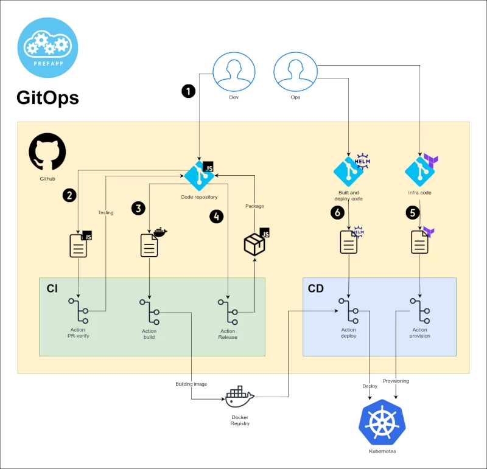
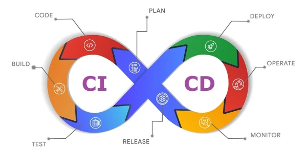

# Workflows utilizados en Prefapp

Ya hemos visto una pequeña explicación de lo que es GitOps, ahora vamos a ver gráficamente algunos workflows básicos para la automatización del ciclo de vida del software. 

1. Se crea el código fuente y se sube a un repositorio de código fuente mediante una Pull Request.
2. La Pull Request activa un workflow que testea el código fuente.
3. Al mergear la Pull Request se activa un workflow que crea una imagen de contenedor, la sube a un registro de contenedores y abre otra Pull Request al repositorio de Helm.
4. Cuando se crea una release en el repositorio del código, esta dispara un workflow que generá un documento Changelog y paquetiza la aplicación.
5. Antes de aplicar la Chart (No tiene por qué ser justo antes, podría ser el paso 1), se deben aprovisionar los recursos necesarios para la aplicación mediante Terraform.
6. Cuando se mergea la Pull Request abierta en el repositorio de Helm (abierta en el paso 3), se activa un workflow que despliega la release de Helm.

  

  

¡Genial! Con esto se ha automatizado casi todo el ciclo de vida del software, desde la creación del código fuente hasta el despliegue de la aplicación.

  

  

Antes de seguir, es recomendable una lectura de las buenas prácticas para crear workflows en GitHub Actions:

- Fortalecer la seguridad en GitHub Actions: https://docs.github.com/en/actions/security-guides/security-hardening-for-github-actions 👀

Vamos a examinar algunos de los workflows más usados en Prefapp para poder introducirnos en el mundo de la automatización de GitHub Actions:

- [release-please](./05_release-please.md) (paso 4)
- [release-pipeline](./07_release-pipeline.md) (paso 4)
- [build_and_dispatch](./06_build_and_dispatch.md) (paso 3)
- [PR-verify](./04_pr_verify.md) (paso 2)

---

Repositorio demo para "[Build and dispatch](https://github.com/prefapp/hello-k8s/blob/main/.github/workflows/build_and_dispatch.yaml)" y "[PR verify](https://github.com/prefapp/hello-k8s/blob/main/.github/workflows/pr_verify.yaml)": [hello-k8s](https://github.com/prefapp/hello-k8s/tree/main/.github) 👀

