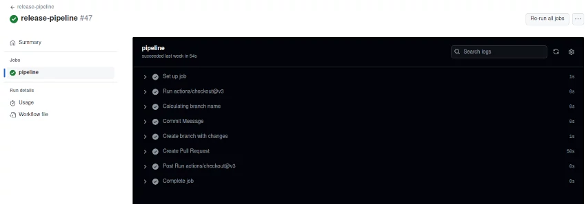

# Workflows utilizados en Prefapp: release-pipeline

El workflow **release-pipeline** está diseñado para facilitar la publicación de nuevos paquetes mediante la automatización de la creación de ramas, la actualización de índices de repositorios Helm, y la generación de Pull Requests (PR) en GitHub. 




## Evento Trigger: `workflow_dispatch`

Este workflow se activa manualmente mediante el evento `workflow_dispatch`, lo cual permite a los usuarios iniciar el proceso proporcionando los siguientes inputs:

- `package`: Nombre del paquete que se va a publicar.
- `version`: Versión del paquete que se va a publicar.


## Variables de Entorno Globales

- `proyecto`: Nombre del proyecto, en este caso, `prefapp`.
- `git_user`: Usuario de Git configurado para las acciones de GitHub (`github-actions`).
- `git_email`: Correo electrónico configurado para las acciones de GitHub (`github-actions@github.com`).


## Definición del Job: `pipeline`

Este único job se encarga de todo el proceso de publicación.


### Pasos del Job

1. **Checkout del Código**
   ```yaml
   - uses: actions/checkout@v3
   ```
   Este paso clona el repositorio en el runner de GitHub Actions.

2. **Calcular el Nombre de la Rama**
   ```yaml
   - name: Calculating branch name
     id: step-branch
     run: echo "::set-output name=branch::$(echo new-release/${{ inputs.package }}-${{ inputs.version }})"
   ```
   Calcula el nombre de la nueva rama basada en el nombre y la versión del paquete proporcionados.

3. **Mensaje del Commit**
   ```yaml
   - name: Commit Message
     id: step-commit_message
     run: echo "::set-output name=commit_message::$(echo New Chart Release '${{ inputs.package }}-${{ inputs.version }}')"
   ```
   Genera el mensaje del commit utilizando los inputs proporcionados.

4. **Crear Rama con Cambios**
   ```yaml
   - name: Create branch with changes
     run: |
       git config --global user.name ${{ env.git_user }}
       git config --global user.email ${{ env.git_email }}
       git checkout -b ${{ steps.step-branch.outputs.branch }}
       cd charts/${{ inputs.package }} && helm package . -d ../../docs/${{ inputs.package }}
       cd ../../docs/${{ inputs.package }} && helm repo index .
       git add .
       git commit -m "${{steps.step-commit_message.outputs.commit_message}}"
       git push origin ${{ steps.step-branch.outputs.branch }}
   ```
   - Configura el usuario y correo electrónico de Git.
   - Crea una nueva rama basada en el nombre calculado.
   - Genera el paquete Helm y actualiza el índice del repositorio.
   - Añade y commitea los cambios, luego empuja la nueva rama al repositorio remoto.

5. **Crear Pull Request**
   ```yaml
   - name: Create Pull Request
     run: |
       prName="Bump release ${{ inputs.package }}-${{ inputs.version }}"
       docker run -v $(pwd):/repo prefapp/prefapp-cicdpy:sleep-test github.pr_auto_merge \
          token=${{ secrets.GITHUB_TOKEN }} \
          titulo="${prName}" \
          rama_origen=${{ steps.step-branch.outputs.branch }} \
          repo=charts \
          proyecto=${{ env.proyecto }} \
          reviewers='${{ github.actor }}'
   ```
   - Usa un contenedor Docker para ejecutar un script que crea un Pull Request automáticamente.
   - Configura el título del PR, la rama de origen, el repositorio, el proyecto, y asigna el revisor basado en el actor de GitHub que inició el workflow.
