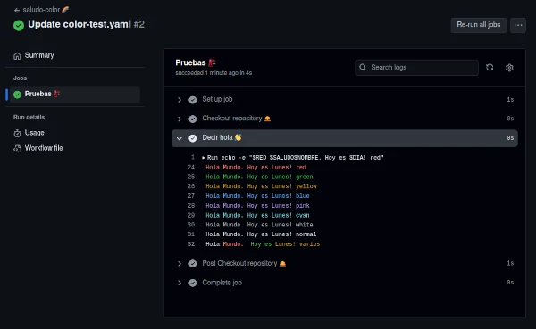
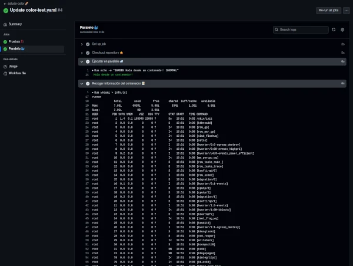
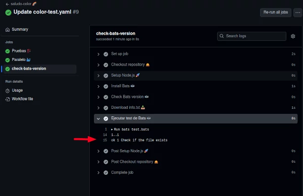
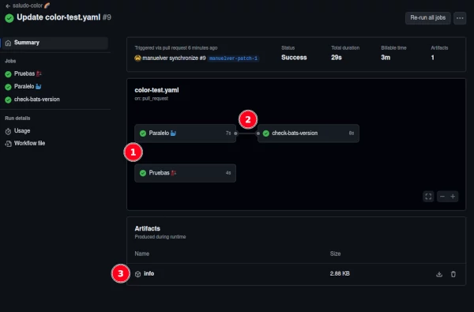

# Práctica guiada - Crear un workflow

Vamos a hacer un práctica sencilla para ver cómo se crea un workflow en GitHub Actions desde 0. Después de lo visto hasta ahora esta práctica nos servirá para repasar conceptos. 

Simplemente enviaremos un saludo a la consola que podremos ver en el panel de Github Action. Estará coloreado y se ejecutará en respuesta a un evento "pull request". Con esta base, iremos añadiendo complejidad al workflow.

Recordad que el workflow se debe guardar en la carpeta `.github/workflows` de vuestro repositorio.

Empezamos con el nombre, debe ser descriptivo y fácil de identificar:

```yaml
name: saludo-color 🌈
```

El trigger hemos dicho que debe ser pull request, pero añadimos también la opción manual:

```yaml
on:
  pull_request:
  workflow_dispatch:
```

Necesitamos unas variables de entorno para definir colores y un mensaje standard. Estas variables serán globales para todo el workflow:

```yaml
  SALUDO: "Hola "
  RED: \033[31m
  GREEN: \033[32m
  YELLOW: \033[33m
  BLUE: \033[34m
  PINK: \033[35m
  CYAN: \033[36m
  WHITE: \033[37m
  NORMAL: \033[0;39m
```

Ahora, vamos a definir algunos aspectos del job que afectarán dentro de este ámbito a los steps que anidemos en él:
- Nombre. [Más info](https://docs.github.com/en/actions/using-workflows/workflow-syntax-for-github-actions#name)
- Sistema operativo. Le asignamos una Ubuntu latest. [Más info](https://docs.github.com/en/actions/using-workflows/workflow-syntax-for-github-actions#jobsjob_idruns-on)
- Variables de entorno. Vamos a especificar una variable específica para el job. [Más info](https://docs.github.com/en/actions/learn-github-actions/variables)

```yaml
jobs:
  pruebas:
    name: Pruebas 🏗️
    runs-on: ubuntu-latest
    env:
      NOMBRE: "Mundo"
```

Ahora ya podemos especificar un step dentro del job. Podemos empezar por el checkout para poder acceder a los archivos del repositorio:

```yaml
    steps:
      - name: Checkout repository 🛎️
        uses: actions/checkout@v3
```

Y el segundo step será el encargado de enviar el saludo. Además añadimos la fecha mediante una variable que actuará tan solo a nivel de step:

```yaml
    steps:
      - name: Decir hola 👋
        run: |
          echo -e "$RED $SALUDO$NOMBRE. Hoy es $DIA! red"
          echo -e "$GREEN $SALUDO$NOMBRE. Hoy es $DIA! green"
          echo -e "$YELLOW $SALUDO$NOMBRE. Hoy es $DIA! yellow"
          echo -e "$BLUE $SALUDO$NOMBRE. Hoy es $DIA! blue"
          echo -e "$PINK $SALUDO$NOMBRE. Hoy es $DIA! pink"
          echo -e "$CYAN $SALUDO$NOMBRE. Hoy es $DIA! cyan"
          echo -e "$WHITE $SALUDO$NOMBRE. Hoy es $DIA! white"
          echo -e "$NORMAL $SALUDO$NOMBRE. Hoy es $DIA! normal"
          echo -e "$NORMAL $SALUDO$RED$NOMBRE. $GREEN Hoy es $YELLOW$DIA! varios $NORMAL"

        env:
          DIA: "Lunes"
```

Con este workflow hemos visto cada parte de un workflow básico. 

Si añadimos estos cambios y los subimos a una pull request, podremos ver que se dispará el workflow. En la interfaz de GitHub Actions se ve así:



¡Genial! Vamos a modificar el workflow para ver algo más complejo. Vamos a añadir un step que se ejecute en un contenedor ubuntu 20.04 ([Más info de standard hosted](https://docs.github.com/en/actions/using-github-hosted-runners/about-github-hosted-runners/about-github-hosted-runners)). Con esto conseguiremos que el step sea paralelo. Envía un saludo en color. 

```yaml
      - name: Ejecutar en paralelo 🐳
        uses: ubuntu-20.04
        with:
          entrypoint: /bin/sh
        run: echo -e "$GREEN Hola desde un contenedor! $NORMAL"
```

Además, vamos a recoger información del contenedor para escribirlo en un documento del repositorio. Podemos recoger información del contenedor con los comandos `whoami`, `free -h` y `ps aux`. Vamos a añadir un step para recoger esta información y escribirla en un archivo `info.txt`.

```yaml
      - name: Recoger información del contenedor 📝
        with:
          entrypoint: /bin/sh
        run: |
          whoami > info.txt
          free -h >> info.txt
          ps aux >> info.txt
          cat info.txt
```



Por último vamos a añadir un nuevo job que dependa del job `paralelo`. En este caso, vamos a instalar Bats, un framework de testing para Bash. 

```yaml
  check-bats-version:
    runs-on: ubuntu-latest
    needs: paralelo
    steps:
      - name: Checkout repository 🛎️
        uses: actions/checkout@v4
      - name: Setup Node.js 🚀
        uses: actions/setup-node@v4
        with:
          node-version: '20'
      - name: Install Bats 🦇
        run: npm install -g bats
      - name: Check Bats version 🦇
        run: bats -v
```

E incluimos otro step para ejecutar un test de Bats. 

```yaml
      - name: Ejecutar test de Bats 🦇
        run: bats test.bats
```

Para tener el documento info.txt creado en otro runner, en el job `paralelo`, debemos añadir un step que lo suba a un artefacto.

```yaml
      - name: Upload info.txt 📤
        uses: actions/upload-artifact@v4
        with:
          name: info
          path: ./info.txt
```

Y luego, añadimos un step en este job para descargar el artefacto.

```yaml
      - name: Download info.txt 📥
        uses: actions/download-artifact@v4
        with:
          name: info
          path: ./info.txt
```

Ahora ya podemos probar un test ejecutando ls info.txt para comprobar si todo ha ido bien. Creamos el siguiente fichero `test.bats` en la raíz:

```bash
@test "Check if the file exists" {
  run ls info.txt
  [ "$status" -eq 0 ]
}
```



La visión general del workflow:



1. Se puede ver como los jobs `Pruebas` y `Paralelo` se ejecutan en paralelo.
2. Se puede ver la dependencia del job `Check Bats version` del job `Paralelo`.
3. El artifact que hemos subido en el job `Paralelo` queda en el workflow con un fichero .zip descargable.

Ficheros: 
- [color-test.yaml](../../_media/04_workflow/color-test.yaml)
- [test.bats](../../_media/04_workflow/test.bats)


!Enhorabuena! 🎉 Has llegado al final de este capítulo. Ahora puedes seguir prácticando con otros workflows que te interesen. Algunas ideas: https://github.com/sdras/awesome-actions/blob/main/ideas.md 

Otros recursos interesantes:
- [Actions Runners Controller (ARC)](https://github.com/actions/actions-runner-controller) - es un operador de Kubernetes que orquesta y escala ejecutores autoalojados para GitHub Actions. 
- [Dagger](https://dagger.io/) - es un lenguaje de programación de flujo de trabajo de código abierto que permite a los desarrolladores definir flujos de trabajo de CI/CD como código. Tenemos un [curso de Dagger](https://prefapp.github.io/formacion/cursos/dagger/#/) en Prefapp.
- [GitHub Actions con Docker](https://github.com/marketplace?type=actions&query=docker+) - Github Actions tiene soporte nativo en Docker, con lo cuál puedes probarlo en local o integrarlo con otras herramientas como Kubernetes o Jenkins.
- [Caracterísiticas avanzadas](https://docs.github.com/en/actions/using-workflows/about-workflows#advanced-workflow-features) - Explora la documentación de Github que merece mucho la pena: Almacenamiento de secretos, jobs dependientes, matrices de variables, caché, etc
