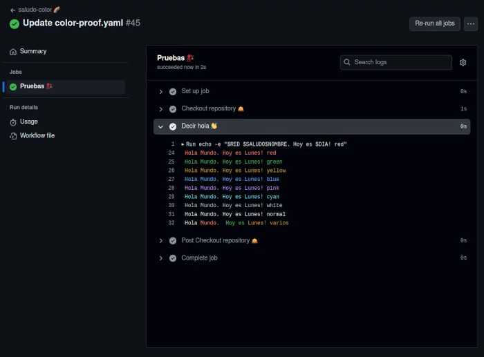

# Práctica guiada - Crear un workflow

Vamos a hacer un práctica sencilla para ver cómo se crea un workflow en GitHub Actions desde 0. Lo que haremos es simplemente enviar un saludo en la consola, que este coloreado y que se ejecute en respuesta a un evento "pull request". También se podrá ejecutar manualmente personalizando el mensaje de saludo.

Recordad que el workflow se debe guardar en la carpeta `.github/workflows` de vuestro repositorio.

Empezamos con el nombre, debe ser descriptivo y fácil de identificar:

```yaml
name: saludo-color 🌈
```

Y el trigger, hemos dicho que debe ser pull request y manual:

```yaml
on:
  pull_request:
  workflow_dispatch:
```

Necesitaremos unas variables de entorno para definir colores y mensajes:

```yaml
  SALUDO: "Hola "
  RED: \033[31m
  GREEN: \033[32m
  YELLOW: \033[33m
  BLUE: \033[34m
  PINK: \033[35m
  CYAN: \033[36m
  WHITE: \033[37m
  NORMAL: \033[0;39m
```

Ahora, vamos a definir algunos aspectos del job:
- Nombre. [Más info](https://docs.github.com/en/actions/using-workflows/workflow-syntax-for-github-actions#name)
- Sistema operativo. Le asignamos una Ubuntu latest. [Más info](https://docs.github.com/en/actions/using-workflows/workflow-syntax-for-github-actions#jobsjob_idruns-on)
- Variables de entorno. Vamos a especificar una variable específica para el job. [Más info](https://docs.github.com/en/actions/learn-github-actions/variables)

```yaml
jobs:
  pruebas:
    name: Prueba saludo 🏗️
    runs-on: ubuntu-latest
    env:
      NOMBRE: "Mundo"
```

Ahora ya podemos especificar un step dentro del job. Podemos empezar por el checkout para poder acceder a los archivos del repositorio:

```yaml
    steps:
      - name: Checkout repository 🛎️
        uses: actions/checkout@v3
```

Y el segundo step será el encargado de enviar el saludo. Además añadimos la fecha mediante una variable que actuará tan solo a nivel de step:

```yaml
    steps:
      - name: Decir hola 👋
        run: |
          echo -e "$RED $SALUDO$NOMBRE. Hoy es $DIA! red"
          echo -e "$GREEN $SALUDO$NOMBRE. Hoy es $DIA! green"
          echo -e "$YELLOW $SALUDO$NOMBRE. Hoy es $DIA! yellow"
          echo -e "$BLUE $SALUDO$NOMBRE. Hoy es $DIA! blue"
          echo -e "$PINK $SALUDO$NOMBRE. Hoy es $DIA! pink"
          echo -e "$CYAN $SALUDO$NOMBRE. Hoy es $DIA! cyan"
          echo -e "$WHITE $SALUDO$NOMBRE. Hoy es $DIA! white"
          echo -e "$NORMAL $SALUDO$NOMBRE. Hoy es $DIA! normal"
          echo -e ""$NORMAL $SALUDO$RED$NOMBRE. $GREEN Hoy es $YELLOW$DIA! varios""

        env:
          DIA: Lunes
```

Con este workflow hemos visto cada parte de un workflow básico. Ahora, vamos a ver cómo se vería en la interfaz de GitHub Actions:




!Enhorabuena! 🎉 Has llegado al final de este capítulo. Ahora puedes seguir prácticando con otros workflows que te interesen. Algunas ideas: https://github.com/sdras/awesome-actions/blob/main/ideas.md 

Además, te animo a que le eches un vistazo al curso de [Dagger](https://dagger.io/) con el que podrás personalizar mucho más cada workflow: https://prefapp.github.io/formacion/cursos/dagger/#/
