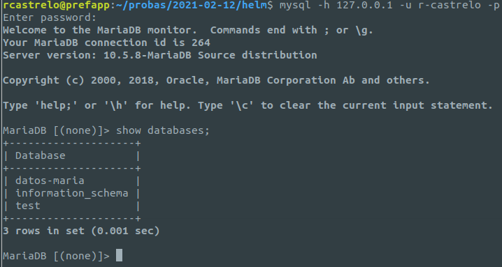

Módulo 1: Primeros Pasos con Helm
=
**<u>Aparatado A:</u>**
```
helm repo add bitnami https://charts.bitnami.com/bitnami
```
**<u>Aparatado B</u>**
Creamos un arquivo chamado configmap.yaml.
Apunte: para esta practica uso un namespace llamado mariadb. 
``` 
kind: ConfigMap
apiVersion: v1
metadata:
  name: mariadb
  namespace: mariadb

auth:
  rootPassword: "gustavo"
  database: "datos-maria"
  username: "r-castrelo"
  password: "r-castrelo"

primary:
  persistence:
    enabled: false
  service:
    port: "3500"

secondary:
  persistence:
    enabled: false
```

Executamos o comando:
```
helm install mariadb -f configmap.yaml  bitnami/mariadb -n mariadb
```
E xa teriamos instalado a base de datos, para acceder teriamos que facer un port-forward:
```
kubectl port-forward service/mariadb -n mariadb --address 0.0.0.0 3306:3500
```

E xa podremos acceder co noso usuario de mysql e listar as bases de datos:


