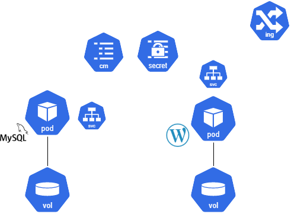
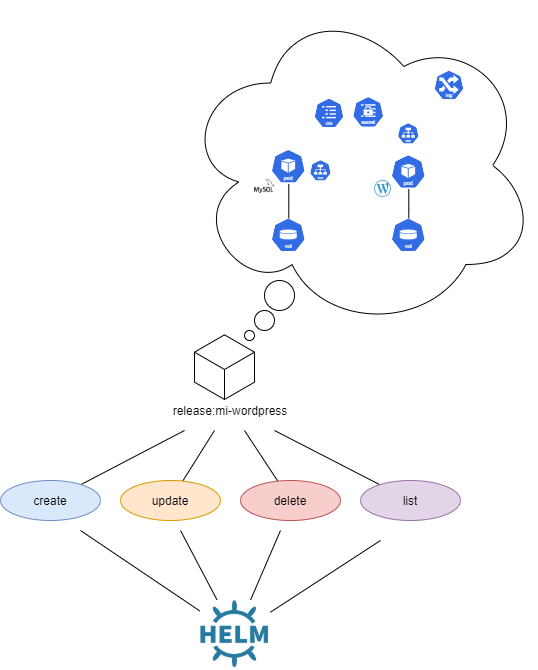
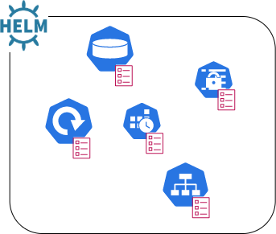
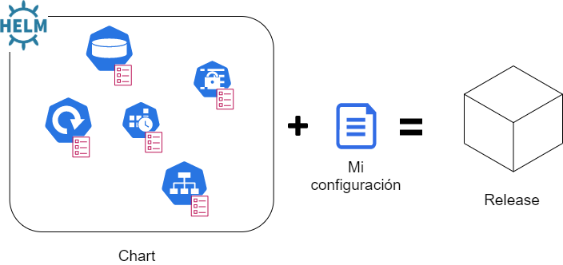

# ¿Qué es HELM?


Helm es una herramienta de gestión de artefactos de Kubernetes que permite instalar y gestionar conjuntos de recursos (services, deployments, jobs, configmaps...) como si de una sola aplicación se tratase. 

A veces llamado el apt/yum de Kubernetes, su empleo permite una mayor eficiencia y mejor gestión de las operaciones en k8s. 

## ¿Cuáles son los problemas que pretende resolver Helm?

Todo lo que existe en kubernetes se expresa en forma de artefactos (objetos). Para que una aplicación funcione correctamente en Kubernetes, se pueden llegar a necesitar decenas e incluso centenas de estos objetos que además son dependientes entre sí.



*Fig 1. Conjunto de artefactos para una posible instalación de wordpress*

Tal y como se puede apreciar en la figura 1, una aplicación en kubernetes puede emplear una cantidad importante de artefactos que:

1. Necesitan desplegarse conjuntamente para que la aplicación funcione. 
1. Es necesario borrar para "desinstalar" una aplicación. 
1. Pueden tener que modificarse (actualizarse) por grupo en determinados momentos. 

Una de las soluciones a las que se suele recurrir para poder realizar estas tareas es la de la expresión de todos los artefactos en un único fichero de yaml (separados entre sí por ---) y recurrir al kubectl  para poder lanzarlos y borrarlos. 

```shell
kubectl {create|apply|delete} <fichero.yaml>
```

Esto, evidentemente, trae problemas a la hora de realizar modificaciones a ese bloque de código, así, se "inventan" soluciones como ficheros en bash que formateen cada artefacto y lo envíen al bloque final que se pasa al kubectl...

Helm da respuesta a este problema mediante el concepto de release. 

Una release de Helm es una instalación de un grupo de artefactos de kubernetes que tratamos como si fuese una unidad: 



*Fig 2.  Casos de uso de una release desde Helm*

Al existir la release, nos podemos despreocupar del conjunto, grande o pequeño, de artefactos que la integran, y tratarlo todo como una unidad.  

> Helm abstrae la complejidad de las aplicaciones residentes en kubernetes y las presenta como **releases** sobre las que podemos operar sin preocuparnos de su estructura interna ni del número de artefactos que la componen.

Un segundo problema que presentan las aplicaciones en K8s es su configuración. Los artefactos que componen una aplicación en kubernetes tienen una configuración que expresa su funcionamiento y su forma de interactuar con los demás. Normalmente, estos objetos suelen tener dos partes bien diferenciadas:
- **Estructura**:  elementos más o menos inmutables del objeto (Kind, Name, apiVersion, annotations, volumes...)

- **Datos**: elementos más volátiles: valores de variables de entorno, puertos, límites de ejecución...

Al administrar una aplicación en k8s, las operaciones suelen comportar la edición de los ficheros de artefactos (expresados en yaml) para modificar los valores (la parte de datos) generalmente sin tocar la estructura de los mismos. Al poco tiempo, se hace evidente la necesidad de usar algún tipo de sistema de [plantillas](https://es.wikipedia.org/wiki/Plantilla) que permita diferenciar la estructura (inmutable) de los artefactos de k8s de los datos (configuración volátil). Helm da una respuesta a este problema mediante un potente lenguaje de plantillas: el [go templates](https://pkg.go.dev/text/template?tab=doc).

Mediante Helm, las aplicaciones (el grupo de artefactos que las conforman) se describen en un conjunto de plantillas, que conforman su estructura, que se pueden rellenar con la configuración que deseemos. 

Al conjunto de plantillas de artefactos que definen una aplicación concreta, en Helm se le da el nombre de **Chart**. 



*Fig 3. Chart de helm*

> Helm expresa la estructura de una aplicación mediante un conjunto de pantillas al que denomina **Chart**

Una chart de Helm, por tanto, no es un conjunto de artefactos de Kubernetes: es un conjunto de plantillas de artefactos al que, aplicando la configuración que deseemos, produce lo que realmente se desplegará en nuestro clúster; esto es, la **release**. 



*Fig 4. Esquema de conceptos en Helm*

> Al aplicar nuestra configuración deseada a una chart obtenemos una release que es lo que realmente se desplegará en nuestro clúster de k8s.

##  ¿Por qué se le llama a Helm el apt/yum de Kubernetes?

Como vimos en la sección anterior, Helm emplea charts que son conjuntos de plantillas para expresar la estructura de una aplicación para Kubernetes. Existe un [repositorio de charts](https://hub.helm.sh/) (al igual que existe para apt o yum) donde podemos encontrar plantillas para muchas aplicaciones y servicios (MariaDB, Wordpress, RabbitMQ, Elastic Search...)

Podemos, por tanto, escoger la chart de cualquier aplicación del repositorio y, con un simple comando, instalarla en nuestro clúster. (Al igual que ocurre con apt o yum).  Además, podremos establecer muchos de sus parámetros de configuración para definir el comportamiento que deseemos e instalarla. 

En un ejemplo, la chart de [MariaDB](https://hub.helm.sh/charts/bitnami/mariadb) 

## Tarea
**Echa un vistazo a la sección de "parameters" de la chart de MariaDB. Identifica algunos de los valores configurables.**


