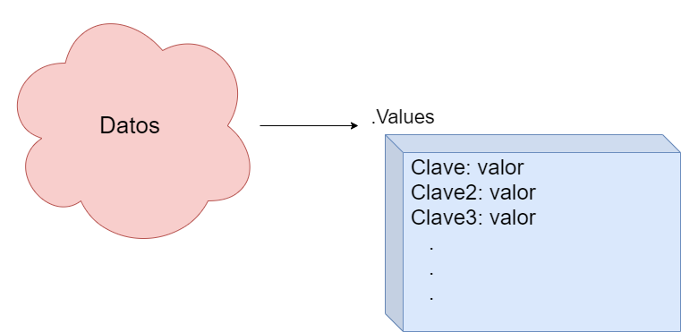
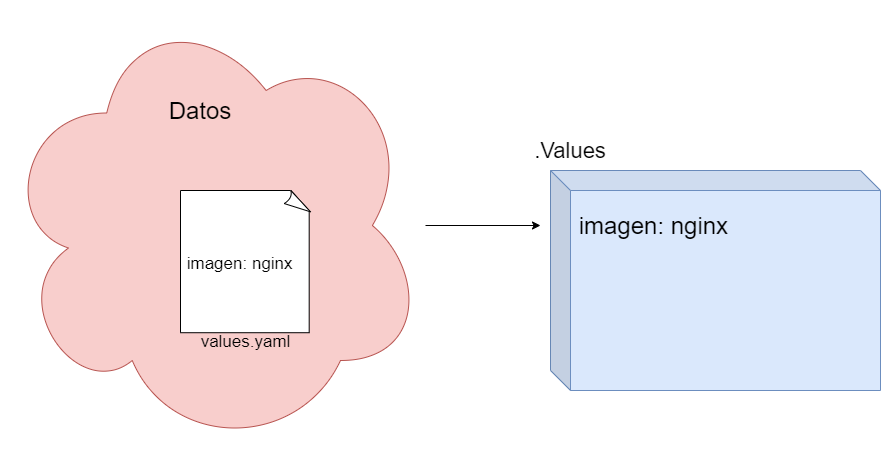

# De los valores y su interpolación

Uno de los componentes básicos de Helm es su potente motor de plantillas. 

Como vimos en la lección anterior, Helm emplea [go templates](https://golang.org/pkg/text/template/) para realizar la interpolación de valores y producir manifiestos. 

Por lo tanto, lo primero que debemos analizar es qué valores maneja las plantillas de Helm y cómo podemos emplearlos para construir nuestras propias charts. 

## a) Los valores
El conjunto de datos que son modificables por parte del usuario aparecen dentro de una chart de Helm bajo un objeto muy especial que se conoce con el nombre de **Values**.

El hecho de ser un objeto ([mapa](https://blog.golang.org/maps) en GO) implica que nos vamos a encontrar con claves a las que tenemos asociados valores. A su vez, por supuesto, el valor puede ser otro objeto (y así sucesivamente). 



*Fig 1. Los valores que pasa el usuario se ven como un objeto llamado Values dentro del Chart*

La construcción del objeto Values no es baladí y sigue un orden de prelación en función de las definiciones que haga el usuario (se verá en otra sección). 

## Ejemplo básico de valores

Para poner un ejemplo, imaginémonos que queremos construir un pod de nginx. Vamos a verlo, en primer lugar como un artefacto de Kubernetes (sin Helm):

```yaml
# Ejemplo básico de pod

apiVersion: v1
kind: Pod
metadata:
  name: web
spec:
  containers:
    - name: web
      image: nginx
      ports:
        - name: web
          containerPort: 80
          protocol: TCP
```
Como podemos ver es un artefacto bastante rígido: no podemos modificar nada sin acceder directamente a él y "tocarlo". 

Vamos a aplicar Helm:
- Dejaremos que el usuario pueda decidir qué versión (imagen) de nginx monta el pod. 

### a) Creando la estructura básica de la chart
Para poder obtener este resultado, vamos a necesitar una plantilla de Helm. 

La plantilla que vamos a crear es **minimalista** así que la vamos a clonar de este ejemplo:

```shell
# creamos un directorio
mkdir ejemplo1 

# creación de chart inicial básica
curl https://raw.githubusercontent.com/frmadem/helm-curso/master/charts/inicial/starter.sh | NOMBRE=ejemplo1 bash -x
```


Si hacemos un listado de la carpeta, vemos que se han creado dos elementos esenciales para la chart:
- **Chart.yaml**: fichero de control de la chart con sus definiciones fundamentales. 
- **templates/**: directorio donde almacenaremos nuestras plantillas. 
En el directorio de templates, crearemos nuestro fichero con la plantilla del pod:

```yaml
# templates/pod.yaml

apiVersion: v1
kind: Pod
metadata:
  name: web
spec:
  containers:
    - name: web
      image: nginx
      ports:
        - name: web
          containerPort: 80
          protocol: TCP
```

Como se puede observar, la plantilla, en este momento, es exactamente igual que artefacto original. 

No obstante, esto que tenemos aquí es perfectamente válido para helm. 

De hecho, si ejecutamos [helm template](https://helm.sh/docs/helm/helm_template/) (comando que renderiza toda la chart en un manifiesto único) obtendremos lo siguiente:


```yaml
# Source: ejemplo1/templates/pod.yaml
# templates/pod.yaml

apiVersion: v1
kind: Pod
metadata:
  name: web
spec:
  containers:
    - name: web
      image: nginx
      ports:
        - name: web
          containerPort: 80
          protocol: TCP
```
```shell
~/ejemplo1  helm template . 
```

Helm nos ha renderizado nuestro `pod.yaml` sin interpolar nada. 

Podemos concluir:
> Las plantillas de helm, en su mayor parte, se basan en la estructura y la sintáxis de un artefacto de Kubernetes.

Obviamente, esta chart es muy limitada, vamos a mejorarla dándole capacidad de recibir datos. 

### b) Agregando valores a nuestra chart

Cuando diseñamos una chart, uno de los primeros elementos en los que hay que centrarse es en el fichero values.yaml. 

Este fichero, que pondremos en el directorio raíz de la chart (al nivel del fichero Chart.yaml) nos permite establecer valores por defecto. Estos valores son los que empleará Helm para renderizar nuestras releases *salvo que el usuario estableza otros diferentes*. 

Como dijimos al principio, vamos a permitir que la imagen de nginx sea definible por el usuario. Esta imagen la vamos a poner en nuestros **Values** con una clave. por ejemplo, la clave `imagen`. 

Vamos, pues, a crear, nuestro fichero de values con el siguiente contenido:
```yaml
# ejemplo1/values.yaml
imagen: nginx
```

Al declarar esto, nuestros datos tienen un primer par clave-valor (imagen: nginx), este es el esquema de datos de nuestra chart:



Por supuesto, hemos introducido datos en el mapa de Values de nuestra chart, pero  ahora tenemos que emplearlos en nuestra plantilla; esto se realiza de la siguiente manera:
```yaml
# templates/pod.yaml

apiVersion: v1
kind: Pod
metadata:
  name: web
spec:
  containers:
    - name: web
      image: {{ .Values.imagen }}
      ports:
        - name: web
          containerPort: 80
          protocol: TCP
```

La línea interesante es la número 10. Básicamente no estamos usando un valor concreto sino aquello que exista en **Values.imagen**. Destacar:
- Es importante notar el "." que va antes de Values, se trata del contexto (que veremos más adelante)
- Las sentencias de plantilla en Helm van rodeadas de `{{ }}`. 

Si ejecutamos de nuevo helm template:
```yaml
# Source: ejemplo1/templates/pod.yaml
# templates/pod.yaml

apiVersion: v1
kind: Pod
metadata:
  name: web
spec:
  containers:
    - name: web
      image: nginx
      ports:
        - name: web
          containerPort: 80
          protocol: TCP
```

```shell
~/ejemplo1 helm template .
```

Vemos que hemos obtenido el mismo resultado de la ejecución anterior, pero con una diferencia crucial: el valor de "image" no está puesto en la plantilla, se ha obtenido de los datos que ha recibido la aplicación en el momento de su renderizado. 

¿Cómo podemos establecer un valor diferente al que hemos definido en el fichero values.yaml? La respuesta la veremos en la siguiente sección. 

### c) Sobreescribiendo los valores por defecto

Como vimos en las sección anterior, los valores por defecto que acepta nuestra chart deben venir establecidos en el fichero `values.yaml`.  Obviamente, cuando queramos crear nuestras releases, tendremos que poder establecer valores que sean distintos de los que se hayan definido por defecto: tiene que haber, por tanto, un orden de prelación a la hora de definir valores. 

De forma general, podemos pasar valores a nuestra Chart de dos formas diferentes:
- Mediante ficheros (en formato yaml) con definiciones de valores. 
- A través de flags de la línea de comandos: `--set <clave>=<valor>`

Vamos a probar estos métodos de paso de valores con nuestra Chart. 

Supongamos que queremos hacer una release que tenga como imagen de nginx la versión 1.19.1, por tanto nuestra imagen sería: nginx:1.19.1. Podemos definirla en un fichero de valores propio:

```yaml
# ejemplo1/mis_valores.yaml
imagen: nginx:1.19.1
```

Ahora, procedemos a renderizar nuestra Chart, pasando el flag `-f <ruta del fichero de valores>`:

```yaml
# Source: ejemplo1/templates/pod.yaml
# templates/pod.yaml

apiVersion: v1
kind: Pod
metadata:
  name: web
spec:
  containers:
    - name: web
      image: nginx:1.19.1
      ports:
        - name: web
          containerPort: 80
          protocol: TCP
```
```shell
~/ejemplo1 helm template . -f mis_valores.yaml
```

Como podemos ver, el resultado es el esperado: la imagen de nginx es la 1.19.1 y no la definida por defecto. 

La razón de que tengamos esta salida se encuentra en la resolución de los datos por parte de Helm:


*fig 3. Fusión de valores y orden de prelación*

> A la hora de preparar el objeto **Values**, Helm fusiona las distintas fuentes de datos siguiendo un estricto orden de precedencia en los ficheros. El valor definido en el último fichero incluído siempre tiene más peso que el que se encuentre en los anteriores.

