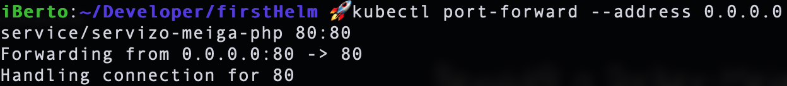

# Práctica guiada: Proyecto Meiga en Helm

Vamos a coger la aplicación **docker-meiga** del módulo 4 del curso de Docker y la vamos a migrar a un cluster de Kubernetes con la ayuda de Helm. Al final de esta guía tendremos un chart de Helm que nos permitirá desplegar la aplicación completa con los ajustes que gustemos lanzando un simple comando.

Para realizar esta práctica necesitamos tener todos los artefactos de Kubernetes que necesita nuestra aplicación. Ya que aprender Kubernetes no es la finalidad de este curso, en este [enlace]((https://github.com/prefapp/formacion/tree/master/cursos/helm/codigo_practica_guiada_meiga/meiga-k8s)) puedes obtener todos los artefactos necesarios para realizar esta práctica.

La aplicación [**Meiga**](https://github.com/prefapp/formacion/tree/master/cursos/helm/codigo_practica_guiada_meiga/meiga-k8s) tiene la siguiente arquitectura dentro de Kubernetes:


Vamos a probar que todo funciona antes de pasarla a Helm:

Ejecutamos:


Hacemos un port-forward:


Y vamos al navegador a comprobar que todo funciona correctamente:


## Probando Helm
Ahora que ya estamos familiarizados con el k8s-meiga, vamos a crear desde cero una chart de Helm para nuestro proyecto.

1. Para crear la estructura Helm simplemente debemos lanzar el siguiente comando:

  ```shell
  $ helm create meiga-project
  ```
  Esto nos creará una serie de ficheros en el directorio `./meiga-project`. Entre ellos **Chart.yaml**, **values.yaml** y el directorio **/templates**.

1. Vamos a modificar el fichero `Chart.yaml` para cambiar la versión de Helm. Deberíamos tener algo así:

  ```yaml
  #Chart.yaml
  apiVersion: v3.5
  name: meiga-project
  description: A Helm chart for Kubernetes
  type: application
  version: 0.1.0
  ```

  La `version: 0.1.0` es la versión asociada a nuestro proyecto.

1. Vamos a modificar el fichero `values.yaml`. Por ahora simplemente borraremos su contenido.

1. Dentro de nuestro proyecto tendremos una carpeta llamada `/templates`. Borraremos todo su contenido y **añadiremos** ahí nuestros artefactos de Kubernetes. Nos quedaría una esctructura como la siguiente:

  

### Helm install
Ya podemos lanzar nuestra aplicación. Con un solo comando `helm install`s Helm se encarga de desplegar todos nuestros artefactos. Debemos asegurarnos de que ninguno de los artefactos de kubernertes que vamos a deplegar se encuentra previamente en el cluster (si en el punto anterior hemos hecho un *apply* de todos los artefactos es posible que nos hayamos olvidado de hacer los *delete* correspondientes). 

El comando para desplegar la chart y con ella todos nuestros artefactos es:

```shell
$ helm install <nombre-de-la-release> <directorio>
```


Probamos que funciona:



Si hacemos:

```shell
$ helm list
```

Podemos ver nuestra release. Para "desinstalarla" junto con todos los artefactos solo tenemos que hacer:

```shell
$ helm uninstall <nombre de la release>
```

## Configurando values.yaml
Ahora que ya tenemos nuestro proyecto funcionando con helm, vamos a mover nuestras configuraciones a `values.yaml`, archivo que habíamos vaciado previamente.

Por ejemplo, para cambiar el puerto de nuestra web meiga-php introducimos la siguiente entrada en `values.yaml`:

```yaml
puertos:
  servicio:
    frontend: 80
```
Y cambiamos la línea correnpondiente de `frontend-service.yaml`
```yaml
...
 - protocol: TCP
    port: {{ .Values.puertos.servicio.frontend }}
    targetPort: 80
```

Vamos a mover a values las imágenes que utilizamos tanto en *bbdd* como en *frontend*, así como todos los valores del *configmap* y *secret*.

Tras todos estos cambios deberíamos tener un `values.yaml` similar a:
```yaml
# meiga-project/values.yaml
imagenes: 
  frontend: elberto/meiga-php-lite
  bbdd: mysql:5.7

puertos:
  servicio:
    frontend: 80

curso:
  nombrecurso: "Aprende Helm"
  docente: "EstudianteA"

mysql:
  host: "servizo-meiga-bbdd:3306"
  user: "root"
  database: "meiga"

secreto: Y29udHJhc2luYWw=
```

> Una vez introducidos todos estos parámetros, ya tenemos nuestra aplicación pasada a una chart de helm. 

Si queremos ejecutarla con unos valores diferentes a los que vienen por defecto podemos pasarlos como parámetro en el install de helm:

```shell
$ helm install mimeiga meiga-project/ --set curso.docente=Pepito
```

o pasar un fichero de configuración como parámetro:
```shell
$ helm install mimeiga meiga-project/ -f misvalores.yaml 
```

Si tienes algún problema con esta práctica guiada puedes ver el proyecto solución completo [aquí](https://github.com/prefapp/formacion/tree/master/cursos/helm/codigo_practica_guiada_meiga/meiga-helm).


