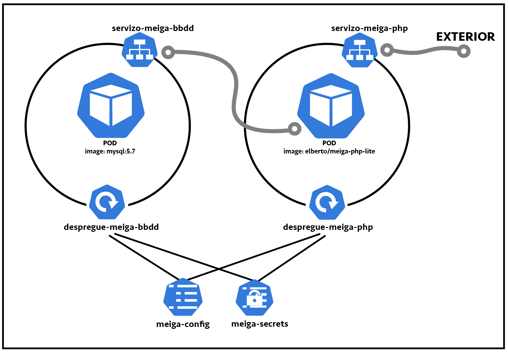
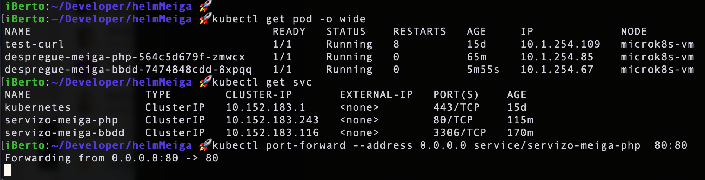
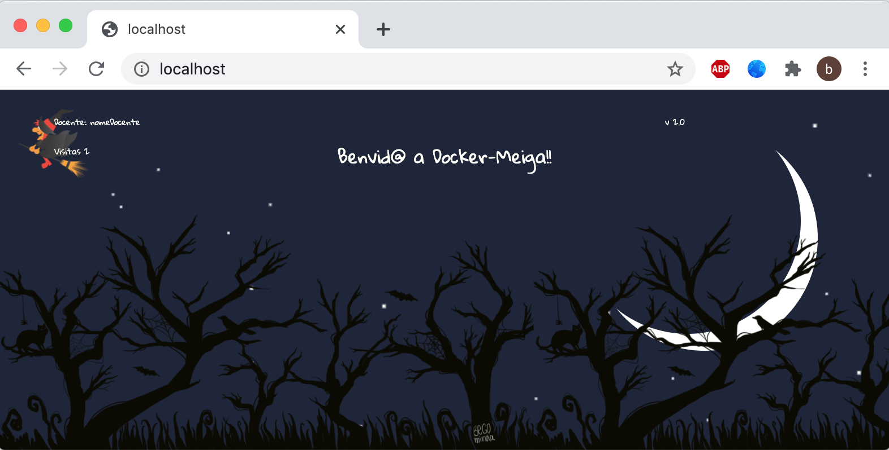

# Práctica guiada: Proxecto Meiga en Helm

> **Work in progres**, chapter not completed yet, just some important information added yet


#### Descargamos los seguintes artefactos: [meigak8s](https://github.com/prefapp/formacion/tree/master/cursos/helm/codigo_practica_guiada_meiga)

La aplicación **Meiga** tiene la siguiente arquitectura dentro de Kubernetes:


Vamos a probar que todo funciona antes de pasarla a Helm:

Ejecutamos:


Hacemos un port-forward:


Y vamos al navegador a comprobar que todo funciona correctamente:



## Probando Helm
Ahora vamos a crear una chart de Helm para nuestro proyecto.

1. Para crear la estructura Helm simplemente debemos lanzar el siguiente comando:

  ```shell
  $ helm create meiga-project
  ```
  Esto nos creará una serie de ficheros en el directorio `./meiga-project`. Entre ellos **Chart.yaml**, **values.yaml** y el directorio **/templates**.

1. Vamos a modificar el fichero `Chart.yaml` para cambiar la versión de Helm, deberíamos tener algo así:

  ```yaml
  #Chart.yaml
  apiVersion: v3.5
  name: meiga-project
  description: A Helm chart for Kubernetes
  type: application
  version: 0.1.0
  ```

  La `version: 0.1.0` es la versión asociada a nuestro proyecto.

1. Vamos a modificar el fichero `values.yaml`. Por ahora simplemente borraremos su contenido.

1. Dentro de nuestro proyecto tendremos una carpeta llamada `/templates`. Borraremos todo su contenido y **añadiremos** ahí nuestros artefactos de Kubernetes. Nos quedaría una esctructura como la siguiente:

  

Ahora vamos a lanzar nuestro aplicación, con un solo comando Helm se encarga de desplegar todos nuestros artefactos. Debemos asegurarnos de que ninguno de los artefactos de kubernertes que vamos a deplegar se encuentra previamente en el cluster. El comando para desplegar la chart y con ella todos nuestros artefactos es:

```shell
$ helm install <nombre-de-la-release> <directorio>
```


Probamos que funciona:


Si hacemos:

```shell
$ helm list
```

Podemos ver nuestra release. Para "desinstalarla" junto con todos los artefactos solo tenemos que hacer:

```shell
$ helm uninstall <nombre de la release>
```

