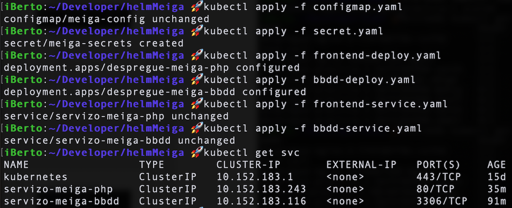

# Práctica guiada: Proxecto Meiga en Helm

> **Work in progres**, chapter not completed yet, just some important information added yet

#### Descargamos los seguintes artefactos: [meigak8s](https://github.com/prefapp/formacion/tree/master/cursos/helm/codigo_practica_guiada_meiga)

La aplicación **Meiga** tiene la siguiente arquitectura dentro de Kubernetes:

Vamos a probar que todo funciona antes de pasarla a Helm:

Ejecutamos:

Hacemos un port-forward:

Y vamos al navegador a comprobar que todo funciona correctamente:

