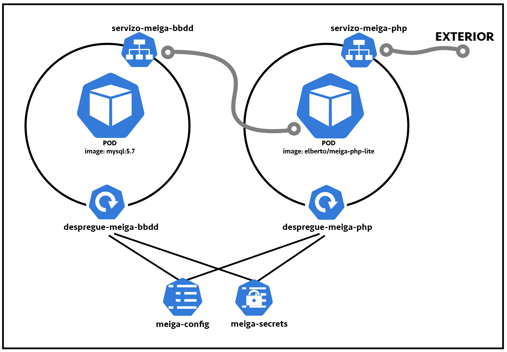
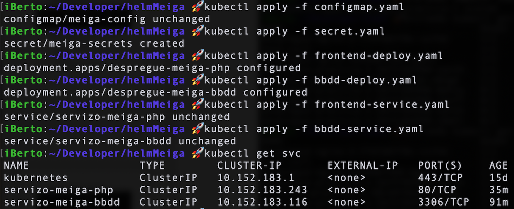
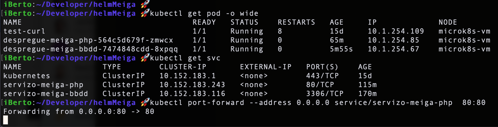
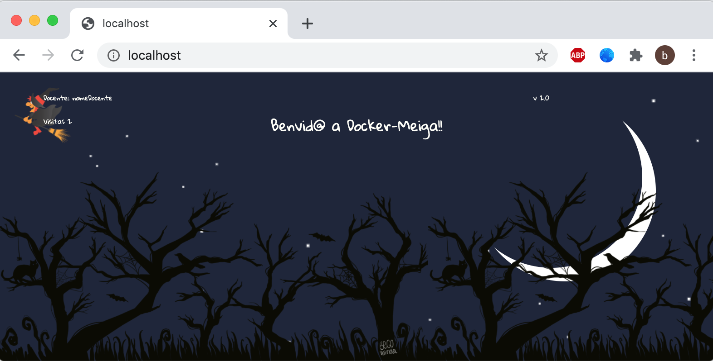
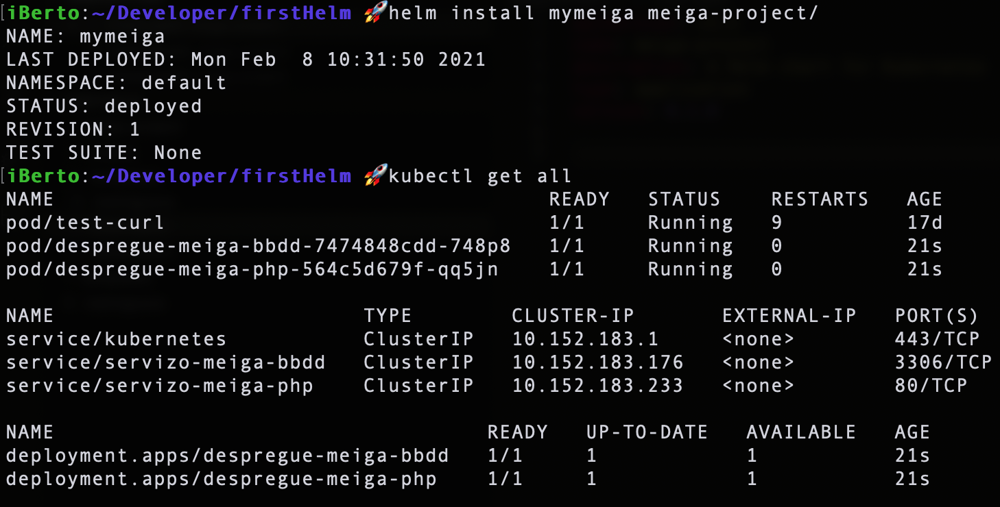
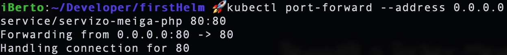

# Práctica guiada: Proyecto Meiga en Helm

Vamos a coger la aplicación [**docker-meiga** del módulo 4](https://prefapp.github.io/formacion/cursos/docker/#/./00_actividades/04_modulo_4?id=deseñar-e-implantar-unha-solución-co-docker-compose-para-docker-meiga) del curso de Docker y la vamos a migrar a un cluster de Kubernetes con la ayuda de Helm. Al final de esta guía tendremos un chart de Helm que nos permitirá desplegar la aplicación completa con los ajustes que gustemos lanzando un simple comando.

Para realizar esta práctica necesitamos tener todos los artefactos de Kubernetes que necesita nuestra aplicación. Ya que aprender Kubernetes no es la finalidad de este curso, en este [enlace](https://github.com/prefapp/formacion/tree/master/cursos/helm/codigo_practica_guiada_meiga/meiga-k8s) puedes obtener todos los artefactos necesarios para realizar esta práctica.

La aplicación [**Meiga**](https://github.com/prefapp/formacion/tree/master/cursos/helm/codigo_practica_guiada_meiga/meiga-k8s) tiene la siguiente arquitectura dentro de Kubernetes:


Vamos a probar que todo funciona antes de pasarla a Helm:

Ejecutamos:


Hacemos un port-forward:


Y vamos al navegador a comprobar que todo funciona correctamente:



## Probando Helm
Ahora que ya estamos familiarizados con el k8s-meiga, vamos a crear desde cero una chart de Helm para nuestro proyecto.

1. Para crear la estructura Helm simplemente debemos lanzar el siguiente comando:

  ```shell
  $ helm create meiga-project
  ```
  Esto nos creará una serie de ficheros en el directorio `./meiga-project`. Entre ellos **Chart.yaml**, **values.yaml** y el directorio **/templates**.

1. Vamos a modificar el fichero `Chart.yaml` para cambiar la versión de Helm. Deberíamos tener algo así:

  ```yaml
  #Chart.yaml
  apiVersion: v2
  name: meiga-project
  description: A Helm chart for Kubernetes
  type: application
  version: 0.1.0
  ```

  La `version: 0.1.0` es la versión asociada a nuestro proyecto.

1. Vamos a modificar el fichero `values.yaml`. Por ahora simplemente borraremos su contenido.

1. Dentro de nuestro proyecto tendremos una carpeta llamada `/templates`. Borraremos todo su contenido y **añadiremos** ahí nuestros artefactos de Kubernetes. Nos quedaría una esctructura como la siguiente:

  

### Helm install
Ya podemos lanzar nuestra aplicación. Con un solo comando `helm install` Helm se encarga de desplegar todos nuestros artefactos. Debemos asegurarnos de que ninguno de los artefactos de kubernertes que vamos a deplegar se encuentra previamente en el cluster (si en el punto anterior hemos hecho un *apply* de todos los artefactos es posible que nos hayamos olvidado de hacer los *delete* correspondientes). 

El comando para desplegar la chart y con ella todos nuestros artefactos es:

```shell
$ helm install <nombre-de-la-release> <directorio> -n <namespace>
```



Probamos que funciona:



Si hacemos:

```shell
$ helm list
```

Podemos ver nuestra release. Para "desinstalarla" junto con todos los artefactos solo tenemos que hacer:

```shell
$ helm uninstall <nombre de la release>
```

## Renombrando nuestro artefactos
Ahora que hemos creado una chart de helm para nuestro proyecto vamos a comenzar a sacarle partido. Como ya sabemos, con el comando `helm install` podemos crear diferentes **releases** de nuestra aplicación. Si tratamos de desplegar **dos releases** de la misma chart nos saldrá un error diciendo que ya existen artefactos con el mismo nombre. 

Para evitar que choquen nuestras *releases* podríamos desplegar cada una en un *namespace* diferente con el flag `-n`. ¿Y si queremos dos releases en el mismo *namespace*? 

La solución a nuestro problema es introducir en el nombre de los artefactos una parte variable, dependiente de cada release.

Utilizando los **[built-in objects](https://helm.sh/docs/chart_template_guide/builtin_objects/)** de Helm podemos inyectar dentro del nombre de nuestros artefactos el nombre específico de la release. 

Vamos entonces a renombrar todos los artefactos de la siguiente manera:

```
despregue-meiga-bbdd   -->  despregue-{{ .Release.Name }}-bbdd  
despregue-meiga-php    -->  despregue-{{ .Release.Name }}-php
servizo-meiga-php      -->  servizo-{{ .Release.Name }}-php
servizo-meiga-bbdd     -->  servizo-{{ .Release.Name }}-bbdd
meiga-secrets          -->  {{ .Release.Name }}-secrets
meiga-config           -->  {{ .Release.Name }}-config
```
Debemos fijarnos y aplicar estos cambios a todas las partes donde se referencien nuestros artefactos. Ejemplo:
```yaml
# bbdd-deploy.yaml
...
env:
          - name: "MYSQL_ROOT_PASSWORD"
            valueFrom:
              secretKeyRef:
                name: {{ .Release.Name }}-secrets
                key: root-password
            
          - name: "MYSQL_DATABASE"
            valueFrom:
              configMapKeyRef:
                name: {{ .Release.Name }}-config
                key: "MYSQL_DATABASE"
...
```


## Configurando values.yaml
Una vez aplicados los cambios del apartado anterior, vamos  seguir aprovechando las funcionalidades que nos ofrece Helm. Moveremos todas las configuraciones de nuestras aplicación a `values.yaml`, archivo que habíamos vaciado previamente. De este manera tendremos un solo punto desde el que configurar todo el despliegue.

### a) Cambiando el puerto del frontend
Para cambiar el puerto de nuestra web meiga-php introducimos la siguiente entrada en `values.yaml`:

```yaml
puertos:
  servicio:
    frontend: 80
```
Y cambiamos la línea correnpondiente de `frontend-service.yaml`
```yaml
...
 - protocol: TCP
    port: {{ .Values.puertos.servicio.frontend }}
    targetPort: 80
...
```

### b) Imágenes como parámetro
Vamos a mover a **values** las imágenes que utilizamos tanto en *bbdd* como en *frontend* para así poder cambiar la imagen o su versión sin tener que tocar ningún artefacto.

`values.yaml`
```yaml
...
imagenes: 
  frontend: elberto/meiga-php-lite
  bbdd: mysql:5.7
```

`bbdd-deploy` (lo mismo para `frontend-deploy`)
```yaml
...
containers:
      - name: meiga-mysql
        image: {{ .Values.imagenes.bbdd }}
...
```

### c) Migrar los valores de nuestro configmap a Values
En el `archivo configmap.yaml` tenemos la siguiente información:
```yaml
...
  CURSO: "nomeCurso"
  DOCENTE: "nomeAlumno"
  MYSQL_HOST: servizo-{{ .Release.Name }}-bbdd
  MYSQL_USER: "root"
  MYSQL_DATABASE: "meiga"
```

Dejaremos `MYSQL_HOST` pues no tiene mucho sentido exponerlo para su configuración. Vamos a declarar estas variables en `values.yaml`.
```
#values.yaml
...
env:
  CURSO: "Aprende Helm"
  DOCENTE: "Estudiante1"

mysql:
  user: "root"
  database: "meiga"
```

Modificaremos el `configmap.yaml` de la siguiente manera:
```yaml
data:
  MYSQL_HOST: servizo-{{ .Release.Name }}-bbdd
  MYSQL_USER: {{ .Values.mysql.user }}
  MYSQL_DATABASE: {{ .Values.mysql.database }}
  # En vez de coger una a una todas las variables de entorno que modifican 
  # la aplicacion, las definimos en Values.env. Si hace falta añadir alguna
  # no tenemos que tocar el artefacto, solo añadir una propiedad en Values.env
  {{ .Values.env | toYaml | nindent 2}}
```


### d) Contenido del secrets
Vamos a exponer la contraseña de nuestra base de datos para que se pueda modificar desde `values.yaml`:
```yaml
#values.yaml
...
secretos:
  rootpass: contrasinal
```

Vamos a utilizar una de las funciones que nos proporciona [Sprig](http://masterminds.github.io/sprig/) para introducir como texto nuestra contraseña en `values.yaml` y que Helm la inyecte dentro de `secret.yaml` en formato base64:
```yaml
#secret.yaml
...
data:
  root-password: {{ .Values.secretos.rootpass | b64enc }}
```


### e) Comprobaciones
Tras todos estos cambios deberíamos tener un `values.yaml` similar a:
```yaml
# meiga-project/values.yaml
imagenes: 
  frontend: elberto/meiga-php-lite
  bbdd: mysql:5.7

puertos:
  servicio:
    frontend: 80

#variables de env que modifican el frontend
env:
  CURSO: "Aprende Helm"
  DOCENTE: "EstudianteA"

mysql:
  user: "root"
  database: "meiga"

secretos:
  rootpass: contrasinal
```

> Una vez introducidos todos estos parámetros, ya tenemos nuestra aplicación pasada a una chart de helm. 

Si queremos ejecutarla con unos valores diferentes a los que vienen por defecto podemos pasarlos como parámetro en el install de helm:

```shell
$ helm install mimeiga meiga-project/ --set curso.docente=Pepito
```

o pasar un fichero de configuración como parámetro:
```shell
$ helm install mimeiga meiga-project/ -f misvalores.yaml 
```

Si tienes algún problema con esta práctica guiada puedes ver el proyecto solución completo [aquí](https://github.com/prefapp/formacion/tree/master/cursos/helm/codigo_practica_guiada_meiga/meiga-helm).

Recuerda que para hacer debugging puedes utilizar `helm template` para visualizar las *templates* renderizadas y comprobar que tu *chart* está funcionando correctamente.


