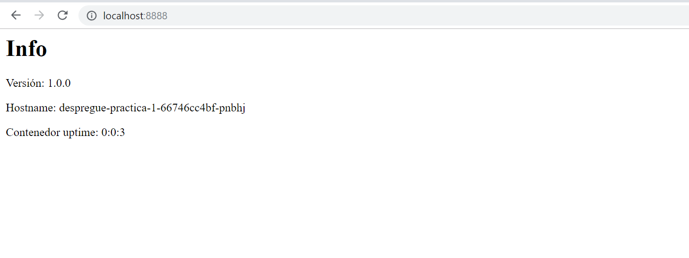

# Módulo 2: Kubernetes: navegando nun océano de contedores

## Instalando Kubernetes na nosa máquina local

Como falaramos na parte [expositiva](../02_kubernetes/01_que_e_kubernetes.md), Kubernetes pódese instalar de moitos xeitos e ten vocación de correr en diferentes contornas (cloud, on premise, bare-metal...) e, tamén, na nosa máquina local. 

No curso, recomendamos [microk8s](https://microk8s.io/) que é un excelente traballo da xente de Canonical e que nos permite, a través de [snap](https://snapcraft.io/), instalar e xestionar un minuclúster de Kubernetes (realmente o "master" e o "nodo" son virtuais e todo corre na nosa Ubuntu local) para facer as prácticas, desenvolver aplicacións, etc... 

### a) Instalación do paquete snap de microk8s
Dende unha shell da nosa ubuntu facemos:

```shell
 sudo snap install microk8s --classic
```

E agardamos a que remate a instalación. 
Comprobamos o estado:

```shell
 sudo microk8s.status
```

Que nos debería devolver algo como isto:


### b) Arranque e parado do microk8s
Para arrancar o microk8s basta con facer:

```shell
 sudo microk8s.start
```

Que debería producir algo como esto:


Agora, se facemos un status:

```shell
sudo microk8s.status
```

Deberíamos obter algo parecido a:


Para deter o microk8s, compre facer:

```shell
sudo microk8s.stop
```

E teríamos o sistema detido. 

### c) Habilitando os servizos
Por defecto, microk8s instálase sen o servizo de dns, fundamental para traballar con [servizos](../02_kubernetes/05_arquitectura_kubernetes_service.md).
Para habilitalo, basta con facer:

```shell
sudo microk8s.enable dns
```

### d) Interactuar co microk8s
A ferramenta principal para traballar contra un Kubernetes é o cli [kubectl](https://kubernetes.io/docs/reference/kubectl/overview/). 

En microk8s, está integrado no comando microk8s.kubectl.
Facendo un:

```shell
sudo microk8s.kubectl version
```
Deberíamos ver a nosa versión do cli e do kubernetes. 

### e) Habilitar o dashboard
Kubernetes expón un dashboard para traballar de xeito gráfico e ver o estado do clúster. 

Para habilitar o dashboard compre executar:

```shell
sudo microk8s.enable dashboard
```

Agora, para poder velo no navegador, dependerá se estamos a correr o microk8s nunha máquina virtual (VirtualBox ) ou o temos directamente correndo na nosa máquina de traballo. 

#### i) Habilitar o dashboard dentro dunha máquina virtual
O xeito máis sinxelo é facer un port-forward e redirixir a un porto da nosa VM ó que teñamos acceso dende o anfitrión. Nunha shell deixaremos correndo o seguinte comando:

```shell
 microk8s.kubectl port-forward service/kubernetes-dashboard -n kube-system --address=0.0.0.0 8888:443 
```

No meu caso, empreguei o porto 8888 porque o teño aberto na máquina virtual e redirixido ó porto 8888 do anfitrión. 

Agora, compre ir ó navegador e poñendo a dirección `https://localhost:8888` xa se pode acceder ó dashboard de Kubernetes. 


En caso de empregar chrome, ver a sección final. 

O certificado estará marcado como inseguro. 

#### ii) Acceder ó dashboard se o microk8s corre na máquina sen VM
Compre buscar a ip do servizo:

```shell
sudo microk8s.kubectl get services -n kube-system
```

E buscar a ip que nos da o sistema:


Con esa ip, ponémola no navegador na forma: `https://10.152.183.223:443`  e accederíamos ó dashboard.

### Addenda. Problemas co certificado auto-firmado

O dashboard escoita no porto 443 e vai por https. O certificado é autofirmado polo que pode dar problemas cos navegadores modernos. 

- En caso de empregar Mozilla Firefox, basta con ir ás opcións avanzadas e aceptar os riscos para ver o panel. 
- No caso do Google Chrome, a cousa é un pelín máis complicada. Compre ir a esta dirección  chrome://flags/#allow-insecure-localhost e permitir o localhost inseguro. Despois xa se pode acceder ó dashboard. 


### Evaluación

**Evidencias da adquición dos desempeños:**
- Captura de pantalla da versión de microk8s instalada (ver parágrafo a)
- Captura de pantalla do estado do microk8s, co dns (parágrafo c) e o dashboard (parágrafo e) habilitados 

**Indicadores de logro:** Deberías ter
- Correctamente instalado o microk8s
- Habilitados o dns e o dashboard e ser quen de ver o dashboard dende o navegador. 

**Criterios de corrección:**
- 15 puntos se hai unha captura da pantalla coa saída da versión de microk8s. 
- 10 puntos se hai unha captura da pantalla coa saída do microk8s.status e vense o dns e dashboard activos. 
- 5 puntos se hai unha captura de pantalla do navegador co dashboard de microk8s funcionando. 

**Autoavaliación:** Autoavalía esta tarefa aplicando os indicadores de logro anteriores

**Peso na cualificación:**
- Peso desta tarefa na cualificación final  ........................................ 30 puntos
- Peso desta tarefa no seu tema ...................................................... 30 %


\
\
\
## Os elementos básicos de Kubernetes

Nesta tarefa imos revisar os conceptos sobre Kubernetes (k8s)

Compre ler a [documentación](../02_kubernetes/) que temos no módulo.

Esta tarefa non ten entrega. 


### Evaluación

**Evidencias da adquición dos desempeños:**
- test feito

**Indicadores de logro:** Deberías ter
- test feito dacordo ós teus coñecementos

**Criterios de corrección:**
- 20 puntos polo test. 

**Autoavaliación:** Autoavalía esta tarefa aplicando os indicadores de logro anteriores

**Peso na cualificación:**
Peso desta tarefa na cualificación final  ........................................ 20 puntos
Peso desta tarefa no seu tema ...................................................... 20 %


\
\
\
## Correndo a nosa primeira aplicación en Kubernetes

Imos comezar a nosa andaina con Kubernetes. 

Para poder completar esta práctica compre ter completada a tarefa onde puxemos a funcionar o noso entorno de microk8s. 

Imos a montar unha sinxela aplicación escrita en nodejs que fai o seguinte:

- Corre un servidor web nun contedor
- Cando recibe unha petición, amosa por pantalla a seguinte información:
  - Versión da aplicación
  - O hostname
  - O uptime da aplicación en horas:minutos:segundos

### a) Despregue en pod
Para comezar, imos despregar a nosa aplicación nun [pod](../02_kubernetes/03_arquitectura_kubernetes_pod.md):
- A imaxe a montar será "frmadem/catro-eixos-k8s-ej1", co tag "v1", esto é: frmadem/catro-eixos-k8s-ej1:v1
- O pod terá como nome "pod-practica-1"
- Executará como comando "npm" "run" "iniciar"
- Compre configurarlle unha variable de contorna:
  - "PUERTO_APP" co valor "80" para que escoite no porto 80

Crearáse un ficheiro chamado "pod.yaml" e o correremos con kubectl apply. 

Unha vez feito isto, deberíamos ter algo como o que segue:


Precisamos, agora, probar a nosa aplicación para ver se da resposta. Para iso, imos exportar un porto conectado co pod a través de `kubectl port-forward`.

```shell
kubectl port-forward pod/pod-practica-1 --address 0.0.0.0 <porto_de_elección_do_vm>:80
```

Feito isto, deberíamos poder ver o resultado da execución no noso navegador:


Vemos a **versión** da aplicación, o **hostname** (o nome do pod onde está a correr) e as **hh:mm:ss** que leva correndo. 

### b) Montando un deploy
Se queremos correr a nosa aplicación con réplicas e control das mesmas compre que empreguemos un [deploy](../02_kubernetes/04_arquitectura_kubernetes_deployment.md).

Para montar o noso despregue temos que cumprir unha serie de requisitos:

- O despregue terá como nome "**despregue-practica-1**"
- Comezará cunha réplica
- Os pods escoitarán no porto 8080


Unha vez creado o artefacto, o lanzamos. 

Comproba que realmente tes o deploy e o pod correndo correctamente. 

Agora o imos a escalar a 5 réplicas. Qué comando haberá que empregar?

Unha vez que o teñas feito, comproba que realmente hai cinco réplicas correndo. 

Volve a establecer as réplicas a 1. 

Lista os pods que quedan unha vez feita esta operación. 


### c) Expoñendo a nosa aplicación a través dun servizo
Agora, temos un deploy que ten réplicas e queremos que poida dar resposta calquera delas. 

Para iso, compre montar un servizo. 

O [servizo](./02_kubernetes/05_arquitectura_kubernetes_service.md) que expón o noso deploy ten que ter novamente unha serie de características:

- O servizo terá como nome "**servizo-practica-1**"
- O porto do servizo será o 80
- Conectará cos pods no porto 8080
- Quedará o noso sistema como segue:


Creamos o artefacto do servizo e o lanzamos. 

Comprobamos que está realmente creado no noso microk8s. Qué comando empregaremos?

Facemos un curl ó clusterIp do noso servizo. Qué saída teremos?


### d) Montando un frontend para a nosa aplicación
Agora que temos un deploy cos nosos pods e un servizo que os expón, solo nos resta montar un frontend que faga peticións ó mesmo. 

Para montar este o frontend:

- Imos empregar a imaxe **frmadem/catro-eixos-k8s-proxy**
- Esta imaxe a montaremos nun novo despregue
- Este despregue terá
  - Unha soa réplica
  - O seu nome será "**frontend-practica-1**"
  - Configuraremos como variable de contorna "SERVIZO_INTERNO" que resolverá ó servizo que creamos no punto c) 
  - O pod expoñerá o porto 80
- Ademáis do despregue, crearemos un servizo para o noso frontend. Coas seguintes características:
  - Terá de nome "servizo-frontend-practica-1"
  - Escoitará no porto 8080 (o porto do servizo será o 8080)
  - Comunicará cos pods no porto 80

Crearemos os artefactos do deploy de frontend e do servizo de frontend. Quedando a nosa aplicación como segue:


Despregamos os nosos artefactos de frontend. Comprobamos que están creados realmente. 


### e) Comprobar que todo está en orde
Agora imos exportar (proxy-forward) o noso servizo de frontend. E enviamos unha petición dende o noso navegador, debería sair unha saída como a do punto a).

Imos, por último, escalar a 5 réplicas o deploy de prácticas (o de backend non o de frontend).

Se recargamos o noso navegador, veremos que o pod que nos responde é diferente en cada execución. (vese no hostname).


### Evaluación

**Evidencias da adquición dos desempeños:**
- Envío dun pdf cos contidos necesarios para realizar os puntos do a) ó e) segundo estes

**Indicadores de logro:** Deberías ter
- Artefacto co yaml necesario para crear o pod cos requisitos do **punto a**) (pod.yaml). Captura de pantalla dos comandos necesarios para:
  - Arrancar o yaml 
  - Comprobar que o pod está a correr (e a súa saída)
  - Exportar o pod
  - Captura do navegador coa saída do pod

- Artefacto do yaml necesario para crear o deploy cos requisitos do **punto b**) (deploy.yaml) Captura de pantalla cos comandos necesarios para:
  - Arrancar o yaml
  - Comprobar que o deploy e o pod están a correr (a as súas saídas)
  - Escalar a cinco réplicas o deploy
  - Comprobar que hai cinco réplicas (e a súa saída)
  - Reducir a unha réplica
  - Comprobar que volve a haber unha réplica (e a súa saída)

- Artefacto co yaml necesario para crear o servizo cos requisitos do **punto c**) (servizo.yaml) Captura da pantalla cos comandos necesarios para:
  - Arrancar o yaml
  - Comprobar que o servizo se creou (e a súa saída)
  - Curl á ipcluster do servizo (e a súa saída)
   
- Artefactos co yaml necesario para crear o deploy e servizo de frontend coas características do **punto d**) Capturas de pantalla dos comandos necesarios para:
  - Arrancar os yaml
  - Comprobar que servizo, deploy e pods están creados (e as súas saídas)

- Comprobar que todo está en orde segundo o **punto e**)
  - Comando de exportar o porto do servizo-frontend-practica-1
  - Captura de pantalla do navegador coa saída do `localhost:<porto forwarded escollido>`
  - Comando para escalar a cinco réplicas
  - Tres capturas de navegador con respostas de distintos pods. 

**Criterios de corrección:**
- ata 15 puntos do apartado a) 
  - 7 puntos se o yaml de creación do pod está correcto
  - 2 puntos por cada comando / captura de saída correcto. 
- ata 10 puntos do apartado b)
  - 4 puntos se o yaml de creación do deploy está correcto
  - 1 punto por cada comando/captura de saída correcto. 
- ata 7 puntos do apartado c)
  - 3 puntos se o yaml de creación do servizo está correcto
  - 1 punto por cada comando/captura de saída correcto. 
- ata 10 puntos do apartado d)
  - 2 puntos por cada artefacto correcto (deploy e service)
  - 1 punto por cada comando/captura de saída correcto. 
- ata 8 puntos do apartado e)
  - 2 puntos por cada comando/captura de saída correcto. 

**Autoavaliación:** Autoavalía esta tarefa aplicando os indicadores de logro anteriores

**Peso na cualificación:**
Peso desta tarefa na cualificación final  ........................................ 50 puntos
Peso desta tarefa no seu tema .................................................... 50 %


