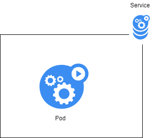

# Artefactos en Kubernetes: o Service

Dado que Kubernetes permite fragmentar a nosa aplicación en diversos compoñentes, cada un deles correndo nun pod (con contedores) distinto, compre que os pods poidan comunicarse uns cos outros. Por exemplo, un pod coa nosa aplicación en PHP realiza conexións con outro pod que leva unha base de datos Mysql, con outro que leva os logs, etc...

Que os pods poidan comunicarse entre sí conleva unha problemática importante:

- Cal é a dirección ip do pod ó que conectarse?
- Qué ocorre se está correndo noutro nodo?
- Qué pasa se hai varias réplicas do pod? A cal nos conectamos?


Kubernetes resolve este problema mediante un novo artefacto: **o servizo**. 

Un servizo ([service]()) é un artefacto que establece regras de acceso a un pod ou conxunto de pods, é o elemento que garante a conexión ó exterior dos pods. Cando falamos de "exterior" estámonos a referir tanto á conexión dende outros pods ou dende fora do clúster de Kubernetes.  

Trátase dunha construcción que permite abstraer os pods que realmente están a traballar como backend dun frontend ou aplicación cliente. Mediante os services, calqueira aplicación cliente pode "despreocuparse" de onde están realmente a se facer as chamadas a programas ou aplicacións que lle serven de backend.



O servizo define principalmente:

- Un endpoint de acceso: realmente unha entrada no DNS de Kubernetes asociada a unha ip. Os pods poden facer un lookup no DNS de kubernetes para atopar esa ip. 
- Regras de atención ás peticións: en caso de ser varios os pods, establécense políticas de resposta tales como: rr (round robin), lc (menos conectado)...


## Creación dun servizo

Para crear servizos podemos acudir ó DSL de K8s.

```yaml
# servizo_1.yaml

kind: Service
apiVersion: v1
metadata:  # esta é a parte de identificación do servizo
  name: primer-servizo
spec:
  selector:   # esta é a parte de selección
    app: nginx
  ports:  # esta é a parte de especificación propia
  - protocol: TCP
    port: 80
    targetPort: 80
```

Como vemos existen tres partes a definir nun servizo:

- Parte identificativa: onde establecemos o nome do servizo (o que empregarán os pods-clientes para conectarse a é)
- Parte de selección: onde se define o pod ou pods ós que conecta o servizo. 
- Parte de rede: onde definiremos os parámetros de rede: 
  - Protocolo a empregar
  - Porto de conexión ó servizo (port)
  - Porto de conexión ós pods que abstrae o servizo (targetPort)

Retomando o exemplo do despregue de nginx da sección anterior, imos darlle conectividade de cara o exterior. 

Lanzamos o seguinte deploy:

```yaml
# deployment_servizo.yaml

apiVersion: apps/v1
kind: Deployment  # esta parte define o Deployment
metadata:
  name: despregue-nginx-2
  labels:
    app: nginx-exemplo
spec:
  replicas: 1
  selector:
    matchLabels:
      app: nginx-exemplo
  template: # a partir de aquí definimos o pod
    metadata:
      labels:
        app: nginx-exemplo
    spec:
      containers:
      - name: nginx
        image: nginx:1.15
        ports:
        - containerPort: 80
```

O arrancamos

```shell
microk8s.kubectl apply -f deployment_servizo.yaml
```

O escalamos a 3 réplicas

```shell
microk8s.kubectl scale deploy despregue-nginx-2 --replicas=3
```

E teríamos o seguinte esquema montado no noso microk8s:


Agora, se queremos otorgar conectividade ó noso despregue, teremos que crear un servizo. Para iso, imos empregar o seguinte artefacto:

```yaml
# servizo_test.yaml

kind: Service
apiVersion: v1
metadata:
  name: test-servizo
spec:
  selector:
    app: nginx-exemplo
  ports:
  - protocol: TCP
    port: 8080
    targetPort: 80
```

Creamos o artefacto no sistema

```shell
microk8s.kubectl apply -f test_servizo.yaml
```

E listamos os servizos do K8s para ver se o temos realmente creado

```shell
microk8s.kubectl get services

NAME           TYPE        CLUSTER-IP       EXTERNAL-IP   PORT(S)    AGE
kubernetes     ClusterIP   10.152.183.1     <none>        443/TCP    26h
test-servizo   ClusterIP   10.152.183.239   <none>        8080/TCP   5m19s
```

O que acabamos de facer é o seguinte:

- Declaramos a existencia dun novo artefacto (un servizo)
- O servizo chámase "test-servizo"
- Aplícase (selecciona) tódolos pods que reúnan as características de ter unha etiqueta (app = nginx-exemplo)
- O porto de acceso ó servizo é o 8080 
- As peticións serán encamiñadas ó porto 80 dun pod que reúna as características do selector

Nun diagrama:


Para testear o noso servizo imos empregar kubectl-run, que nos permite crear un despregue "ad hoc" e executar un comando "dentro" do contedor. 

```shell
microk8s.kubectl run test-curl -ti --image=yauritux/busybox-curl sh
```

Se executamos este comando aparecerá unha shell especial (a do contedor creado) e dende ahí imos facer un curl ó servizo:

```shell
/home# curl test-servizo:8080
```

E obteremos a resposta por defecto do nginx:

```html
<!DOCTYPE html>
<html>
<head>
<title>Welcome to nginx!</title>
<style>
    body {
        width: 35em;
        margin: 0 auto;
        font-family: Tahoma, Verdana, Arial, sans-serif;
    }
</style>
</head>
<body>
<h1>Welcome to nginx!</h1>
<p>If you see this page, the nginx web server is successfully installed and
working. Further configuration is required.</p>

<p>For online documentation and support please refer to
<a href="http://nginx.org/">nginx.org</a>.<br/>
Commercial support is available at
<a href="http://nginx.com/">nginx.com</a>.</p>

<p><em>Thank you for using nginx.</em></p>
</body>
</html>
```

Vemos que:

- Calquer pod dentro do kubernetes (e no namespace correcto) ten acceso ó servizo, basta con saber:
o nome do servizo
  - o porto de conexión (do servizo)
  - Non hai que facer ningunha configuración no pod cliente
- O pod cliente non se preocupa do número de réplicas, do nodo no que está o pod de nginx, a súa ip, etc...
- Cal é a réplica do pod de nginx que nos está a contestar? a resposta é que non o sabemos: o sistema envía a un pod aleatorio. Veremos máis adiante que esto é configurable. 

Para finalizar, temos que borrar todo o que creamos:

```shell
# borramos o servizo
microk8s.kubectl delete -f test_servizo.yaml

# borramos o despregue
microk8s.kubectl delete -f despregue_test.yaml

# borramos o despregue de test
microk8s.kubectl delete deploy test-curl
```
