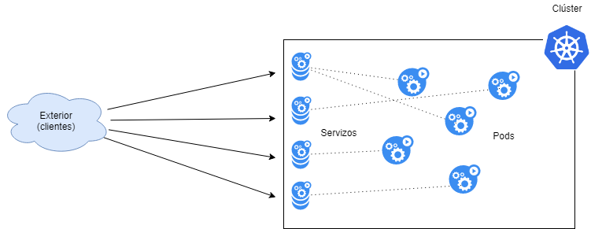

# Ingress: controlando o tráfico de entrada

No que vimos ata agora, os nosos **servizos** teñen a responsabilidade en Kubernetes de reenviar as peticións que se fagan contra eles ó pod ou pods que se teña indicado nas súas especificacións. 

Esos servizos teñen asignada unha Ip de clúster e, coa configuración axeitada, poden ser accesibles dende o mundo exterior. 

Nembargantes, esto presenta varios problemas:

- Pola súa propia natureza, un clúster de K8s está chamado a ter moitos servizos e, polo tanto, moitos puntos de entrada ó clúster. 
- Para que cada servizo sexa accesible dende o mundo exterior, compre que teña asignada unha ip pública. 
- Implica, polo tanto que, a N servizos de acceso público, teremos que asignarlles N IPs públicas. 
- Para cada servizo, en caso de querer securizalo, habería que controlar os certificados SSL. 



As IPs públicas temos que solicitalas ó proveedor, son normalmente caras e tardan en aprovisionarse. 

Ante este problema, a comunidade de Kubernetes aporta unha solución: **ingress**. 

## Ingress

Ingress é un sistema que actúa como proxy inverso expoñendo **un único servizo ó exterior** e reenviando as peticións que reciba a diversos servizos segundo a súa configuración. 


### a) Estrutura e control de ingress

O [ingress](https://kubernetes.io/docs/concepts/services-networking/ingress/) está constituido por:
- Servidor: normalmente un Nginx, que manexa as conexións facendo de proxy inverso.
- Controlador: unha aplicación que controla o servidor reprogramándoa segundo as regras que se declaren. 
- Regras: artefactos de Kubernetes que declaran accións que debe levar a cabo o Ingress.  

#### i) Regras en ingress

Como xa dixemos, as regras de ingress son un artefacto de Kubernetes. 

Unha regra de ingress está constituida polas seguintes partes:
- **Host**: hostname da petición que determina a aplicación ou non da regra. 
- **Paths**: a ruta na petición. 
- **Backend**: o conxunto de *servizo* e *porto* que van a configurar a ónde reenviar a petición. 

Se vemos unha regra sinxela:
```yaml
# exemplo ing.yaml
apiVersion: networking.k8s.io/v1beta1
kind: Ingress
metadata:
  name: exemplo-ingress
spec:
  rules:
  - http:
      paths:
      - backend:
          serviceName: servizo-1
          servicePort: 80
```

Vemos que se trata dun artefacto de K8s, co que eso implica (declarativo, pode ter metadatos...)

No artefacto, declárase:
- Un nome: "exemplo-ingress"
- Unha regra:
  - O tráfico que entre por http
  - Se a url ten o path "/servidor"
  - Reenviar ó servizo "servizo-1"
  - A través do porto 80

Agora, 
```shell
# creamos o artefacto
microk8s.kubectl apply -f ing.yaml

# e facemos unha petición
curl localhost:<porto_ingress>/servizo

# responderá o servizo-1
```

Poderíamos, obviamente, crear varios paths:
```yaml
apiVersion: extensions/v1beta1
kind: Ingress
metadata:
  name: ingress
  annotations:
    nginx.ingress.kubernetes.io/rewrite-target: "/"
    nginx.ingress.kubernetes.io/ssl-redirect: "false"
spec:
  rules:
  - http:
      paths:
      - path: /servizo
        backend:
          serviceName: servizo
          servicePort: 8080
      - path: /test
        backend:
          serviceName: servizo-test
          servicePort: 8888
```

Neste exemplo, teríamos:
- Duás rutas `/servizo` e `/test` que resolverían a dous servizos distintos.
- **Ollo!** O porto é o do servizo non o de entrada ó ingress. Iso é importante de reter. 
- Podemos ver tamén dúas annotations (liñas 6 e 7). Trátase de datos para controlar o propio ingress
  - Na liña 6 dicimos que compre redirixir á / do servizo de backend (desaparecerían `/servizo` ou `/test`)
  - Na liña 7 estamos a dicir que non queremos que haxa redirección ó 443 (para ssl)

Un dos elementos clave en ingress é que as regras se expresan como un artefacto, polo que poderíamos:

```shell
# listar os ingress aplicables 
microk8s.kubectl get ing
NAME                 HOSTS   ADDRESS     PORTS   AGE
o-meu-ingress   *       127.0.0.1   80      7h11m

# poderíamos editalo
microk8s.kubectl edit ing o-meu-ingress

# poderíamos borralo
microk8s.kubectl delete ing o-meu-ingress
```


