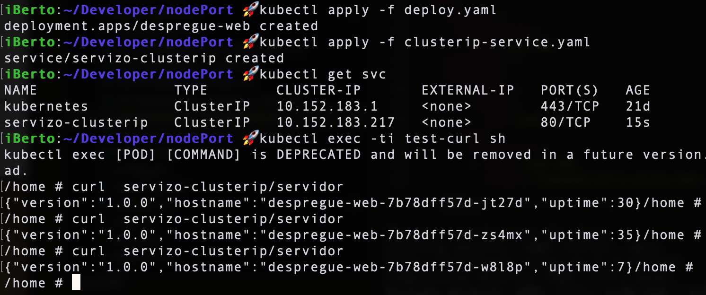
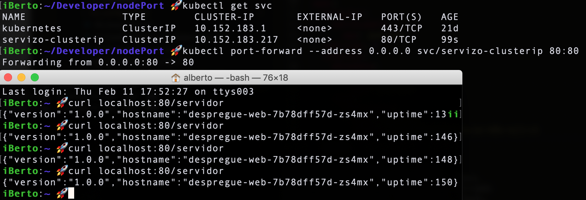
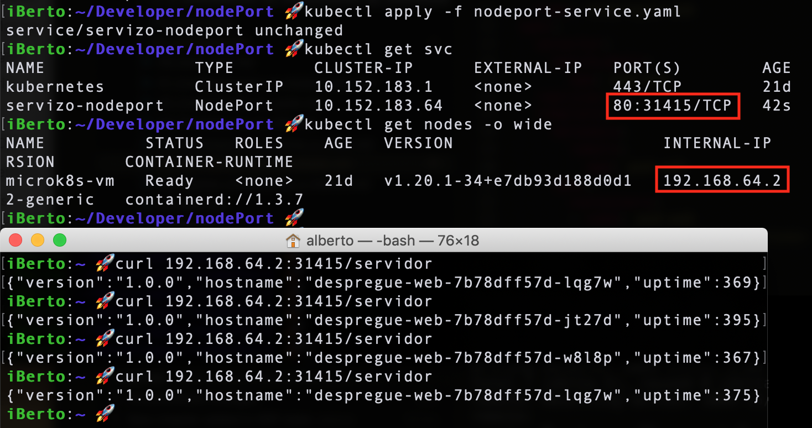
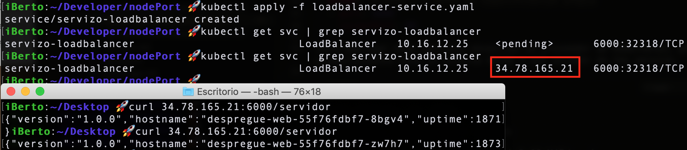

# Servizos en profundidade

No [anterior tema](https://prefapp.github.io/formacion/cursos/kubernetes/#/./02_kubernetes/05_arquitectura_kubernetes_service) vimos a importancia dos *services* como abstracción dos pods backend para unha aplicación cliente. Mediante os services, calqueira aplicación cliente pode "despreocuparse" de onde se están realmente a facer as chamadas a programas ou aplicacións que lle serven de backend.


Neste capítulo imos ver os seguintes tipos de *Service*, cos seus casos de uso e as súas debilidades:
- ClusterIp
- NodePort
- LoadBalancer

Despregaremos o seguinte deploy para ilo expoñendo con cada tipo de servizo e apreciar así as diferencias entre cada *service kind* : 
```yaml
#deploy.yaml
apiVersion: apps/v1
kind: Deployment
metadata:
  name: despregue-web
spec:
  selector:
    matchLabels:
      app: pod-web
  replicas: 5 
  template:
    metadata:
      labels:
        app: pod-web
    spec:
      containers:
      - name: pod-web
        image: frmadem/catro-eixos-k8s-ej1:v1
        env:
          - name: PUERTO_APP
            value: "80"
        command: ["npm", "run", "iniciar"]
        ports:
          - containerPort: 80
```

Non é mais que un servidor web que mostra unha pequena mensaxe coa versión do servidor e a máquina que sirve os datos.

Se facemos un apply do noso `deploy.yaml`. Teremos 5 pods correndo o servidor web.


## ClusterIp
Para expoñer o noso deploy imos empregar primeiramente un servicio de tipo `ClusterIp` que é o tipo por defecto nos *services* de kubernetes:
```yaml
# clusterip-service.yaml
kind: Service
apiVersion: v1
metadata:  # esta é a parte de identificación do servizo
  name: servizo-clusterip
spec:
  selector:   # esta é a parte de selección
    app: pod-web
  ports:  # esta é a parte de especificación propia
  - port: 80
    targetPort: 80
```

Se facemos un curl desde dentro veremos que van rotando os pods que devolven a petición: 


Sin embargo si facemos un `port-forward` do noso servizo para acceder desde o exterior podemos comprobar que sempre se nos devolve o mesmo pod. 



## NodePort
O comando `port-forward`, ainda que lle indiquemos un servizo vai a expoñernos un pod, o primeiro que atope a través do servizo. Se queremos expoñer o servizo temos que utilizar un servizo de tipo `Nodeport`:
```yaml
# nodeport-service.yaml
kind: Service
apiVersion: v1
metadata:  
  name: servizo-nodeport
spec:
  type: NodePort # tipo de servizo
  selector:   
    app: pod-web
  ports:  
  - port: 80
    targetPort: 80
    nodePort: 31415   
```

NodePort, como o nome indica, abre un porto específico en todos os nodos do cluster e todo o tráfico que se envía a este porto (`nodePort: 31415`) reenvíase ao servizo.
 


Esta opcion ten varios problemas:
- Solo podes ter un servizo por porto.
- Solo se poden empregar os portos 30000–32767.
- Debemos ter un mecanismo de axuste por se cambia a IP do nodo.

## LoadBalancer
Para solventar as carencias do *Nodeport* aparece un servizo máis avanzado que permite expoñer o noso servizo a través dunha IP pública propia. Para empregar este servicio necesitas un proveedor de Kubernetes, pois o seu despregue proporcionache unha IP externa desde a que acceder ao teu servizo.
```yaml
# loadbalancer-service.yaml
kind: Service
apiVersion: v1
metadata:  # esta é a parte de identificación do servizo
  name: servizo-loadbalancer
spec:
  type: LoadBalancer
  selector:  # esta é a parte de selección
    app: pod-web
  ports:  # esta é a parte de especificación propia
  - port: 6000
    targetPort: 80
```



Si se desexa expoñer directamente un servizo, este é o método predeterminado. Todo o tráfico do porto especificado será reenviado ao servizo. Non hai filtrado, nin enrutamento, etc. Isto significa que poden enviarche case calquera tipo de tráfico, como HTTP, TCP, UDP, Websockets, gRPC ou calquera outra cousa.
A gran desvantaxe é que cada servizo que se expón cun *LoadBalancer* recibirá o seu propio enderezo IP e teremos que pagar por cada servizo exposto, o que pode resultar caro.

Se estas a empregar tráfico HTTP, un Ingress permitirache empregar unha sola IP e facer routing por path e subdominio, como veremos no [seguinte capítulo](https://prefapp.github.io/formacion/cursos/kubernetes/#/03_configuracion/06_Ingress_controlando_o_trafico) do tema.
