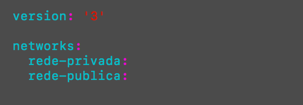
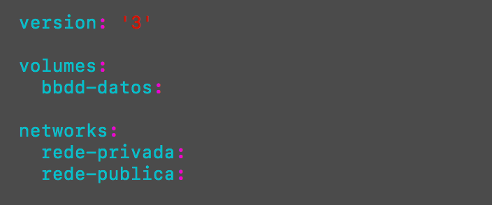
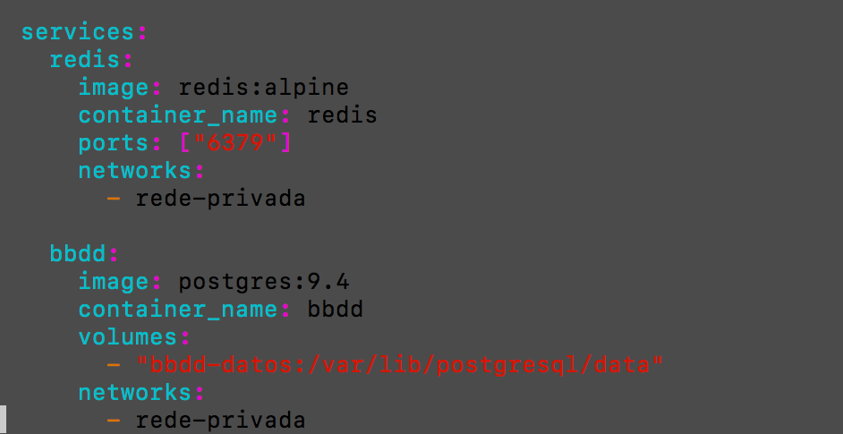
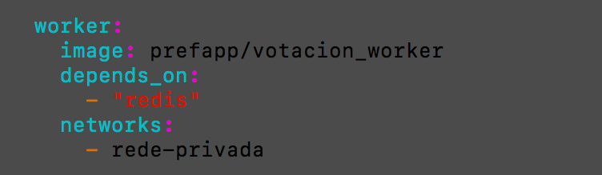
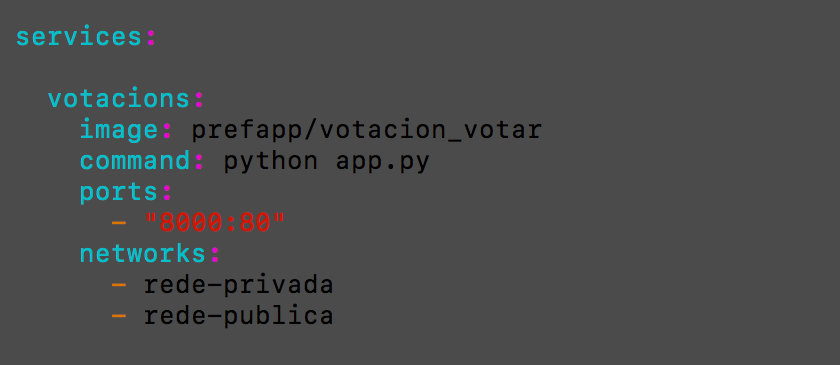
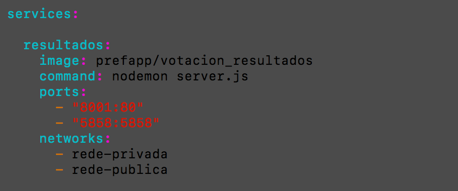
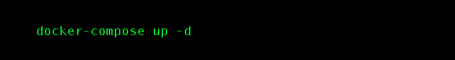
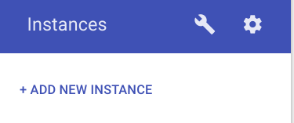
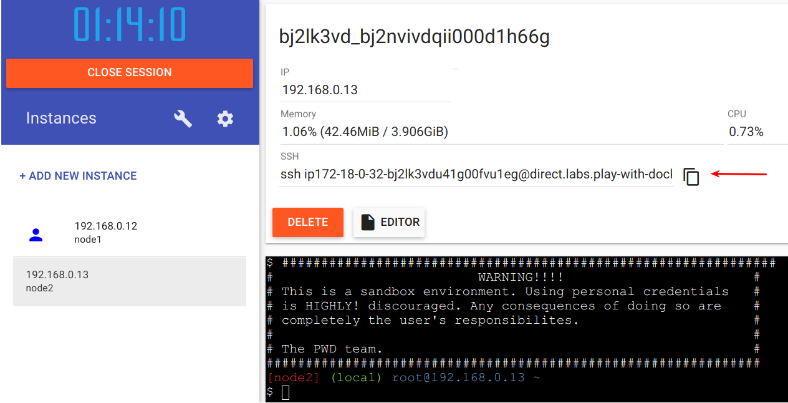

# El problema de la orquestación de contenedores de software

## Instale una aplicación multicontenedor
Este ejercicio se basa en este ejemplo del repositorio [docker samples](https://github.com/dockersamples/example-voting-app).

### Explicación del proyecto

Ya que estamos en tiempos de votaciones, vamos a desplegar con contenedores Docker, una aplicación de votación electrónica de Rindo, que nos permitirá hacer una elección sencilla:

¿De qué somos? ¿Nesquik o Cola Cao?

El enfoque es simple, pero para hacerlo más interesante, la aplicación utilizará una arquitectura de microservicios compuesta por los siguientes elementos:

1. Un web panel donde el usuario votará por la opción deseada.
1. Otro web panel donde se pueden ver en todo momento los resultados de las votaciones globales.
1. Un Worker que procesará los votos recogidos del servicio de votación y actualizará los totales para el servicio de resultados
1. Además tendremos dos servicios de almacenamiento, uno con redis, como cola de mensajes, para almacenar temporalmente los votos recogidos en el servicio de votaciones y posteriormente procesados ​​por el Worker
1. y otro con Postgresql donde el Worker dejará los totales, ya que procesa los votos de la cola

### Los servicios

#### 1. Votación

La aplicación de votación está escrita en python con [Flask](http://flask.pocoo.org/).

Esta aplicación expone un puerto al exterior donde acepta solicitudes (puerto 80).


Cuando alguien vota, apunta el sentido del voto a una base de datos [Redis](https://redis.io/) (que escucha dentro del contenedor #6379).


#### 2. Worker

El Worker es un servicio que escucha mensajes en redis y agrega esos resultados parciales al resultado final.

Los resultados finales están en una base de datos [PostgreSQL](https://www.postgresql.org/).

El Worker está escrito en [.NET](https://www.microsoft.com/net/).


#### 3. Servicio de resultados

El servicio de resultados se realiza en [nodejs](https://nodejs.org/es/). Este servicio expone (en el puerto 80) una página en HTML5 y monitorea constantemente la base de datos de PostgreSQL para devolver el estado actual de la encuesta.


#### 4. Esquema final de servicios

El esquema final de servicios sería el siguiente:


### Las redes

Mirando el diagrama de servicio, parece claro que debería haber dos redes:

- Un **privado** donde todos los contenedores están conectados para comunicarse entre sí
- Un **público** donde EXCLUSIVAMENTE los contenedores frontend (votación y resultados) tienen conectividad


De esta forma, los contenedores BBDD y el Worker quedan aislados del mundo exterior, es decir, solo los contenedores que están en su red (privada) pueden hablar con ellos.

Por el contrario, los contenedores de votaciones y resultados, que exponen páginas web, están conectados a ambas redes para poder mediar entre el backend y el frontend de nuestra aplicación.


### Volúmenes: persistencia

Para esta práctica guiada, vamos a darle persistencia a la parte de resultados finales. Es decir, a los datos que se almacenan en PostgreSQL.

### El docker-compose

Expresemos ahora toda esta infraestructura en el DSL docker-compose.

Las imágenes a utilizar serán:
- Worker: (.Net) [prefapp/votacion_worker](https://hub.docker.com/r/prefapp/votacion_worker/)
- Votos: (Python) [prefapp/votacion_votar](https://hub.docker.com/r/prefapp/votacion_votar/)
- Resultados: (NodeJS) [prefapp/votacion_resultados](https://hub.docker.com/r/prefapp/votacion_resultados/)
- Resultados de Bbdd: (PostgreSQL) [postgres:9.4](https://hub.docker.com/_/postgres/)
- Bdd: (Redis) [redis:alpine](https://hub.docker.com/_/redis/)

Para definir la parte de **redes**, se vería así:



Vemos que hemos creado dos redes, una pública y otra privada. En la parte de **volúmenes**, vamos a crear un volumen que luego asociaremos con el servicio de PostgreSQL:



Pasemos a la definición de **servicios**, comenzando con bbdd:



Vemos como ambos servicios se conectan a la red privada. Además, el servicio bbdd (postgresql) vincula el directorio de datos al volumen creado. Esto proporciona persistencia en los sucesivos reinicios del sistema.

También se agradece exponer el puerto redis [6379] para conexiones (siempre desde la red privada).

Ahora veamos el servicio del **Worker**:



El Worker también está en la red privada. Vemos la etiqueta [depends_on](https://docs.docker.com/compose/compose-file/#depends_on) que establece el orden de inicio de los servicios (contenedores).

Como se indica en esta línea, el contenedor de Workers **no se puede iniciar** antes de que se ejecute el contenedor de Redis.

Pasamos ahora a la definición del **servicio de votación**:



El servicio de votación no tiene sorpresas. Se asocia tanto a redes públicas como privadas.

Asocie el puerto 8000 del host al puerto 80 del contenedor para garantizar la conectividad con el exterior.

**Hay un error con el Worker y este nombre de contenedor de bbdd, el Worker está configurado para conectarse al nombre de dns "db", no a "bbdd".
Para resolverlo, la forma más fácil es agregar un alias al host bbdd:**

```yaml
bbdd:
  image: postgres:9.4
  networks:
    rede-privada:
      aliases:
        - db
```

Finalmente, veamos el **servicio de resultados**:


El servicio de resultados tampoco tiene mucho que comentar. El puerto 8001 es el puerto de escucha del servidor y donde tendrás que conectarte para ver la página web con la información.

Escribimos un docker-compose.yaml con toda esa información y hacemos:


¡¡Y ahí lo tenemos!! Si accedemos desde nuestro navegador a http://localhost:8000 tendremos el panel de votaciones y si entramos en http://localhost:8001 tendremos el panel de resultados.

Si abrimos dos pestañas, una para cada lado, y votamos, veremos cómo cambian los resultados en tiempo real y sin necesidad de recargar nada.

### Evaluación

**Evidencia de la adquisición de actuaciones**:
- Pasos 1 a 4 realizados correctamente de acuerdo a estos...

**Indicadores de logros**:
- Presentar un documento con:
  - el archivo de composición donde se han aplicado las diferentes modificaciones indicadas.
  - el resultado de ejecutar el comando "**docker-compose ps**".
  - las respuestas a las siguientes preguntas:
    - ¿Qué pasaría si el servicio de "votación" tuviera una incidencia y se detuviera por un error de la aplicación? ¿Habría alguna forma automática de reactivarlo?
    - ¿Qué pasa si todo el nodo se cae?
- *Si lo prefieres, puedes enviar un screencast de la consola, con asciinema.org

**Criterios de corrección**:
- Adaptaciones indicadas en la descripción, cumplimentadas correctamente (60 puntos)
  - Redis
  - Postgresql
  - Votar
  - Worker
  - Resultados
- Respuestas a las preguntas planteadas (10 puntos)


**Autoevaluación**: Revisa y autoevalúa tu trabajo aplicando los indicadores de logro.

**Peso en calificación**:
- Peso de esta tarea en la calificación final .......................................... 70 puntos
- Peso de esta tarea en su tema ............................................................. 70%

---

## Identificar problemas con aplicaciones de varios contenedores que se ejecutan en un clúster de nodos

Ahora cambiemos la aplicación anterior y, en lugar de implementarla en nuestra máquina docker, la implementaremos en un grupo de nodos docker (docker swarm).

Para lanzar este clúster de nodos tenemos varias opciones:

### Opción 1: La más sencilla. [Play with docker](https://labs.play-with-docker.com/).

[Play with docker](https://labs.play-with-docker.com/) es una herramienta online para practicar con Docker, sin necesidad de instalar nada en nuestro ordenador local. Para usarlo y construir un clúster de swarm, solo tenemos que iniciar sesión con nuestros datos [dockerhub](https://hub.docker.com/) (necesitamos tener una cuenta hub.docker.com, puede crear una cuenta completa gratis desde la [página de registro](https://hub.docker.com/signup)).

Una vez que comience el laboratorio, tendrá 4 horas para realizar la práctica, pero si se acaba el tiempo o tiene que abandonar el laboratorio, puede volver en cualquier momento y lanzar nuevas máquinas docker.

Desde aquí podemos construir un clúster lanzando 2 nuevas instancias:



Una vez que tenga las 2 instancias operativas, debe conectarlas haciendo el clúster Swarm. Para esto, puede elegir **nodo1** como el nodo maestro y ejecutar el siguiente comando en su terminal:

```shell
$ docker swarm init --advertise-addr 192.168.0.XX

Swarm initialized: current node (0a605ril8w5gsyyl9598kqssa) is now a manager.
To add a worker to this swarm, run the following command:

docker swarm join --token SWMTKN-1-1ma2gywbmnr8nwf8dr9hg7etrsc5sx0q1wrgwhde5d5v7tuuw1-b7ir4aj81xwcph5d04jrygor5 192.168.0.12:2377

To add a manager to this swarm, run 'docker swarm join-token manager' and follow the instructions.
```

Donde la advertise-add es la dirección IP del nodo (192.168.0.xxx).

En la misma inicialización del nodo maestro del clúster Swarm, ya te dice qué comando tendrás que lanzar en el **nodo2** (Worker) para unirte al clúster, en mi caso:

```shell
docker swarm join --token SWMTKN-1-1ma2gywbmnr8nwf8dr9hg7etrsc5sx0q1wrgwhde5d5v7tuuw1-b7ir4aj81xwcph5d04jrygor5 192.168.0.12:2377
```

**Y listo, ya tienes el clúster Docker Swarm listo para desplegar aplicaciones.** Incluso puedes conectarte vía ssh, usando el comando indicado en la sección SSH




### Opción 2: Docker-machine y Virtualbox

Si estamos usando virtualbox, docker tiene una utilidad para crear nodos de Swarm (**docker-machine**) utilizando varias plataformas de virtualización, incluidas VirtualBox o HyperV:

Tienes un ejemplo de cómo construir el clúster con nodos de Virtualbox, en el [tema 4 del modulo 6 del Curso de Docker](https://prefapp.github.io/formacion/cursos/docker/#/./06_docker_swarm/04_montando_o_primeiro_cluster_swarm).

### Desplegar

Usando el Swarm de clústeres construido en la sección anterior, desplegamos en él la aplicación de nesquik vs colacao vista en el ejercicio 1.2.

#### 1. Para empezar adaptaremos el [docker-compose.yaml](https://s3-eu-west-1.amazonaws.com/formacion.4eixos.com/solucions/nesquik_vs_colacao_docker-compose.yml) de la aplicación anterior, al formato v3, lista para lanzar en Swarm, con una serie de mejoras a la hora de brindar un servicio más confiable.

Para ello iremos de servicio en servicio añadiendo configuración extra.

Lo primero que debemos hacer es cambiar la versión de la especificación docker-compose, para usar al menos 3. (La última revisión de formato es 3.7)

Básicamente todas las configuraciones relacionadas con el modo swarm se concentran, dentro de cada servicio, en la sección ***deploy**, por lo que el único comando que interpreta estas opciones es `docker stack deployment, y tanto docker-compose up como docker -compose run simplemente pase por alto esta sección.

##### 1.1. redis
En el caso del servicio redis, solo queremos que tenga una sola réplica y una política de reinicio:

- en caso de falla del contenedor, el clúster Swarm debe encargarse de levantarlo nuevamente, y que lo intente por lo menos 3 veces, con 10s entre cada intento, en una ventana de tiempo de 120s

##### 1.2 PostgreSQL
En el caso del servicio de base de datos, al ser algo bastante crítico que NECESITA PERSISTENCIA, sus datos deben almacenarse en un volumen DEPENDIENTE DEL ANFITRIÓN*.

Por lo tanto, no podemos permitir que el programador Swarm mueva la base de datos a otro nodo diferente de donde se inició la primera vez y donde estarán los datos.

Para esto vamos a agregar una restricción para que este servicio solo se ejecute en el nodo **Manager**.

**Docker se caracteriza por traer baterías incluidas, pero intercambiables. Esto quiere decir que hay partes del Docker Engine que, aunque vienen con una funcionalidad ya definida, se pueden cambiar por otras de otro proveedor para mejorarlo.** Existen principalmente 2 tipos de proveedores de complementos, los que brindan **complementos de red** y los que brindan **complementos de administración de volumen**. Precisamente estos últimos están muy centrados en intentar buscar soluciones para poder abstraer el volumen de datos, del host, de forma que los contenedores de servicios puedan moverse entre nodos del clúster y seguir teniendo sus datos disponibles. Puede ver algunos de ellos [aquí](https://store.docker.com/search?type=plugin).*


##### 1.3 Votación
Para el servicio de votaciones, como es una aplicación que no guarda estado en sí misma, y ​​está teniendo mucha demanda ;) la vamos a escalar a 2 réplicas, para que el cluster se encargue de balancear las solicitudes entre cada una de a ellos.

Además, cuando sea necesario actualizar el servicio, queremos que la actualización de las 2 réplicas se ejecute al mismo tiempo y, por supuesto, si falla, se reiniciará automáticamente por sí solo.

##### 1.4 Worker
Para el nodo de trabajo vamos a agregar 1 única réplica ya que la aplicación que se ejecuta en él ya no es compatible, y también agregaremos una política de reinicio en caso de falla.

##### 1.5 Resultados:
Para el nodo de resultados, agreguemos otras 2 réplicas, de manera similar a la votación.

#### 2. Una vez realizadas estas adaptaciones solo queda desplegar este stack (el docker-compose v3 que acabamos de adaptar)

Para esto, puede configurar nuestro cliente docker local para hablar con el nodo Administrador del clúster o enviar el archivo con la pila al nodo maestro.

Y finalmente, sería necesario implementar esta pila y ejecutar el comando en su contra para implementarla.

### Evaluación

**Evidencia de la adquisición de actuaciones**:
- Realizó correctamente los pasos de acuerdo con estos...

**Indicadores de logros**:
- Presentar un documento con:
  - el archivo de composición/pila donde se han aplicado las diferentes modificaciones indicadas.
  - los comandos necesarios para realizar el despliegue de la pila, y como visualizar que ese despliegue se está ejecutando correctamente.
- *Si lo prefieres, puedes enviar un screencast de la consola, con asciinema.org

**Criterios de corrección**:
- Adaptaciones indicadas en 1.1 a 1.5 correctamente cumplimentadas (15 puntos)
  - Redis
  - Postgresql
  - Votar
  - Worker
  - Resultados
- Comandos necesarios para el apartado 2 correctamente indicados (5 puntos)


**Autoevaluación**: revise y autoevalúe su trabajo

