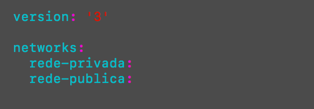
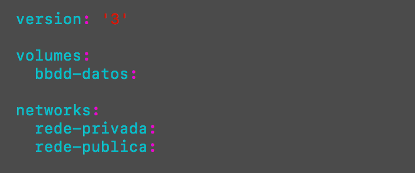
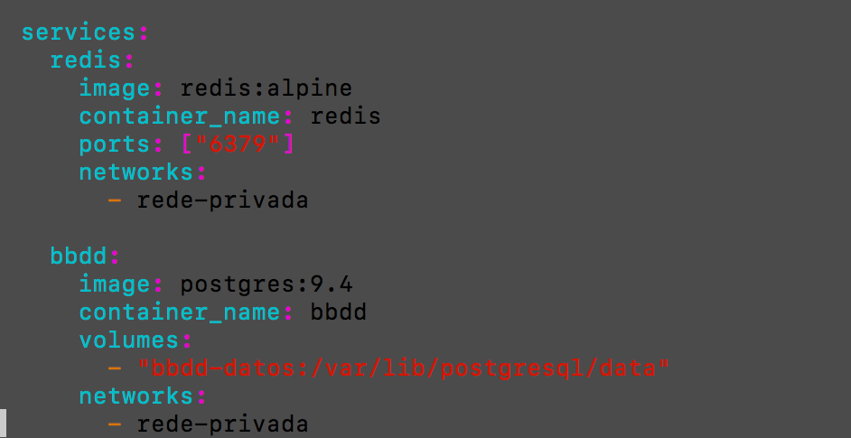
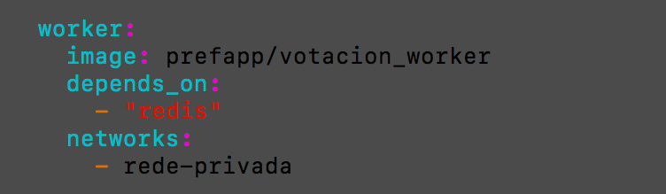
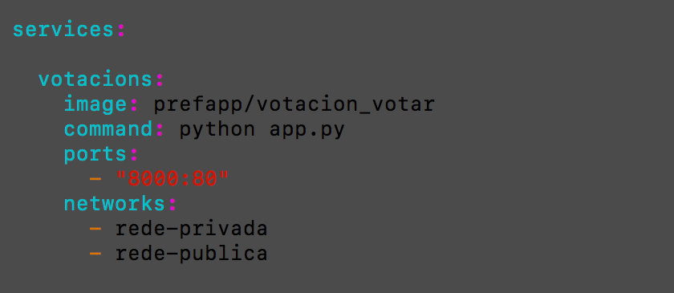
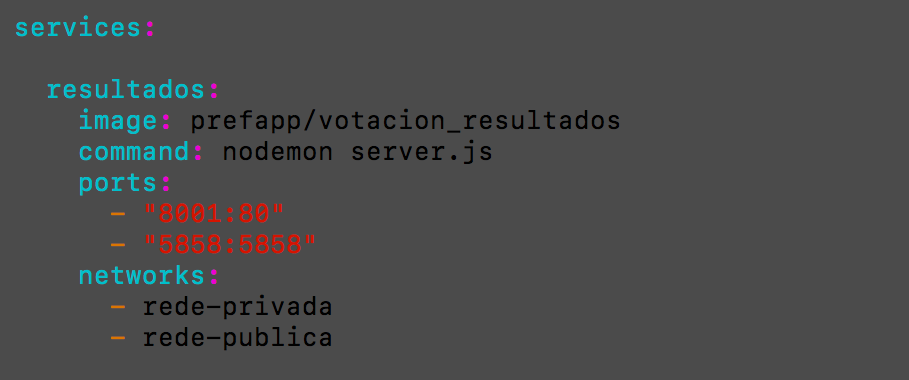
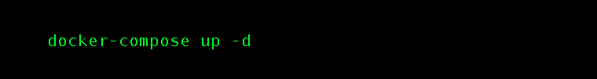
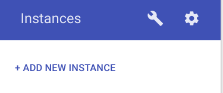

# A problemática da orquestración de contedores de software

## Instalar unha aplicación multicontedor
Este exercicio basease neste exemplo do repositorio de [exemplos de docker](https://github.com/dockersamples/example-voting-app).

### Explicación do proxecto

Xa que estamos en tempos de votación, imos despregar con contedores Docker, unha aplicación de votación electrónica Rindo, que nos permita facer unha sinxela escolla:

De qué somos? de Nesquik ou de Cola Cao? 

O plantexamento é sinxelo, pero para facelo máis interesante, a aplicación vai a empregar unha arquitectura de microservicios composta polos seguintes elementos:

1. Un panel web onde o usuario vai a votar a opción desexada.
1. Outro panel web onde se vai poder ver en todo momento os resultados globais da votación.
1. Un worker que vai a procesar os votos recollidos do servizo de votacións e vai a actualizar os totais para o servizo de resultados
1. Ademais teremos dous servizos de almacenamento, un con redis, como cola de mensaxes,  para almacenar temporalmente os votos recollidos no servizo de votacións e que posteriormente se procese polo worker
1. e outro con Postgresql onde o worker irá deixando os totais, segundo vai procesando votos da cola       

### Os Servizos

#### 1. Votación

A aplicación de votacións está escrita en python con [Flask](http://flask.pocoo.org/).

Esta aplicación expón un porto ó exterior por onde acepta peticións (porto 80).


Cando alguén vota, apunta o senso do voto nunha base de datos [Redis](https://redis.io/) (que escoita dentro do contedor no 6379).


#### 2. Worker

O worker é un servizo que escoita mensaxes no redis e agrega eses resultados parciais ó resultado final.

Os resultados fináis atópanse nunha base de datos [PostgreSQL](https://www.postgresql.org/).

O worker está escrito en [.NET](https://www.microsoft.com/net/).


#### 3. Servizo de resultados

O servizo de resultados está feito en [nodejs](https://nodejs.org/es/). Este servizo expón (no porto 80) unha páxina en HTML5 e monitoriza constantemente a base de datos PostgreSQL para devolver o estado actual da enquisa.


#### 4. Esquema final dos servizos

O esquema final dos servizos quedaría como segue:


### As redes

Vendo o esquema de servizos, parece claro que debería haber dúas redes:

- Unha **privada** onde estén conectados tódolos contedores para comunicarse entre sí
- Unha **pública** onde teñan conectividade EXCLUSIVAMENTE os contedores de frontend (o de votacións e o de resultados)


Deste xeito, os contedores de BBDD e o worker están illados do mundo exterior, é dicir, únicamente os contedores que estén na súa rede (privada) poden falar con eles.

Polo contrario, os contedores de votación e resultados, que expoñen páxinas web, están conectados a ambas redes para poder face-lo traballo de mediación entre o backend e o fronted da nosa aplicación.


### Volumes: persistencia

Para esta práctica guiada, imos dar persistencia á parte de resultados finais. Isto é, ós datos que están almacenados no PostgreSQL.

### O docker-compose

Imos agora expresar toda esta infraestructura no DSL de docker-compose.

As imaxes a empregar serán:
- Worker: (.Net) [prefapp/votacion_worker](https://hub.docker.com/r/prefapp/votacion_worker/)
- Votos: (Python) [prefapp/votacion_votar](https://hub.docker.com/r/prefapp/votacion_votar/)
- Resultados: (NodeJS) [prefapp/votacion_resultados](https://hub.docker.com/r/prefapp/votacion_resultados/)
- Bbdd resultados: (PostgreSQL) [postgres:9.4](https://hub.docker.com/_/postgres/)
- Bbdd: (Redis) [redis:alpine](https://hub.docker.com/_/redis/)

Para definir a parte de **redes**, quedaría como segue:


Vemos que creamos dúas redes, unha pública e outra privada. Na parte de **volumes**, imos a crear un volume que despois asociaremos ó servizo de PostgreSQL:


Pasemos á definición dos **servizos**, comezamos cos de bbdd:


Vemos como se conectan ambos servizos á rede privada. Ademáis, o servizo de bbdd (postgresql) vincula o directorio de datos ó volume creado. Isto otorga persistencia en caso de sucesivos reinicios do sistema.

Apréciase tamén a exposición do porto de redis [6379] para conexións (sempre dende a rede privada).

Vexamos agora o servizo do **worker**:


O worker tamén está na rede privada. Vemos a etiqueta [depends_on](https://docs.docker.com/compose/compose-file/#depends_on) que establece a orde de arranque dos servizos (dos contedores).

Tal e como está expresado nesta liña, o contedor do worker **non se pode iniciar** antes de que o do Redis esté en funcionamento.

Pasamos agora á definición do **servizo de votacións**:


O servizo de votacións non ten moita sorpresa. Está asociado a ambas redes, a pública e a privada.

Asocia o porto 8000 do host ó porto 80 do contedor para asegurá-la conectividade co exterior.

**Hai un erro co worker e o nome de este contedor de bbdd, o worker está configurado para conectarse ao nome dns "db", non "bbdd".
Para solventalo o xeito máis sinxelo é agregar un alias ao host bbdd:**

```yaml
bbdd:
  image: postgres:9.4
  networks:
    rede-privada:
      aliases:
        - db
```

Por último, imos ver o **servizo de resultados**:


O servizo de resultados tampouco ten moito que comentar. O porto 8001 é o de escoita do servidor e por onde haberá que conectarse para ve-la páxina web coa información.

Escribimos un docker-compose.yaml con toda esa información e facemos:


E ahí o temos!! Se accedemos dende o noso navegador a http://localhost:8000 teríamos o panel de votación e se entramos en  http://localhost:8001 teremos o panel de resultados.

Se abrimos duas lapelas, unha por cada parte, e votamos, veremos como cambian os resultados en tempo real e sen necesidade de recargar nada.

### Evaluación

**Evidencias da adquisición dos desempeños**:
- Pasos 1 ao 4 correctamente realizados segundo estes...

**Indicadores de logro**: 
- Entregar un documento con:
  - o ficheiro compose onde se foron aplicando as diferentes modificacións indicadas.
  - o resultado da execución do comando "**docker-compose ps**".
  - as respostas as seguintes cuestións:
    - ¿que ocorrería se o servizo de "votacions" tivera unha incidencia e se detivese por un erro da aplicación? Habería algún xeito automático de que se volvese a reactivar?
    - e se o nodo completo se cae?
- *Se o preferides, podedes entregar un screencast da consola, con asciinema.org

**Criterios de corrección**:
- Adaptacións indicadas na descripción, completadas correctamente (60 puntos)
  - Redis
  - Postgresql
  - Votacions
  - Worker
  - Resultados
- Respostas as cuestións plantexadas  (10 puntos)


**Autoavaliación**: Revisa e autoavalia o teu traballo aplicando os indicadores de logro.

**Peso na cualificación**:
- Peso desta tarefa na cualificación final ........................................ 70 puntos
- Peso desta tarefa no seu tema ...................................................... 70 %

---

## Identificar os problemas das aplicacións multicontedor correndo sobre un clúster de nodos

Vamos a darlle unha volta agora a aplicación anterior, e en vez de desplegala na nosa máquina docker, vamos a desplegala sobre un cluster de nodos docker (docker swarm).

Para lanzar este cluster de nodos temos varias opcións:

### Opcion 1: A máis sinxela. [Play with Docker](https://labs.play-with-docker.com/).

[Play with docker](https://labs.play-with-docker.com/) é unha ferramenta online para prácticar con Docker, sen necesidade de instalar nada no noso equipo local. Para empregalo e construir un cluster de swarm, só temos que facer Login cos nosos datos de [dockerhub](https://hub.docker.com/)  (precisa que teñamos unha conta de hub.docker.com, podedes crear unha totalmente gratuita dende a [páxina de rexistro](https://hub.docker.com/signup)).

Unha vez arranquedes o laboratorio teredes 4h para facer a práctica, pero se se esgota o tempo ou tedes que abandoar o laboratorio, podedes volver en calquer momento e lanzar novas máquinas docker.

Dende aquí podemos construir un cluster lanzando 2 novas instancias:


Unha vez teñades as 2 instancias operativas, hai que conectalas facendo o cluster Swarm. Para esto podedes escoller o **nodo1** como nodo master, e executar na sua terminal o seguinte comando:

```shell
$ docker swarm init --advertise-addr 192.168.0.XX

Swarm initialized: current node (0a605ril8w5gsyyl9598kqssa) is now a manager.
To add a worker to this swarm, run the following command:

docker swarm join --token SWMTKN-1-1ma2gywbmnr8nwf8dr9hg7etrsc5sx0q1wrgwhde5d5v7tuuw1-b7ir4aj81xwcph5d04jrygor5 192.168.0.12:2377

To add a manager to this swarm, run 'docker swarm join-token manager' and follow the instructions.
```

Onde a advertise-add e a dirección ip do nodo (192.168.0.xxx).

Na propia inicialización do nodo master do cluster de Swarm xa vos indica que comando teredes que lanzar no **nodo2** (worker) para unirse ao cluster, no meu caso :

```shell
docker swarm join --token SWMTKN-1-1ma2gywbmnr8nwf8dr9hg7etrsc5sx0q1wrgwhde5d5v7tuuw1-b7ir4aj81xwcph5d04jrygor5 192.168.0.12:2377
```

**E listo xa tedes o cluster de Docker Swarm preparado para desplegar aplicacións.** Ata vos podedes conectar por ssh, empregando o comando indicado  no apartado SSH


### Opción 2: Docker-machine e Virtualbox

se estamos a usar virtualbox, docker dispón dunha utilidade para crear nodos swarm (**docker-machine**) empregando varias plataformas de virtualización, entre elas VirtualBox ou HyperV:

Tedes un exemplo de como construir o cluster con nodos de Virtualbox, na [seguinte páxina dos contidos do curso](WIP).

### Despregue

Empregando o cluster swarm construido no apartado anterior despreguemos sobre él a aplicación de nesquik vs colacao vista no exercicio 1.2.

#### 1. Para comezar vamos a adaptar o [docker-compose.yaml](https://s3-eu-west-1.amazonaws.com/formacion.4eixos.com/solucions/nesquik_vs_colacao_docker-compose.yml) da aplicación anterior, ao formato v3, preparado para o lanzamento nun swarm, cunha serie de melloras á hora de dar un servicio máis confiable.

Para esto imos ir servizo a servizo agregándolle configuración extra.

O primeiro que temos que facer e cambiar a versión da especificación de docker-compose, para usar polo menos a 3. (A última revisión do formato é a 3.7)

Básicamente todas as configuracións relativas ao modo swarm están concentradas, dentro de cada servicio, no apartado de ***deploy**, de tal maneira que o único comando que interpreta estas opcións é `docker stack deploy`, e tanto docker-compose up como docker-compose run simplemente evitan esta sección.

##### 1.1. Redis
No caso do servicio de redis, só queremos que teña unha única replica, e unha política de reinicio:

- en caso de fallo do container, o cluster de Swarm debe encargarse de levantalo de novo, e que o intente polo menos 3 veces, con 10s entre cada intento, nunha ventá de tempo de 120s

##### 1.2 Postgresql
No caso do servicio de base de datos, como é algo bastante crítico QUE NECESITA PERSISTENCIA, os datos da mesma se teñen que almacenar nun volumen DEPENDENTE DO ANFITRIÓN* onde corre o contedor.

Por eso, non podemos permitir que o scheduler do Swarm nos mova a base de datos a outro nodo diferente de onde se arrincaou a primeira vez, e onde van a estar os datos da mesma.

Para esto vamos a agregar unha restricción de xeito que ese servicio só se execute no nodo **Manager**.

**Docker se caracteriza por traer baterías incluidas, pero intercambiables. Esto quere decir que hai partes do Docker Engine que, aínda que veñen cunha funcionalidade xa definida, se permiten intercambiar por outras de outro proveedor para mellorala. Principalmente hai 2 tipos de proveedores de plugins, os que proveen plugins de rede, e os que proveen **plugins para a xestión de volumenes**. Precisamente estos últimos están moi enfocados en tratar de atopar solucións para poder abstraer o volume de datos, do anfitrión, de xeito que se poida mover os contedores dos servicios entre nodos do cluster e continuen a ter os seus datos dispoñibles. Podedes ver algúns deles [aquí](https://store.docker.com/search?type=plugin).*


##### 1.3 Votacions
Para o servicio de votacións, como é unha aplicación que non garda estado en si mesma, e está tendo moita demanda ;) vamos a escalalo a 2 replicas, de xeito que o cluster se encargue de balancear as peticións entre cada unha delas.

Ademáis cando faga falta actualizar o servicio, queremos que se execute a actualización das 2 replicas á vez, e por suposto, se se cae que automáticamente se volva a arrincar soa.

##### 1.4 Worker
Para o nodo worker vamos a agregar 1 única réplica xa que a aplicación que nel corre non soporta máis, e admeáis agregarmoes unha política de restart on-failure.

##### 1.5 Resultados:
Para o nodo de resultados agregemos outras 2 réplicas, de maneira similar ao de votacions.

#### 2. Unha vez completado estas adaptacións só queda facer o deploy de esta stack ( o docker-compose v3 que acabamos de adaptar)

Para esto ben se pode configurar ó noso cliente local de docker para que fale contra o nodo Manager do cluster, ou ben mandar o ficheiro co stack ao nodo master.

E finalmente quedaría facer o deploy desta stack e executar contra el o comando para despregala 

### Evaluación

**Evidencias da adquisición dos desempeños**:
- Pasos correctamente realizados segundo estes...

**Indicadores de logro**: 
- Entregar un documento con:
  - o ficheiro compose/stack onde se foron aplicando as diferentes modificacións indicadas.
  - os comandos necesarios para levar a cabo o deploy da stack, e como visualizar que ese depregue se está executando correctamente.
- *Se o preferides, podedes entregar un screencast da consola, con asciinema.org

**Criterios de corrección**:
- Adaptacións indicadas no 1.1 ao 1.5 completadas correctamente (15 puntos)
  - Redis
  - Postgresql
  - Votacions
  - Worker
  - Resultados
- Comandos necesarios para o apartado 2 correctamente indicados (5 puntos)


**Autoavaliación**: Revisa e autoavalia o teu traballo aplicando os indicadores de logro.

**Peso na cualificación**:
- Peso desta tarefa na cualificación final ........................................ 20 puntos