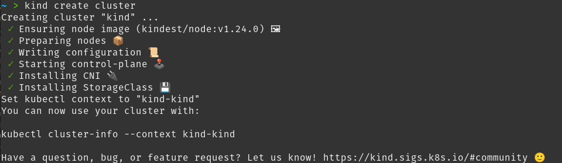

# Módulo 2: Kubernetes: Navegando por un océano de contenedores

## Instalar Kubernetes en nuestra máquina local

Como comentamos en el [expositorio](https://prefapp.github.io/formacion/cursos/kubernetes/#/./02_kubernetes/01_que_e_kubernetes), Kubernetes se puede instalar de muchas formas y tiene vocación de ejecutarse en diferentes entornos (cloud, on-premise, bare-metal...) y también en nuestra máquina local.

En el curso, recomendamos crear clústeres locales usando Kind. Para ello debemos tener instalado tanto Kind como kubectl como se explica en el apartado [instalación de Kind](https://prefapp.github.io/formacion/cursos/kubernetes/#/./02_kubernetes/07_instalando_kind).


### a) Creación de clústeres con tipo

El primer paso será verificar que Kind esté instalado correctamente. Para ello, emitimos el siguiente comando:

```shell
kind version
```

Lo que devolverá una respuesta similar a la siguiente:

```shell
kind v0.14.0 go1.18.2 linux/amd64
```

Ahora, creamos un nuevo clúster en especie:

```shell
kind create cluster
```

Que debería producir algo como esto:



Y podemos usar kubectl para ver el nodo que acabamos de crear:

```shell
~ > kubectl get nodes
NAME                 STATUS   ROLES           AGE     VERSION
kind-control-plane   Ready    control-plane   3m53s   v1.24.0
```
### b) Habilite dashboard:

Kubernetes expone un dashboard para trabajar gráficamente y ver el estado del clúster.

Para implementarlo necesitas ejecutar:

```shell
kubectl apply -f https://raw.githubusercontent.com/kubernetes/dashboard/v2.5.0/aio/deploy/recommended.yaml
```

Esto creará los artefactos precisos para que funcione.

Además, necesitaremos crear un usuario de prueba con permisos para acceder al dashboard. Para ello, crearemos los siguientes artefactos:

```yaml
# dashboard_adminuser.yaml
apiVersion: v1
kind: ServiceAccount
metadata:
  name: admin-user
  namespace: kubernetes-dashboard

```

```yaml
# dashboard_rolebinding.yaml
apiVersion: rbac.authorization.k8s.io/v1
kind: ClusterRoleBinding
metadata:
  name: admin-user
roleRef:
  apiGroup: rbac.authorization.k8s.io
  kind: ClusterRole
  name: cluster-admin
subjects:
- kind: ServiceAccount
  name: admin-user
  namespace: kubernetes-dashboard

```

Y las aplicamos

```shell
kubectl apply -f dashboard_adminuser.yaml
kubectl apply -f dashboard_rolebinding.yaml
```

Ejecutamos el siguiente comando para obtener el token asociado al usuario que acabamos de crear:

```shell
kubectl -n kubernetes-dashboard create token admin-user
```

Y, para habilitar el acceso al Tablero, lanzamos:

```shell
kubectl proxy
```

De esta forma, kubectl nos facilitará el acceso a través de: http://localhost:8001/api/v1/namespaces/kubernetes-dashboard/services/https:kubernetes-dashboard:/proxy/

Ingresamos a este enlace e ingresamos el token que creamos anteriormente en la pantalla de inicio de sesión, y podremos ver el dashboard.

### c) Eliminar el clúster

Una vez que hayamos terminado de trabajar con un clúster, podemos eliminarlo. Para ello haremos:


```shell
kind delete cluster
```

Y el sistema eliminará el clúster local de nuestra máquina.

### Evaluación

**Evidencia de la adquisición de actuaciones**:
- Captura de pantalla de la versión Kind (ver párrafo a).
- Captura de pantalla de la versión de los nodos creados con Kind con el dashboard (inciso e) habilitado.

**Indicadores de logros**: Deberías haber...
- Instalado correctamente el Tipo.
- El tablero está habilitado y se accede desde el navegador.

**Criterios de corrección**:
- 15 puntos si hay una captura de pantalla con la salida de la versión Kind.
- 5 puntos si hay una captura de pantalla del navegador con el panel de control de kubernetes ejecutándose.

**Autoevaluación**: autoevalúe esta tarea aplicando los indicadores de logro anteriores.

**Peso en calificación**:
- Peso de esta tarea en la calificación final ....................................... 30 puntos
- Peso de esta tarea en su tema .......................................................... 30%

---
## Ejecutando nuestra primera aplicación en Kubernetes

Comencemos nuestro viaje con Kubernetes.

Para completar esta práctica, debe haber completado la tarea en la que pusimos en funcionamiento nuestro entorno Kind, con un clúster activo.

Configuremos una aplicación simple escrita en nodejs que haga lo siguiente:
- Ejecutar un servidor web en un contenedor.
- Cuando recibe una solicitud, muestra la siguiente información en la pantalla:
  - Versión de la aplicación.
  - El nombre de host.
  - El tiempo de actividad de la aplicación en horas: minutos: segundos.

### a) Desplegar en pod

Para comenzar, implementemos nuestra aplicación en un pod:
- La imagen a montar será "frmadem/catro-eixos-k8s-ej1", con la etiqueta "v1", esto es: "frmadem/catro-eixos-k8s-ej1:v1".
- El nombre del pod será "pod-practica-1".
- Se ejecutará como comando "npm" "run" "start".
- Es necesario configurar una variable de entorno:
  - "PUERTO_APP" con el valor "80" para que escuche en el puerto 80.

Se creará un archivo llamado "pod.yaml" y lo ejecutaremos con kubectl apply.

Una vez hecho esto, deberíamos tener algo como lo siguiente:


Ahora necesitamos probar nuestra aplicación para ver si responde. Para hacer esto, exportemos un puerto conectado al pod a través de `kubectl port-forward`.

```shell
kubectl port-forward pod/pod-practica-1 --address 0.0.0.0 <porto_de_elección_do_vm>:80
```

Una vez hecho esto, deberíamos poder ver el resultado de la ejecución en nuestro navegador:


Vemos la **versión** de la aplicación, el **hostname** (el nombre del pod donde se está ejecutando) y el **hh:mm:ss** que se ha estado ejecutando.

### b) Configuración de una deployment

Si queremos ejecutar nuestra aplicación con réplicas y controlarlas, debemos usar un [deploy](https://prefapp.github.io/formacion/cursos/kubernetes/#/./02_kubernetes/04_arquitectura_kubernetes_deployment).

Para configurar nuestro despliegue tenemos que cumplir una serie de requisitos:
- El nombre del deployment será "**deploy-practice-1**".
- Comenzará con una réplica.
- Los pods escucharán en el puerto 8080.


Una vez creado el artefacto, lo lanzamos.

Verifique que realmente tenga la implementación y el pod ejecutándose correctamente.

Ahora vamos a escalarlo a 5 réplicas. ¿Qué comando se utilizará?

Una vez que haya hecho eso, compruebe que en realidad hay cinco réplicas en ejecución.

Vuelva a establecer las réplicas en 1.

Enumere los pods restantes una vez realizada esta operación.

### c) Exponer nuestra aplicación a través de un servicio

Ahora, tenemos una implementación que tiene réplicas y queremos que cualquiera de ellas pueda responder.

Para hacer esto, compre configurar un servicio.

El [servicio](https://prefapp.github.io/formacion/cursos/kubernetes/#/./02_kubernetes/05_arquitectura_kubernetes_service) que expone nuestro deployment debe volver a tener una serie de características:
- El nombre del servicio será "**servicio-practica-1**".
- El puerto de servicio será el 80
- Se conectará a los pods en el puerto 8080.
- Nuestro sistema será el siguiente:


Creamos el artefacto de servicio y lo lanzamos.

Verificamos que realmente se haya creado en nuestro clúster. ¿Qué comando usaremos?

Hacemos un curl al clusterIp de nuestro servicio. ¿Qué salida tendremos?

### d) Montaje de un frontend para nuestra aplicación

Ahora que tenemos una implementación con nuestros pods y un servicio que los expone, todo lo que queda es configurar una interfaz que le haga solicitudes.

Para ensamblar esta interfaz:
- Usaremos la imagen **frmadem/catro-eixos-k8s-proxy**.
- Montaremos esta imagen en un nuevo deployment.
- Este despliegue tendrá:
  - Una única réplica.
  - Su nombre será "**frontend-practica-1**"./s/1.
  - Configuraremos como variable de entorno "SERVIZO_INTERNO" que dará como resultado el servicio que creamos en el punto c).
  - El pod expondrá el puerto 80.
- Además de la implementación, crearemos un servicio para nuestra interfaz. Con las siguientes caracteristicas:
  - Se llamará "service-frontend-practica-1".
  - Escuchará en el puerto 8080 (el puerto de servicio será el 8080).
  - Se comunicará con los pods en el puerto 80.

Crearemos los artefactos de implementación y servicio de frontend. Dejando nuestra aplicación de la siguiente manera:


Desplegamos nuestros artefactos frontend. Comprobamos que están realmente creados.

### e) Verificar que todo esté en orden

Ahora exportemos (proxy-forward) nuestro servicio frontend. Y enviamos una petición desde nuestro navegador, debería salir una salida como la del punto a).

Finalmente, vamos a escalar la implementación de la práctica a 5 réplicas (el backend, no el frontend).

Si recargamos nuestro navegador, veremos que el pod que nos responde es diferente en cada ejecución. (ver el hostname).

### Evaluación

**Evidencia de la adquisición de actuaciones**:
- Envío de un pdf con los contenidos necesarios para llevar a cabo los puntos a) ae) según estos.

**Indicadores de logros**: Deberías haber...
- Artefacto con el yaml necesario para crear el pod con los requisitos del **punto a**) (pod.yaml). Captura de pantalla de los comandos necesarios para:
  - Inicie el yaml.
  - Compruebe que el pod se está ejecutando (y su salida).
  - Exportar la vaina.
  - Captura del navegador con salida de pod.
- Artefacto de Yaml necesario para crear la implementación con los requisitos del **punto b**) (deploy.yaml) Captura de pantalla con los comandos necesarios para:
  - Inicie el yaml.
  - Verifique que la implementación y el pod se estén ejecutando (en sus salidas).
  - Escale a cinco réplicas o implemente.
  - Comprobar que hay cinco réplicas (y su salida).
  - Reducir a una réplica.
  - Comprobar que hay una réplica de nuevo (y su salida).
- Artefacto con el yaml necesario para crear el servicio con los requisitos del **punto c**) (service.yaml) Captura de pantalla con los comandos necesarios para:
  - Inicie el yaml.
  - Comprobar que se ha creado el servicio (y su salida).
  - Curl al ipcluster del servicio (y su salida).
- Artefactos con el yaml necesario para crear el servicio de deployment y frontend con las características del **punto d**) Capturas de pantalla de los comandos necesarios para:
  - Iniciar los yamls.
  - Comprobar qué servicio, implementación y pods se crean (y sus resultados).
- Comprobar que todo esté en orden según el **punto e**):
  - Comando para exportar el puerto de "service-frontend-practica-1".
  - Captura de pantalla del navegador con la salida de ```localhost:<puerto reenviado elegido>''.
  - Comando para escalar a cinco réplicas.
  - Tres capturas del navegador con respuestas de diferentes pods.

**Criterios de corrección**:
- hasta 15 puntos del apartado a):
  - 7 puntos si la creación del pod yaml es correcta.
  - 2 puntos por cada comando de salida/captura correcto.
- hasta 10 puntos del apartado b):
  - 4 puntos si el yaml de creación del deployment es correcto.
  - 1 punto por cada comando de salida/captura correcta.
- hasta 7 puntos del apartado c):
  - 3 puntos si el yaml de creación del servicio es correcto.
  - 1 punto por cada comando de salida/captura correcta.
- hasta 10 puntos del apartado d):
  - 2 puntos por cada artefacto correcto (despliegue y servicio).
  - 1 punto por cada comando de salida/captura correcta.
- hasta 8 puntos del apartado e):
  - 2 puntos por cada comando de salida/captura correcta.

**Autoevaluación**: autoevalúe esta tarea aplicando los indicadores de logro anteriores.

**Peso en calificación**:

-Peso de esta tarea en la nota final ..................................................... 50 puntos

-Peso de esta tarea en su asignatura .................................................. 50%
