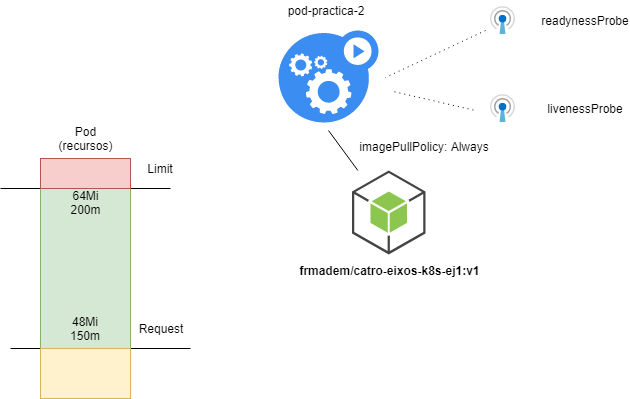
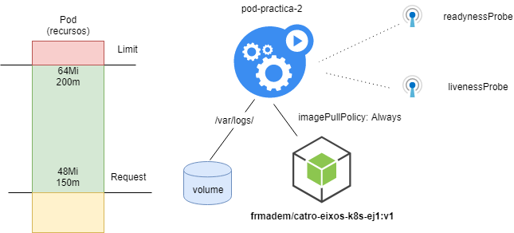
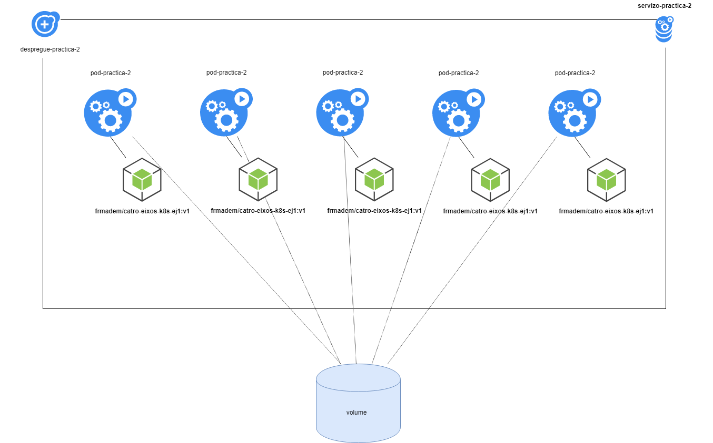
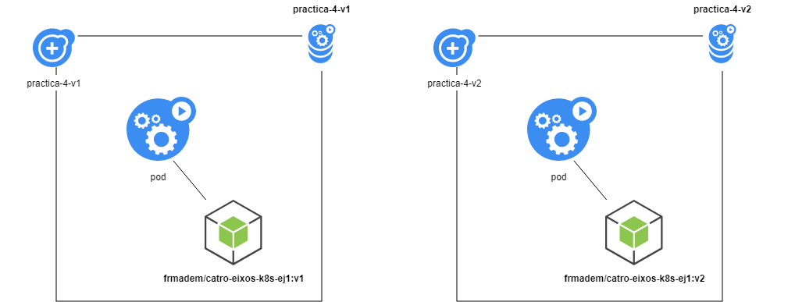
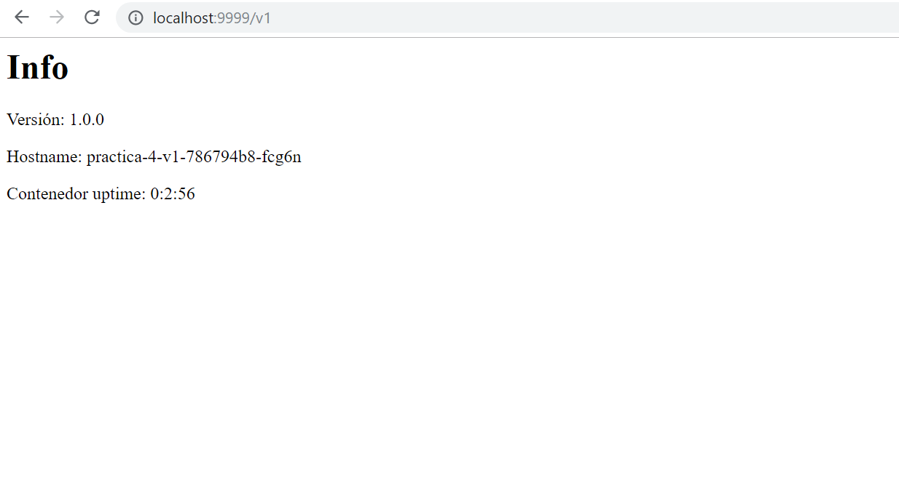
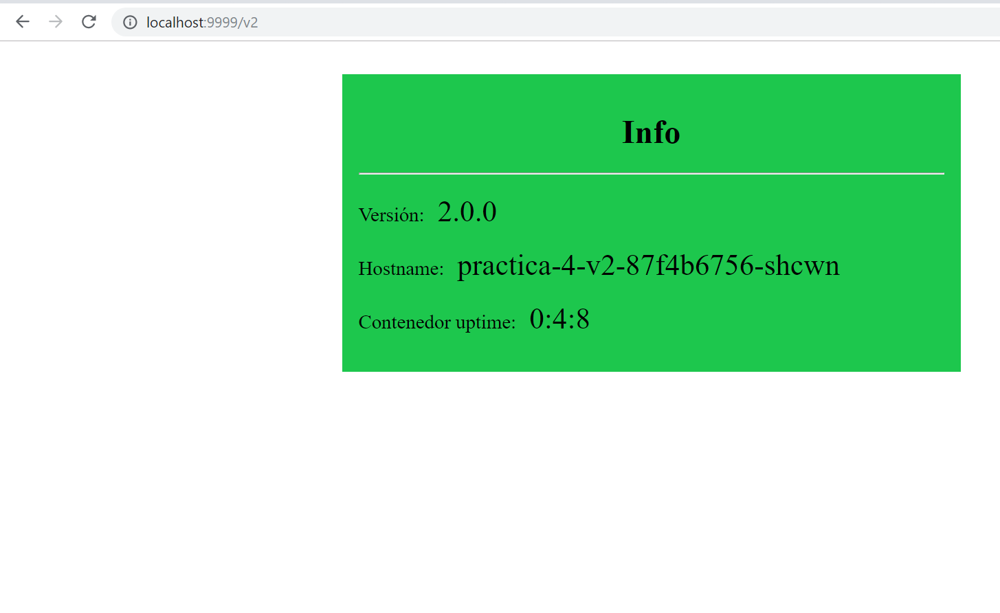

# Módulo 3: Navegando en aguas turbulentas: Kubernetes avanzado
## Mejorando nuestra aplicación.

Para realizar esta tarea, primero lea la documentación sobre "[Kubernetes avanzado](https://prefapp.github.io/formacion/cursos/kubernetes/#/./03_configuracion/01_Configuracions_en_Kubernetes)".

Vamos a mejorar nuestro despliegue de la aplicación de la tarea [2.3](https://prefapp.github.io/formacion/cursos/kubernetes/#/./00_actividades/02_modulo_2?id=correndo-a-nosa-primeira-aplicación-en-kubernetes).

Por lo tanto, es necesario haber completado esa tarea antes de comenzar este módulo.

### a) Mejorando nuestro pod

Después de leer la documentación, llegamos a la conclusión de que una de las mejoras que podemos hacer en nuestros pods es equiparlos con sondas que nos permitan determinar:
* Cuando esté listo para recibir solicitudes (readinessProbe).
* Su estado de "salud" (livenessProbe).

Además, y para que el programador (el componente de K8s encargado de determinar el nodo del clúster donde se ejecutarán nuestros pods) haga bien su trabajo, es necesario ingresar límites y solicitudes.

Es necesario que modifique el pod de la tarea 2.3 a) con los siguientes cambios:
* Renombrar el pod, se llamará "pod-practica-2".
* Agregue una prueba ready y una live:
  * Se realizarán a través de peticiones get a /servidor.
  * La prueba ready comenzará a los 15 segundos de vida útil del contenedor y se repetirá cada 5 segundos.
  * La prueba live comenzará a los 20 segundos y se repetirá cada 10 segundos.
* Por otro lado, vamos a crear algunos limits y request a nuestros pods:
  * Como limits habrá 64Mi y 200m.
  * Como requests tendremos 48Mi y 150m.
* Por último, vamos a cambiar la política pullimage y obligar a Kubernetes a buscar cambios en la imagen del pod cada vez que se inicia ([imagePullPolicy](https://kubernetes.io/docs/concepts/containers/images/)).

Con todos estos cambios se debe generar un nuevo yaml que cumpla con los requisitos de la tarea 2.3.a) pero estos nuevos (el yaml se llamará pod_mellorado.yaml).

Hace falta de todos modos.

Una vez hecho esto tendríamos lo siguiente:

### b) Agregar persistencia

¡Resulta que nuestra aplicación tenía registros!

Esos registros de acceso se están perdiendo porque nuestros pods no tienen persistencia.

Démosle persistencia a nuestro sistema:
* Eliminar el pod de la sección anterior.
* Basado en él, crear un nuevo archivo llamado "pod_mellorado_volume.yaml".
* Se deben realizar los siguientes cambios en el pod:
  * Agregar una nueva variable de entorno que establezca los logs RUTA_LOGS=/var/log (los tendremos así en /var/log/k8s_access.log).
  * Es necesario crear un volumen:
  * Será de tipo __hostPath__.
* Tiene que apuntar a __/tmp/k8s_logs__.
* Debe llamarse __volume-logs__.

Cuando lo tengas listo:
* Inicie el pod.
* Verifique que haya un registro __k8s_access.log__ en la ruta __/tmp/k8s_logs__.
* Hacer un port-forward del pod.
* Hacer solicitudes a __/servidor__.
* Mostrar contenido de registro con una cola.

El sistema ahora se vería así:

### c) Agregar un deploy, un configmap y un servicio

Ahora que tenemos el pod bien preparado, pongámoslo dentro de un deploy que lo controle.

* Eliminar el pod de la sección anterior.
* Crear deploy:
  * Su nombre será "despregue-practica-2".
  * Las cápsulas serán del tipo del apartado anterior (cuidado con el selector!!!).
  * Tendrá como labels:
    * "app=pod-practica-2".
    * "practica=modulo_3_1".
  * Los pods usarán un ConfigMaps:
    * Se llamará "config-practica-2".
    * Tendrá como labels:
      * "app=pod-practica-2".
      * "practica=modulo_3_1".
    * Tendrás la configuración de:
      * "PUERTO_APP=80".
      * "RUTA_LOGS=/var/log".
  * La implementación se exporta a través de un servicio:
    * se llamará "servicio-práctica-2".
    * sus labels serán:
      * "app=pod-practica-2".
      * "practica=modulo_3_1".
    * Escuchará en el puerto 80 (port = 80).

Así que necesitamos tres artefactos:
* Deploy (despregue_practica_2.yaml).
* ConfigMap (config_practica_2.yaml).
* Service (servizo_practica_2.yaml).

El diagrama que tenemos se vería así (las sondas y los límites no se muestran por falta de espacio):

Una vez que tengas todo listo:

1. Inicie los tres artefactos (en el orden correcto).
2. Compruebe que los tres funcionan.
3. Averigüe la ip del servicio.
4. Escale a 5 réplicas y espere a que estén listas.
5. Realice curl en <ip_servizo>/servidor.
6. Haga una tail del archivo de logs.
7. Elimine los tres artefactos utilizando labels en lugar de nombres.

---

### Evaluación

**Evidencia de la adquisición de actuaciones**:
* Envío de un pdf con los contenidos necesarios para llevar a cabo los puntos a) o c) según estos.

**Indicadores de logros**: Deberías haber...
* Artefacto con el yaml necesario para crear el pod con los requisitos del **punto a)** (enhanced_pod.yaml). Captura de pantalla de los comandos necesarios para:
* Inicie el yaml.
* Compruebe que el pod se está ejecutando (y su salida).
* Artefacto con el yaml necesario para crear el pod con los requisitos del **punto b)** (enhanced_volume_pod.yaml). Captura de pantalla con los comandos necesarios para:
* Inicie el yaml.
* Exporte el pod a un host o puerto de máquina.
* Registre la salida en /tmp/k8s_logs/k8s_access.log del host.
* 3 artefactos (ConfigMap, Deploy y Service) con los requisitos del **punto c)** (config_practica_2.yaml, deployment_practica_2.yaml y service_practica_2.yaml) Captura de pantalla con salidas y comandos necesarios para:
* Poner en marcha la estructura y asegurar que esté funcionando.
* Escale la implementación a 5 réplicas.
* Salida de cola (en el host) desde "/tmp/k8s_logs/k8s_access.log".
* Eliminación de artefactos (por etiquetas).

**Criterios de corrección**:
* Hasta 10 puntos del apartado a):
* 8 puntos si la creación del pod yaml es correcta.
* 1 punto por cada comando de salida/captura correcto.
* Hasta 10 puntos del apartado b):
* 7 puntos si el yaml de creación de pod mejorado y con volumen es correcto.
* 1 punto por cada comando/captura de salida correcto.
* Hasta 20 puntos del apartado c):
* 4 puntos si los yaml de implementación, mapa de configuración y servicio son correctos.
* 2 puntos por cada comando de salida/captura correcta.

**Autoevaluación**: autoevalúe esta tarea aplicando los indicadores de logro anteriores.

**Peso en calificación**:
* Peso de este trabajo en la nota final ..........................................40 puntos
* Peso de esta tarea en su tema ..................................................... 40%
___

## Montar nuestra aplicación en un clúster de Kubernetes

Ejecutemos nuestra aplicación en un clúster real de Kubernetes.

Para ello revisa la documentación [sobre usuarios y roles](https://prefapp.github.io/formacion/cursos/kubernetes/#/./03_configuracion/04_Namespaces_usuarios_e_roles).

El administrador del clúster nos pedirá una serie de elementos:
* Un certificado generado por nosotros para poder trabajar contra la API del clúster.
* Un artefacto que crea nuestro espacio de nombres, donde trabajaremos:
  * El namespace tendrá el siguiente formato: "<inicial_nombre>-<primer_apelido>".
  * Ejemplo: (Francisco Maseda) __f-maseda__.
* Un artefacto que crea un Rol:
  * Tienes que dar permisos sobre los siguientes recursos:
    * ConfigMaps.
    * Services.
    * Pods
    * Desploys.
  * Los permisos serán de lectura y escritura (verbos POST, PUT, PATCH, GET, WATCH, LIST).
* Un RoleBinding para vincular el Rol al usuario en nuestro namespaces.

Esos objetos y el certificado **deben ir en un tar** que enviaremos al administrador por correo electrónico (para Francisco Maseda o Javier Gómez).

### a) Generar nuestras credenciales

Para generar nuestras credenciales por favor sigue esta [guía](https://prefapp.github.io/formacion/cursos/kubernetes/#/./03_configuracion/00_Guia_cert).

Copiamos el certificado .csr (por ejemplo f.maseda.csr) a nuestra ruta tar.

### b) Cree los artefactos de namespaces, role y RoleBinding

El administrador también nos pide que declaremos los artefactos necesarios para crear:
* namespaces:
  * El nombre del namespaces tendrá el formato del que hablamos anteriormente.
  * Tendrá como label: tipo=platega-alumno.
* Role:
  * Tendrá el nombre de "role-alumno".
  * Tendrá la label: "tipo=platega-alumno".
  * Tienes que dar permisos sobre los siguientes recursos:
    * Pods
    * Services.
    * Desploys.
    * ConfigMaps.
  * Los permisos serán de lectura y escritura (GET, POST, PUT, WATCH, LIST, PATCH).
* RoleBinding:
  * Tendrá el nombre de binding-alumno.
  * Se aplicará al usuario nombrado con el formato que hayamos establecido (<inicial_primer>-<primer_apellido>).
  * Tendrá la label: "tipo=platega-alumno".
  * Será sobre el namespace creado.

Los tres yamls (namespace.yaml, role.yaml, role_binding.yaml) se ingresarán en el tar que se enviará.

### c) Envío a los administradores del clúster

El tar se enviará al administrador (Francisco Maseda o Javier Gómez) por correo electrónico. Responderán con un certificado.

### d) Instalación del certificado en kubectl

Una vez que obtengamos el certificado de los administradores:
* Agregamos una nueva configuración para el clúster.
* Se llamará "platega".
* La dirección del servidor es: "https://35.205.163.207".
* Se debe realizar "insecure-skip-tls-verify=true".
* Agregamos un nuevo usuario (con el nombre como lo tenemos en el RoleBinding).
* Se debe insertar el certificado que nos devuelve el administrador (opción --embed-certs=true).
* La clave generada en la **sección a)**.
* Agregamos un nuevo contexto.
* Con el nombre de "contexto-platega".
* Asociará el clúster "platega" con nuestro usuario.

Enumeramos los contextos que tenemos.

### e) Creando nuestro despliegue de la tarea 3.1 en el clúster

Establecemos el contexto actual en "contexto-platega".

Lanzamos el configmap, deploy y service de la **apartado c)** de la tarea anterior.

Avisamos al administrador por mensaje privado que tenemos el sistema instalado en el clúster.

---

### Evaluación

**Evidencia de la adquisición de actuaciones**:
* Envío de un tar por correo electrónico con los contenidos necesarios para llevar a cabo los puntos de **a)** y **b)** según estos.

**Indicadores de logros**: Debe tener:
* Generado correctamente un certificado como se indica en el apartado a).
* Yamls correctos para:
* Crear un espacio de nombres con las especificaciones del apartado b).
* Crear un Rol de acuerdo a la especificación del apartado b).
* Cree un RoleBinding de acuerdo con la especificación de la sección b).
* Lanzar nuestra aplicación en el clúster (después de realizar los pasos del apartado c) ) y avisar a los administradores por mensaje privado.

**Criterios de corrección**:
* Hasta 20 puntos del apartado a) y b):
* 5 puntos si el certificado es correcto.
* 5 puntos si el artefacto de creación del espacio de nombres es correcto.
* 5 puntos si el Rol es correcto.
* 5 puntos si el RoleBinding es correcto.
* 1 punto por cada comando de salida/captura correcto.
* Hasta 20 puntos del apartado d):
* 20 puntos si lo implementa, los mapas de configuración y el servicio se ejecutan en el clúster.

**Autoevaluación**: autoevalúe esta tarea aplicando los indicadores de logro anteriores.

Si tienes alguna duda o consulta sobre cómo realizar la tarea, pregúntala en el [Foro de Preguntas](https://www.edu.xunta.gal/platega/mod/forum/view.php?id=110051) de este tema.

**Peso en calificación**:
* Peso de este trabajo en la nota final ......................................... 40 puntos
* Peso de esta tarea en su tema .................................................... 40%

----

## Conectando nuestra aplicación con ingress

Para poder hacer esta práctica, necesitamos:
- Revisar el tema que dejamos en este módulo, en especial la sección sobre [ingress](https://prefapp.github.io/formacion/cursos/kubernetes/#/./03_configuracion/06_Ingress_controlando_o_trafico).
- Se debe crear un controlador de ingress en el cluster Kind, o crear el cluster con el [fichero.sh](00_solucions/03_solucion/despregar-cluster-con-registry-e-ingress.md) resultante de la [Práctica guiada Kind](03_configuracion/10_practica_guiada_tipo).

Ahora que sabemos [ingress](https://kubernetes.io/docs/concepts/services-networking/ingress), lo usaremos para configurar dos versiones de la aplicación del curso y redirigir el tráfico según el acceso sendero.

De este modo:
- En /v1 tendremos la versión 1 de nuestra aplicación (la que usamos en las tareas de los dos módulos anteriores)
- En /v2 tendremos la versión 2 del mismo.

### a) Creando nuestra infraestructura
Partiremos de la estructura básica del módulo 2:
 - Vamos a tener un **deploy**.
   - Se utilizará la imagen `fmadem/catro-axios-k8s-ej1`
   - La etiqueta será `v1`
   - El nombre del deployment será *practica-4-v1*
   - Ni pruebas ni limits deben fallar
   - El comando para ejecutar es `npm run iniciar`
   - Estará en un fichero *deploy_practica_4_v1.yaml*
- Expondremos un **servicio**
  - Se conectará a los pods de deploy en el puerto 8080
  - Su puerto será 80
  - Se llamará *practica-4-v1*
  - Estará en un fichero *service_practica4_v1.yaml*
- Tendremos otro **desploy**
  - Se utilizará la imagen `fmadem/catro-axios-k8s-ej1`
  - La etiqueta será `v2`
  - El nombre del deploy será *practica-4-v2*
  - Estará en un fichero *deploy_practica_4_v2.yaml*
  - Ni pruebas ni limits deben fallar
  - El comando para ejecutar es `npm run iniciar`
- Tendremos otro **servicio**
  - Se conectará a los pods en el puerto 8080
  - Su puerto también será 80
  - Su nombre será *practica-4-v2*
  - Estará en un fichero *service_practica4_v2.yaml*

Quedaría una estructura como la siguiente:

Ahora desplegamos esta estructura.

### b) Aplicar reglas de ingress para conectar todo

Vamos a crear una regla de ingress de tal manera que:

- El artefacto se llamará* practica-4-ingress*
- Definir dos paths:
  - `/v1` => lo que conducirá al servicio *practica-4-v1*
  - `/v2` => lo que conducirá al servicio *practica-4-v2*

Una vez que se crea esta configuración (en un fichero llamado ingress.yaml), se iniciará en el clúster Kind.

Ahora, y desde un puerto redirigido de la vm a nuestro host (que apunta al puerto 80 de la vm) lo haremos en el navegador

`localhost:<puerto redirigido>/v1`

`localhost:<porto redirixido>/v2`

---

### Evaluación

**Evidencia de la adquisición de actuaciones**:
- Envío de un pdf con los contenidos necesarios para llevar a cabo los puntos a) yb) según estos.

**Indicadores de logros**: Deberías haber...
- Artefactos con el yaml para crear los deployments y los servicios v1 y v2 de acuerdo a los requerimientos del **punto a)** y capturando los comandos necesarios para:
  - Iniciar los yaml
  - Comprobar que los pods se están ejecutando (y su salida)
  - Compruebe que los servicios y desploys se crean en k8s.
- Artefacto con la entrada según los requisitos del **punto b)** y los comandos necesarios para
  - Iniciar la estructura
  - Comprobar que se crea en el sistema (y su salida)
- Capturas de pantalla del navegador con salida de rutas v1 y v2

**Criterios de corrección**:
- hasta 20 puntos del apartado a)
  - 5 puntos si los yaml de creación de deploy y servicio v1 son correctos
  - 5 puntos si los yaml de creación de deploy y servicio v2 son correctos
  - 2 puntos por cada comando o grupo de comandos para iniciar y listar los artefactos.
- hasta 10 puntos del apartado b)
  - 8 puntos si el yaml de creación de ingress es correcto
  - 1 punto por el comando para crear y listar el artefacto de ingress
- hasta 10 puntos
  - 5 puntos por cada una de las capturas de pantalla del navegador para v1 y v2

**Autoevaluación**: autoevalúe esta tarea aplicando los indicadores de logro anteriores.

**Peso en calificación**:
- Peso de este trabajo en la nota final .......................................... 40 puntos
- Peso de esta tarea en su asignatura ........................................... 40%