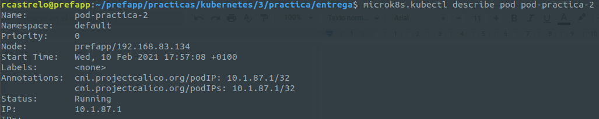
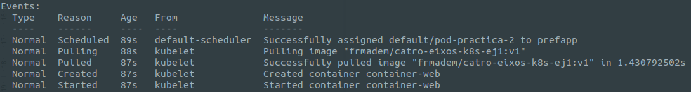
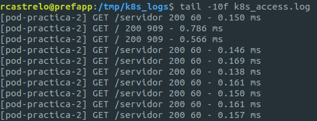
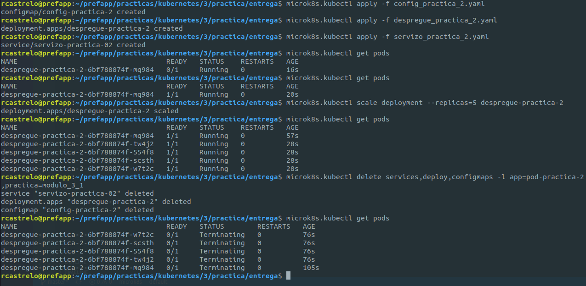
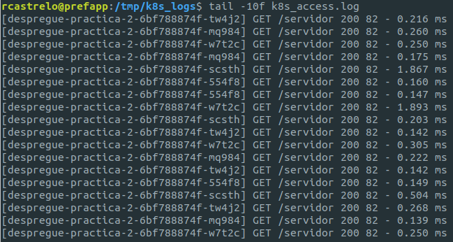

# Mejorando nuestra aplicación.
[link]( https://prefapp.github.io/formacion/cursos/kubernetes/#/./00_actividades/03_modulo_3?id=a-creando-a-nosa-infraestrutura) al ejercicio, en este caso sería la sección "Mejorando nuestra aplicación".

**<u>Punto A:</u>**

**<u>Punto B:</u>**

**<u>Punto C:</u>**

